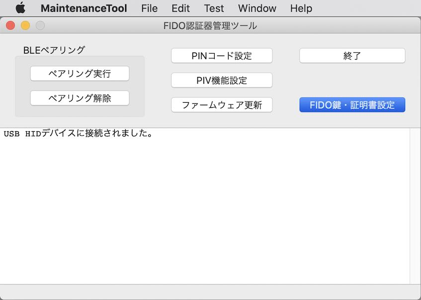
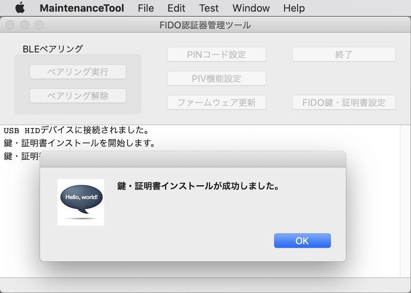
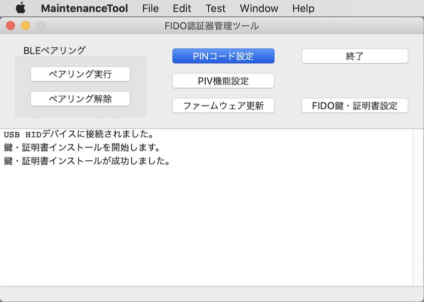
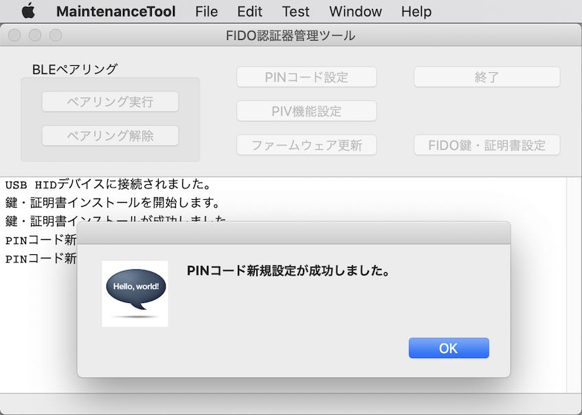
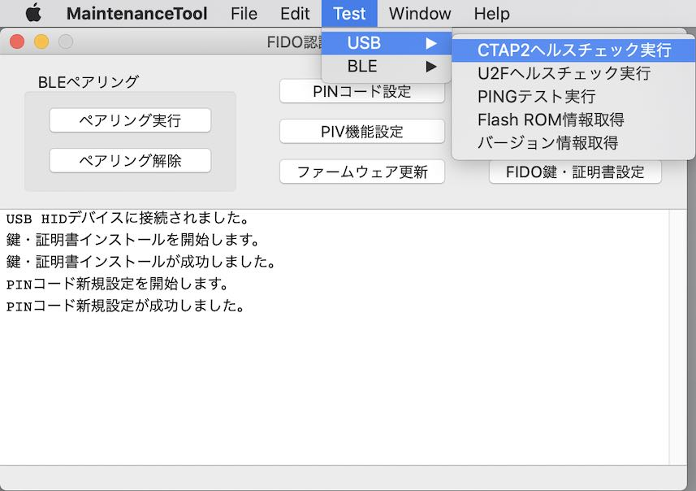
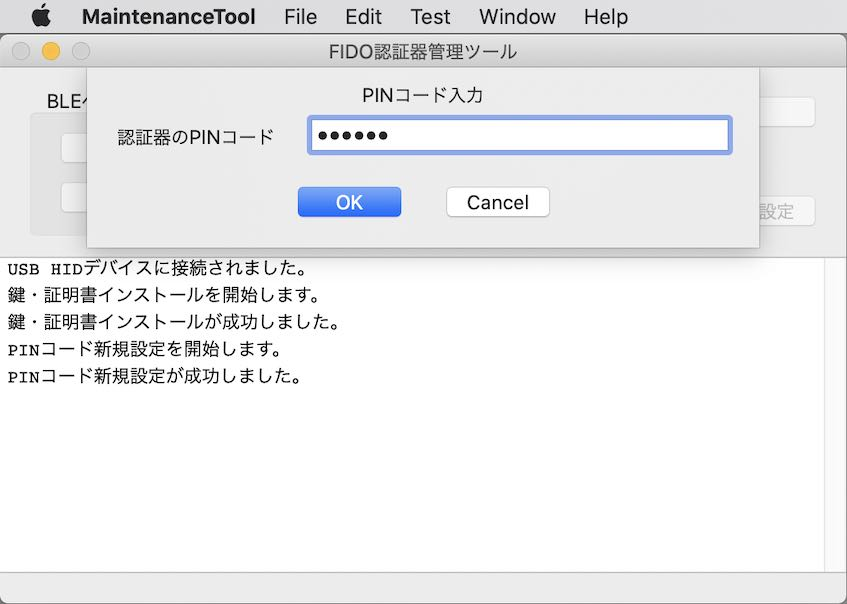
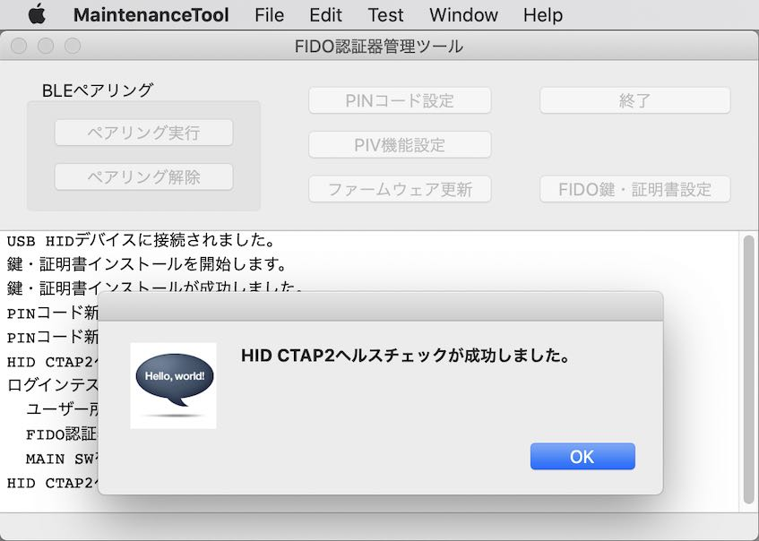
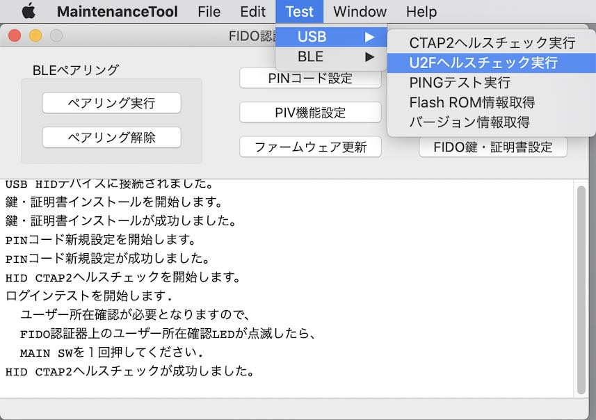

# nRF52840アプリケーション動作確認手順書

## 概要

[管理ツール](../../../MaintenanceTool/README.md)を使用し、[MDBT50Q Dongle](../../../FIDO2Device/MDBT50Q_Dongle/README.md)に導入した[nRF52840アプリケーション](../../../nRF52840_app/firmwares/secure_device_app)の動作確認を行う手順について、以下に掲載いたします。

## 作業の準備

動作確認の前に、MDBT50Q Dongleと管理ツールを用意します。

#### MDBT50Q Dongleの準備

[nRF52840アプリケーション](../../../nRF52840_app/firmwares/secure_device_app)が書き込まれたMDBT50Q Dongleを、あらかじめ準備します。 
具体的な手順は、別ドキュメント「[nRF52840アプリケーション初回導入手順書](../../../nRF52840_app/firmwares/secure_device_app/WRITEAPP.md)」をご参照ください。

MDBT50Q Dongleを、PCのUSBポートに装着すると、下図のように、基板上の緑色のLEDが点滅している状態になります。

#### 管理ツールのインストール

あらかじめ、最新バージョンの管理ツールをPCにインストールしておきます。 
具体的な手順は、別ドキュメント「[管理ツールインストール手順](../../../MaintenanceTool/macOSApp/INSTALLPRG.md)」をご参照ください。

MDBT50Q DongleがPCのUSBポートに装着されている状態だと、管理ツール起動時、下図のようなメッセージ「USB HIDデバイスに接続されました。」が表示されます。

## FIDO2機能の動作確認

FIDO2機能の動作確認は、管理ツールのヘルスチェック機能（`Test --> USB`メニュー）で実行できます。

#### 鍵・証明書のインストール

管理ツールを起動し、画面の「鍵ファイルのパス」「証明書ファイルのパス」欄に、鍵・証明書ファイル名のフルパスを入力します。 
（ファイル入力欄の右側「選択」ボタンをクリックすることにより、ファイルが選択できます）

なお本プロジェクトでは、ヘルスチェックのためにテスト用の秘密鍵ファイルと自己署名証明書ファイルを用意しております。 
適宜ご利用ください。

| # |ファイル名 |説明 |
|:-:|:-|:-|
|1|[`fido2test.pem`](../../../Research/provisionalCA/fido2test.pem)|ヘルスチェック実行用秘密鍵ファイル（PEM形式）|
|2|[`fido2test.crt`](../../../Research/provisionalCA/fido2test.crt)|ヘルスチェック実行用自己署名証明書ファイル（DER形式）|

ファイル名のフルパスを入力したら、画面上のボタン「鍵・証明書ファイルのインストール」をクリックします。

下図のような確認ダイアログが表示されます。 
「Yes」ボタンをクリックし、鍵・証明書ファイルのインストール処理を実行させます。

ほどなくインストール処理が完了し、ポップアップが表示されます。

「OK」をクリックし、ポップアップを閉じます。

#### PIN番号の設定

WebAuthn機能（Windows版）で使用するPIN番号を設定します。 
管理ツール画面上の「PINコード設定」ボタンをクリックします。

下図のようなPINコード設定画面が表示されます。 
６桁のPIN番号を数字で入力します。 
（確認用の欄にも、同じ数字を入力してください）

「新規設定」ボタンをクリックし、PINコード設定処理を実行させます。

ほどなくPIN設定処理が完了し、ポップアップが表示されます。

「OK」をクリックし、ポップアップを閉じます。

#### CTAP2ヘルスチェック実行

WebAuthn機能（Windows版）で使用される「CTAP2」のヘルスチェックを実行します。 
管理ツール画面のメニュー「Test --> USB --> CTAP2ヘルスチェック実行」を選択します。

下図のようなPINコード入力画面が表示されます。 
先ほど設定した、６桁のPIN番号を数字で入力します。

「OK」ボタンをクリックし、CTAP2ヘルスチェック処理を実行させます。

下図のようなメッセージが表示されたら、MDBT50Q Dongleの基板上のボタンを１回押します。 
（約３０秒以内に押してください）

ほどなくCTAP2ヘルスチェック処理が完了し、ポップアップが表示されます。

「OK」をクリックし、ポップアップを閉じます。

#### U2Fヘルスチェック実行

WebAuthn機能（macOS版）で使用される「U2F」のヘルスチェックを実行します。 
管理ツール画面のメニュー「Test --> USB --> U2Fヘルスチェック実行」を選択します。

U2Fヘルスチェック処理が開始されます。 
下図のようなメッセージが表示されたら、MDBT50Q Dongleの基板上のボタンを１回押します。 
（約３０秒以内に押してください）

ほどなくU2Fヘルスチェック処理が完了し、ポップアップが表示されます。

「OK」をクリックし、ポップアップを閉じます。
