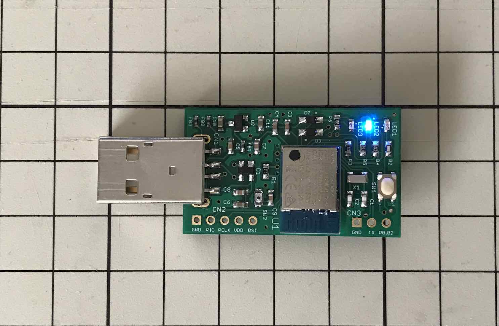

# FIDO2機能動作確認手順書（BLE）

## 概要

[管理ツール](../../../MaintenanceTool/README.md)を使用し、[nRF52840アプリケーション](../../../nRF52840_app/firmwares/secure_device_app)のFIDO2機能に関する動作確認を行う手順について、以下に掲載いたします。

本ドキュメントでは、FIDO2機能のうち、BLEペリフェラル機能の動作確認を実施します。

## 作業の準備

動作確認の前に、以下の項目について準備します。

#### MDBT50Q Dongleの準備

[nRF52840アプリケーション](../../../nRF52840_app/firmwares/secure_device_app)が書き込まれたMDBT50Q Dongleを、あらかじめ準備します。 
具体的な手順は、別ドキュメント「[nRF52840アプリケーション初回導入手順書](../../../nRF52840_app/firmwares/secure_device_app/WRITEAPP.md)」をご参照ください。

MDBT50Q Dongleに、ボタン乾電池（CR1225）を装着すると、下図のように、基板上の青色LEDが点滅している状態になります。
BLEペリフェラル機能がアイドル状態である事を示しています。

なお、BLEペリフェラル機能のアイドル状態が３分以上続くと、青色LEDが消灯し、スリープ状態に遷移します。 
（電池消耗を防ぐための仕様です） 
この場合は、基板上のスイッチを１回プッシュすると、アイドル状態にもどり、再び青色LEDが点滅します。

#### 管理ツールのインストール

あらかじめ、最新バージョンの管理ツールをPCにインストールしておきます。 
具体的な手順は、別ドキュメント「[管理ツールインストール手順](../../../MaintenanceTool/macOSApp/INSTALLPRG.md)」をご参照ください。

MDBT50Q DongleがPCのUSBポートに装着されている状態だと、管理ツール起動時、下図のようなメッセージ「USB HIDデバイスに接続されました。」が表示されます。

#### 管理ツールによる事前設定

管理ツールを使用し、あらかじめ以下の項目を実施してください。 
・鍵・証明書ファイルのインストール 
・PIN番号の設定

具体的な手順は、別ドキュメント「[FIDO2機能動作確認手順書（HID）](../../../nRF52840_app/firmwares/secure_device_app/TESTAPPHID.md)」の「鍵・証明書のインストール」「PIN番号の設定」の各章をご参照ください。

## ペアリングの実施

動作確認を行う前に、使用するPCとMDBT50Q Dongle間でペアリングを実施します。

#### ペアリングモードに遷移

基板上のスイッチを３秒間以上押し続けると、橙色LEDが点灯するので、スイッチを離します。 
下図のように、橙色LEDが連続点灯している状態となります。

これでMDBT50Q Dongleがペアリングモードとなり、ペアリングが実行可能となります。

#### ペアリングの実行

管理ツールを起動し、画面上の「ペアリング実行」ボタンをクリックします。

ほどなくペアリング処理が完了し、ポップアップが表示されます。

「OK」をクリックし、ポップアップを閉じます。

Bluetooth設定画面で、デバイス「Secure Dongle」が表示されていれば、ペアリングは成功です。

## 動作確認の実施

FIDO2機能の動作確認は、管理ツールのヘルスチェック機能（`Test --> BLE`メニュー）で実行できます。

#### PINGテスト実行

まずはBLEトランスポートの動作確認を行います。 
管理ツール画面のメニュー「Test --> BLE --> PINGテスト実行」を選択します。

PINGテスト処理が実行されます。 
ほどなく処理が完了し、ポップアップが表示されます。

「OK」をクリックし、ポップアップを閉じます。

#### CTAP2ヘルスチェック実行

WebAuthn機能（Windows版）で使用される「CTAP2」のヘルスチェックを実行します。 
管理ツール画面のメニュー「Test --> BLE --> CTAP2ヘルスチェック実行」を選択します。

下図のようなPINコード入力画面が表示されます。 
前述「管理ツールによる事前設定」で設定した、６桁のPIN番号を数字で入力します。

「OK」ボタンをクリックし、CTAP2ヘルスチェック処理を実行させます。

下図のようなメッセージが表示されます。

MDBT50Q Dongleの基板上の緑色LEDが点滅しますので、ボタンを１回押します。 
（約３０秒以内に押してください）

ほどなくCTAP2ヘルスチェック処理が完了し、ポップアップが表示されます。

「OK」をクリックし、ポップアップを閉じます。

#### U2Fヘルスチェック実行

WebAuthn機能（macOS版）で使用される「U2F」のヘルスチェックを実行します。 
管理ツール画面のメニュー「Test --> USB --> U2Fヘルスチェック実行」を選択します。

U2Fヘルスチェック処理が開始され、下図のようなメッセージが表示されます。

MDBT50Q Dongleの基板上の緑色LEDが点滅しますので、ボタンを１回押します。 
（約３０秒以内に押してください）

ほどなくU2Fヘルスチェック処理が完了し、ポップアップが表示されます。

「OK」をクリックし、ポップアップを閉じます。
