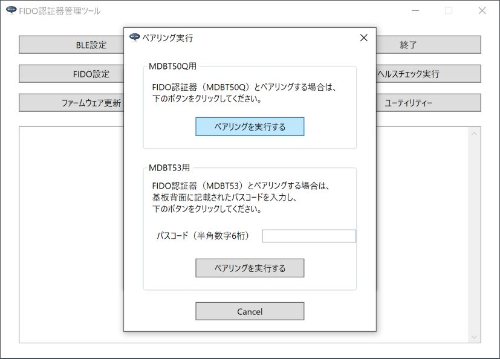
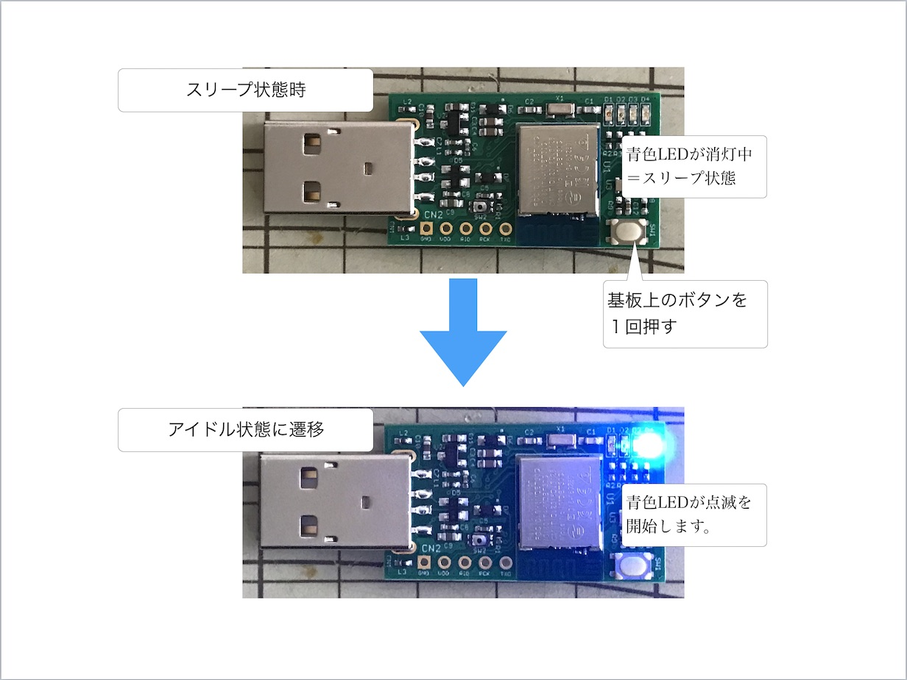
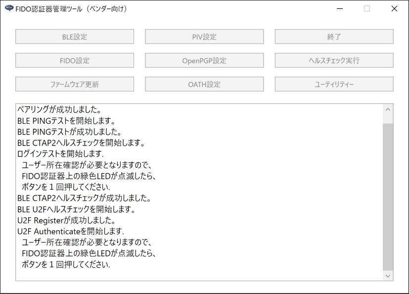

# FIDO2機能動作確認手順書（BLE）

最終更新日：2023/2/8

## 概要

[管理ツール](../../../MaintenanceTool/README.md)を使用し、[nRF52840アプリケーション](../../../nRF52840_app/firmwares/secure_device_app)のFIDO2機能に関する動作確認を行う手順について、以下に掲載いたします。

本ドキュメントでは、FIDO2機能のうち、BLEペリフェラル機能の動作確認を実施します。

## 作業の準備

動作確認の前に、以下の項目について準備します。

#### MDBT50Q Dongleの準備

[nRF52840アプリケーション](../../../nRF52840_app/firmwares/secure_device_app)が書き込まれたMDBT50Q Dongleを、あらかじめ準備します。 
具体的な手順は、別ドキュメント「[nRF52840アプリケーション初回導入手順書](../../../nRF52840_app/firmwares/secure_device_app/WRITEAPP.md)」をご参照ください。

なお、MDBT50Q Dongleには、必ずボタン乾電池（CR1225）を装着しておいてください。

#### 管理ツールのインストール

あらかじめ、最新バージョンのベンダー向け管理ツールをPCにインストールしておきます。 
手順につきましては下記ドキュメントをご参照ください。 
　・[インストール手順（Windows版）](../../../MaintenanceTool/dotNET/DEVTOOLINST.md) 
　・[インストール手順（macOS版）](../../../MaintenanceTool/macOSApp/DEVTOOLINST.md)

#### 管理ツールによる事前設定

管理ツールを使用し、あらかじめ以下の項目を実施してください。 
・鍵・証明書ファイルのインストール 
・PINコードの設定

鍵・証明書ファイルのインストール手順につきましては、下記ドキュメントをご参照ください。 
　・[鍵・証明書の導入手順（Windows版）](../../../MaintenanceTool/dotNET/ATTESTATION.md) 
　・[鍵・証明書の導入手順（macOS版）](../../../MaintenanceTool/macOSApp/ATTESTATION.md)

PINコードの設定手順につきましては、下記ドキュメントをご参照ください。 
　・[PINコードの設定手順（Windows版）](../../../MaintenanceTool/dotNET/SETPIN.md) 
　・[PINコードの設定手順（macOS版）](../../../MaintenanceTool/macOSApp/SETPIN.md)

## ペアリングの実施

動作確認を行う前に、使用するPCとMDBT50Q Dongle間でペアリングを実施します。

#### ペアリング情報を削除

あらかじめ、MDBT50Q Dongle側とPC側のペアリング情報を削除しておきます。

MDBT50Q Dongle側 

PC側 

ペアリング情報削除手順につきましては、下記ドキュメントの該当章をご参照ください。 
　・[BLEペアリング情報の削除手順（Windows版）](../../../MaintenanceTool/dotNET/BLEPAIRING.md) 
　・[BLEペアリング情報の削除手順（macOS版）](../../../MaintenanceTool/macOSApp/BLEPAIRING.md)

#### ペアリングモードに遷移

MDBT50Q Dongleが下図のように、オレンジ色LEDが連続点灯した状態となり、ペアリングが実行可能となります。

#### ペアリングの実行

管理ツールの「ペアリング実行」機能を実行し、PCとMDBT50Q Dongle間でペアリングを行います。

ペアリング手順につきましては、下記ドキュメントの該当章をご参照ください。 
　・[ペアリングの実行手順（Windows版）](../../../MaintenanceTool/dotNET/BLEPAIRING.md) 
　・[ペアリングの実行手順（macOS版）](../../../MaintenanceTool/macOSApp/BLEPAIRING.md)

ペアリングが完了すると、下図のように、基板上の青色LEDが点滅している状態になります。 
BLEペリフェラル機能がアイドル状態である事を示しています。

なお、BLEペリフェラル機能のアイドル状態が３分以上続くと、青色LEDが消灯し、スリープ状態に遷移します。 
（電池消耗を防ぐための仕様です） 
この場合は、基板上のスイッチを１回プッシュすると、アイドル状態にもどり、再び青色LEDが点滅します。

## 動作確認の実施

FIDO2機能の動作確認は、管理ツールの「ヘルスチェック実行（BLE）」メニューで実行できます。

#### PINGテスト実行

まずはBLEトランスポートの動作確認を行います。 
「ヘルスチェック実行（BLE）」メニューの「PINGテスト実行」をクリックします。

PINGテスト処理が実行されます。 
ほどなく処理が完了し、ポップアップが表示されます。

「OK」をクリックし、ポップアップを閉じます。

#### CTAP2ヘルスチェック実行

WebAuthn機能（Windows版）で使用される「CTAP2」のヘルスチェックを実行します。 
「ヘルスチェック実行（BLE）」メニューの「CTAP2ヘルスチェック実行」をクリックします。

下図のようなPINコード入力画面が表示されます。 
前述「管理ツールによる事前設定」で設定した、６桁のPIN番号を数字で入力します。

「OK」ボタンをクリックし、CTAP2ヘルスチェック処理を実行させます。

下図のようなメッセージが表示されます。

MDBT50Q Dongleの基板上の緑色LEDが点滅しますので、ボタンを１回押します。 
（約１０秒以内に押してください）

ほどなくCTAP2ヘルスチェック処理が完了し、ポップアップが表示されます。

「OK」をクリックし、ポップアップを閉じます。

#### U2Fヘルスチェック実行

WebAuthn機能（macOS版）で使用される「U2F」のヘルスチェックを実行します。 
「ヘルスチェック実行（BLE）」メニューの「U2Fヘルスチェック実行」をクリックします。

U2Fヘルスチェック処理が開始され、下図のようなメッセージが表示されます。

MDBT50Q Dongleの基板上の緑色LEDが点滅しますので、ボタンを１回押します。 
（約１０秒以内に押してください）

ほどなくU2Fヘルスチェック処理が完了し、ポップアップが表示されます。

「OK」をクリックし、ポップアップを閉じます。
