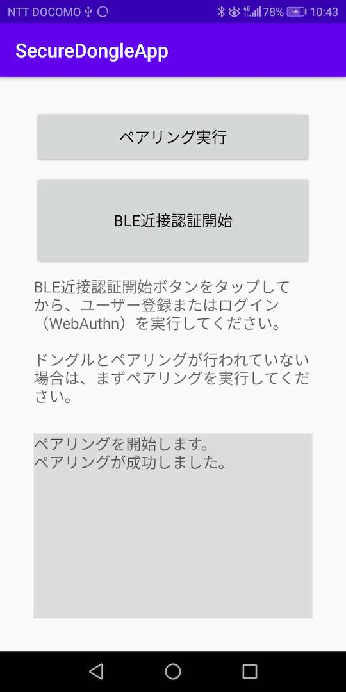
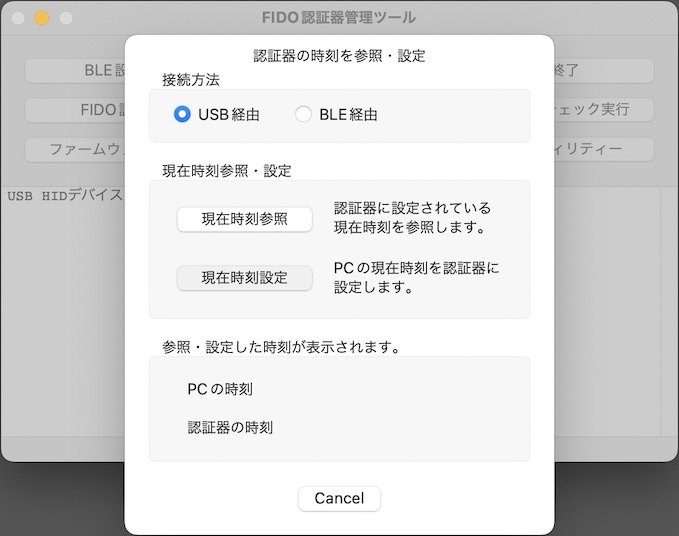
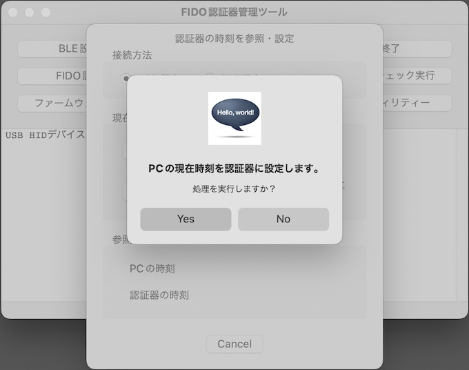
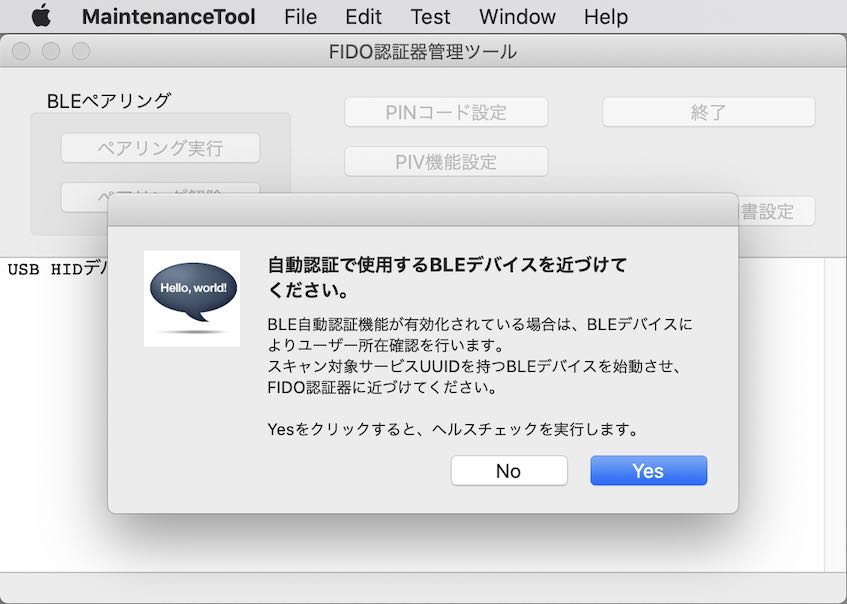

# FIDO2機能動作確認手順書（BLE近接認証）

## 概要

[管理ツール](../../../MaintenanceTool/README.md)を使用し、[nRF52840アプリケーション](../../../nRF52840_app/firmwares/secure_device_app)のFIDO2機能に関する動作確認を行う手順について、以下に掲載いたします。

本ドキュメントでは、[BLE近接認証機能](../../../FIDO2Device/SecureDongleApp/Android/BLEAUTH.md)を使用したFIDO2機能の動作確認を実施します。

## 作業の準備

動作確認の前に、以下の項目について準備します。

#### MDBT50Q Dongleの準備

[nRF52840アプリケーション](../../../nRF52840_app/firmwares/secure_device_app)が書き込まれたMDBT50Q Dongleを、あらかじめ準備します。 
具体的な手順は、別ドキュメント「[nRF52840アプリケーション初回導入手順書](../../../nRF52840_app/firmwares/secure_device_app/WRITEAPP.md)」をご参照ください。

MDBT50Q Dongleを、PCのUSBポートに装着すると、下図のように、基板上の緑色LEDが点滅している状態になります。 
USB HIDインターフェースがアイドル状態である事を示しています。

#### 管理ツールのインストール

あらかじめ、最新バージョンの管理ツールをPCにインストールしておきます。 
具体的な手順は、別ドキュメント「[管理ツールインストール手順](../../../MaintenanceTool/macOSApp/INSTALLPRG.md)」をご参照ください。

MDBT50Q DongleがPCのUSBポートに装着されている状態だと、管理ツール起動時、下図のようなメッセージ「USB HIDデバイスに接続されました。」が表示されます。

#### 鍵・証明書インストール

管理ツールを使用し、あらかじめ鍵・証明書ファイルをインストールします。 
具体的な手順は、別ドキュメント「[鍵・証明書の導入手順](../../../MaintenanceTool/macOSApp/INSTALLKEYCRT.md)」の「鍵・証明書のインストール」の章をご参照ください。

#### BLE近接認証アプリのインストール

Androidスマートフォンに、BLE近接認証アプリをインストールし、MDBT50Q Dongleとペアリングしておきます。

手順につきましては「<b>[BLE近接認証アプリインストール手順](../../../FIDO2Device/SecureDongleApp/Android/INSTALLPRG.md)</b>」をご参照願います。

## 自動認証パラメーターの登録

管理ツールを使用し、自動認証パラメーター（BLE近接認証で使用するBLEデバイスのサービスUUIDや、そのスキャン秒数）を、事前にMDBT50Q Dongleに設定します。 
設定は、管理ツールのツール設定画面上で行います。

#### ツール設定画面の表示

管理ツールを起動し、PCのUSBポートにMDBT50Q Dongleを装着します。 
その後、メニューから「Preferences...」をクリックします。

ツール設定画面（ポップアップ画面）が表示されます。

ツール設定画面表示時は、画面項目が入力不可になっている状態ですので、画面上の「設定読込」ボタンをチェックし、画面にパラメーターを入力できるようにします。

認証器に自動認証パラメーターが未設定の状態ですと、下図のように画面項目が入力可能となり、デフォルト値が表示されます。

#### 自動認証パラメーターの登録

画面上に、自動認証パラメーター（BLE近接認証機能で必要となるパラメーター）の各項目を入力／指定します。

|# |項目名 |値 |
|:-:|:-|:-|
|1|自動認証機能を有効化 |BLE近接認証機能を有効化するので、チェックをOnにします。|
|2|スマートフォンをBLEデバイスとして使用 |スマートフォンをBLEデバイスとして使用するので、チェックをOnにします。|
|3|スキャン対象サービスUUID |「422E0000-E141-11E5-A837-0800200C9A66」[注1]と入力します。|
|4|スキャン秒数 |１〜９（秒）の値で入力します。|

[注1] [BLE近接認証アプリ](../../../FIDO2Device/SecureDongleApp)のサービスUUIDは「422E0000-E141-11E5-A837-0800200C9A66」となっております。変更はできません。

各項目の入力が終わったら、画面上の「設定書込」ボタンをクリックします。

処理続行を確認するポップアップが表示されるので「Yes」ボタンをクリックします。

処理完了のメッセージボックスが表示され、自動認証パラメーターが認証器に登録されます。 
「OK」ボタンをクリックして、メッセージボックスを閉じます。

ツール設定画面には、登録した自動認証パラメーターの値が表示されます。 
「閉じる」ボタンをクリックし、ツール設定画面を閉じます。

これで、自動認証パラメーター登録は完了です。

## 動作確認の実施

FIDO2機能の動作確認は、管理ツールのヘルスチェック機能（`Test --> USB`メニュー）で実行できます。

#### U2Fヘルスチェック実行

WebAuthn機能（macOS版）で使用される「U2F」のヘルスチェックを実行します。

まずはBLE近接認証アプリの「近接認証開始」をタップします。

Android上で、認証のためのBLEアドバタイジングが開始されます。

その後、管理ツール画面のメニュー「Test --> USB --> U2Fヘルスチェック実行」を選択します。

下図のような確認メッセージが表示されますので、Yesボタンをクリックし、U2Fヘルスチェック処理を開始させます。

U2Fヘルスチェック処理が開始され、下図のようなメッセージが表示されます。

MDBT50Q Dongleの基板上の赤色LEDが点滅しますが、別段何もする必要はありません。

ほどなくU2Fヘルスチェック処理が完了し、ポップアップが表示されます。

「OK」をクリックし、ポップアップを閉じます。

BLE近接認証アプリのほうは、ヘルスチェックが完了すると自動的にBLEアドバタイジング処理が終了（タイムアウト）しますので、終了処理は別段必要はありません。

以上でU2Fヘルスチェック実行は完了です。

#### CTAP2ヘルスチェック実行

WebAuthn機能（Windows版）で使用される「CTAP2」のヘルスチェックを実行します。

まずはBLE近接認証アプリの「近接認証開始」をタップします。

Android上で、認証のためのBLEアドバタイジングが開始されます。

その後、管理ツール画面のメニュー「Test --> USB --> CTAP2ヘルスチェック実行」を選択します。

下図のような確認メッセージが表示されますので、Yesボタンをクリックします。

下図のようなPINコード入力画面が表示されます。 
前述「管理ツールによる事前設定」で設定した、６桁のPIN番号を数字で入力します。

「OK」ボタンをクリックし、CTAP2ヘルスチェック処理を実行させます。

CTAP2ヘルスチェック処理が開始され、下図のようなメッセージが表示されます。

MDBT50Q Dongleの基板上の赤色LEDが点滅しますが、別段何もする必要はありません。

ほどなくCTAP2ヘルスチェック処理が完了し、ポップアップが表示されます。

「OK」をクリックし、ポップアップを閉じます。

BLE近接認証アプリのほうは、ヘルスチェックが完了すると自動的にBLEアドバタイジング処理が終了（タイムアウト）しますので、終了処理は別段必要はありません。

以上でCTAP2ヘルスチェック実行は完了です。
