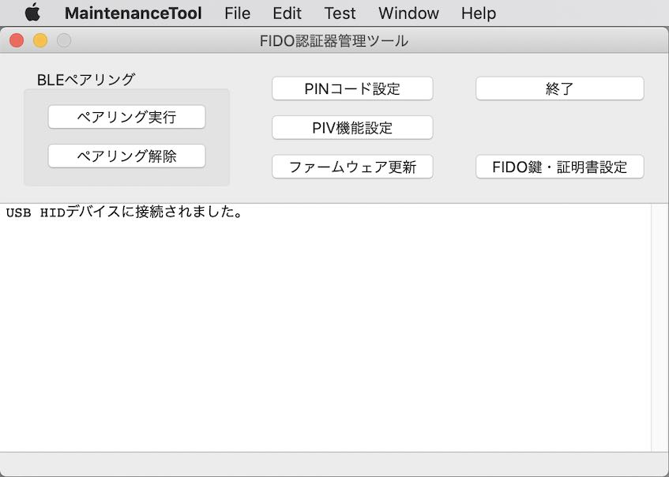
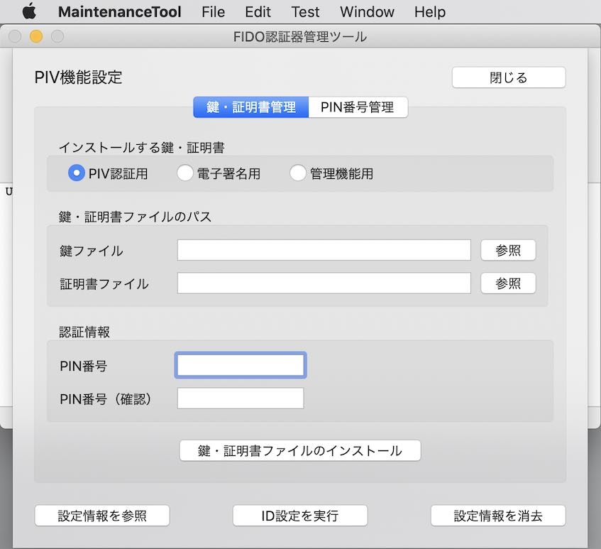
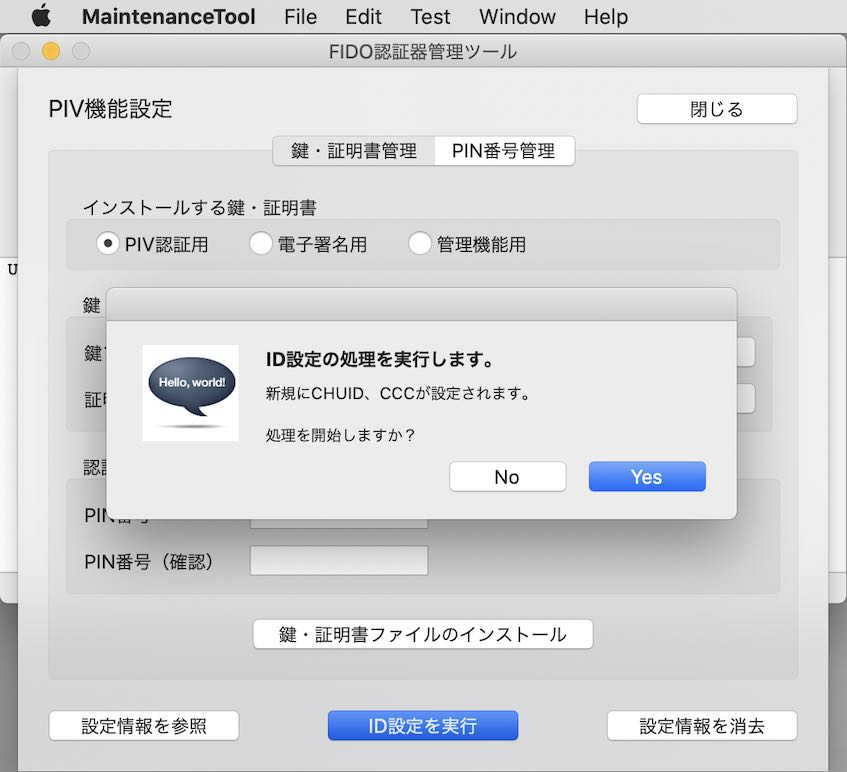
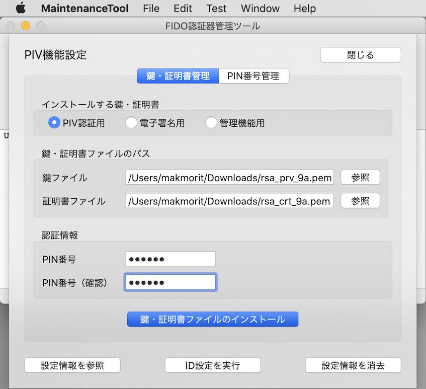
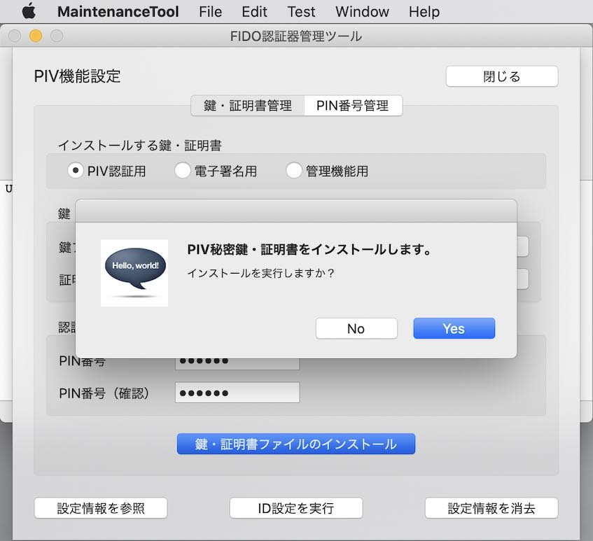
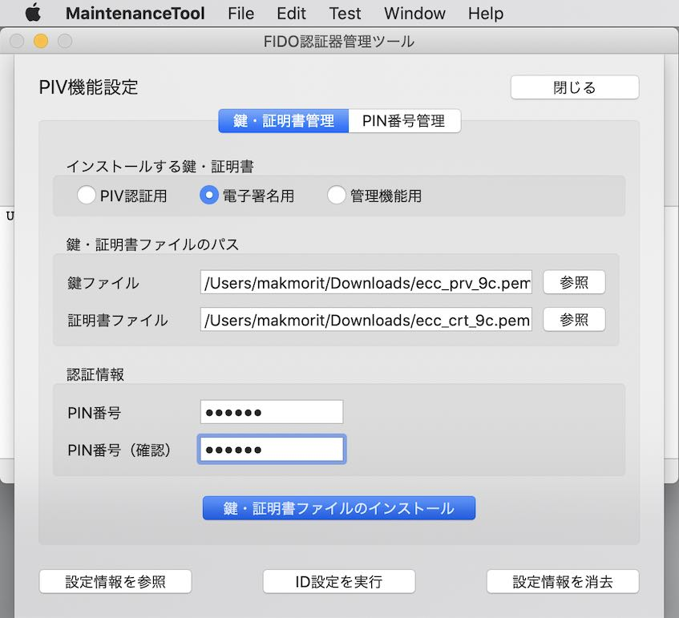

# PIV機能動作確認手順書

## 概要

[管理ツール](../../../MaintenanceTool/README.md)を使用し、[nRF52840アプリケーション](../../../nRF52840_app/firmwares/secure_device_app)のPIV機能に関する動作確認を行う手順について、以下に掲載いたします。

## 作業の準備

動作確認の前に、以下の項目について準備します。

#### MDBT50Q Dongleの準備

[nRF52840アプリケーション](../../../nRF52840_app/firmwares/secure_device_app)が書き込まれたMDBT50Q Dongleを、あらかじめ準備します。 
具体的な手順は、別ドキュメント「[nRF52840アプリケーション初回導入手順書](../../../nRF52840_app/firmwares/secure_device_app/WRITEAPP.md)」をご参照ください。

MDBT50Q Dongleを、PCのUSBポートに装着すると、下図のように、基板上の緑色のLEDが点滅している状態になります。

#### 管理ツールのインストール

あらかじめ、最新バージョンの管理ツールをPCにインストールしておきます。 
具体的な手順は、別ドキュメント「[管理ツールインストール手順](../../../MaintenanceTool/macOSApp/INSTALLPRG.md)」をご参照ください。

MDBT50Q DongleがPCのUSBポートに装着されている状態だと、管理ツール起動時、下図のようなメッセージ「USB HIDデバイスに接続されました。」が表示されます。

#### CCIDドライバーのインストール

まず最初に、macOSにCCIDドライバーをインストールします。 
具体的な手順は、別ドキュメント<b>「[CCIDドライバーインストール手順](../../../CCID/INSTALLPRG.md)」</b>をご参照ください。

#### 鍵・証明書の準備

本プロジェクトでは、PIV機能動作確認のために、テスト用の秘密鍵ファイルと自己署名証明書ファイルを用意しております。 
GitHubリポジトリーの「[`/CCID/pemForTest.zip`](../../../CCID/pemForTest.zip)」に配置しましたので、ダウンロード／解凍してご利用ください。

解凍されたファイルの内容は下記の通りです。

| # |ファイル名 |説明 |
|:-:|:-|:-|
|1|`rsa_prv_9a.pem`|PIV認証用 秘密鍵ファイル（PEM形式）|
|2|`rsa_crt_9a.pem`|PIV認証用 自己署名証明書ファイル（PEM形式）|
|3|`ecc_prv_9c.pem`|電子署名用 秘密鍵ファイル（PEM形式）|
|4|`ecc_crt_9c.pem`|電子署名用 自己署名証明書ファイル（PEM形式）|
|5|`ecc_prv_9d.pem`|管理機能用 秘密鍵ファイル（PEM形式）|
|6|`ecc_crt_9d.pem`|管理機能用 自己署名証明書ファイル（PEM形式）|

## 動作確認の実施

PIV機能の動作確認は、PIV機能設定の実行により行います。 
管理ツールのPIV機能設定画面で実行できます。

#### PIV機能設定画面の表示

管理ツール画面の「PIV機能設定」ボタンをクリックします。

PIV機能設定画面が表示されます。

以降の確認作業は、すべてこのPIV機能設定画面上で行います。

#### ID設定の実行

PIV機能設定画面下部の「ID設定を実行」ボタンをクリックします。

下図のような確認ダイアログが表示されます。 
「Yes」ボタンをクリックし、ID設定処理を実行させます。

ほどなくID設定処理が完了し、ポップアップが表示されます。

「OK」をクリックし、ポップアップを閉じます。 
これで、ID設定の実行は完了です。

#### 鍵・証明書のインストール

PIV機能に必要な、３種類の鍵・証明書をインストールします。

まず最初に、<b>PIV認証用</b>の鍵・証明書ファイルのインストールを実行します。 
画面上の「インストールする鍵・証明書」（ラジオボタン）から「PIV認証用」を選択します。 

その後、鍵・証明書ファイルを、それぞれ「参照」ボタンをクリックして選択します。 
（画面の「鍵ファイル」「証明書ファイル」欄の右側「選択」ボタンをクリックすることにより、ファイルが選択できます）

下図は、先述の「[`/CCID/pemForTest.zip`](../../../CCID/pemForTest.zip)」をダウンロード後解凍し、その解凍されたファイルを選択した状態です。 
「鍵ファイル」に`Downloads/rsa_prv_9a.pem`、「証明書ファイル」に`Downloads/rsa_crt_9a.pem`がそれぞれ選択されています。

続いて、PIV機能のPIN番号を入力します。 
（先述のFIDO2機能で設定したPIN番号とは別物です。ご注意ください）

ここでは、PIV機能のデフォルトPIN番号である`123456`を入力します。 
（確認用の欄にも、同じ数字を入力してください）

PIN番号を入力したら、画面下部の「鍵・証明書ファイルのインストール」ボタンをクリックします。

下図のような確認ダイアログが表示されます。 
「Yes」ボタンをクリックし、インストール処理を実行させます。

ほどなくインストール処理が完了し、ポップアップが表示されます。

「OK」をクリックし、ポップアップを閉じます。

引き続き、他の種類（<b>電子署名用</b>、<b>管理機能用</b>）の鍵・証明書ファイルのインストールも、上記手順と同様に実行してください。

・<b>電子署名用</b>の鍵・証明書ファイルのインストール 
（下図は「鍵ファイル」に`Downloads/ecc_prv_9c.pem`、「証明書ファイル」に`Downloads/ecc_crt_9c.pem`がそれぞれ選択されている例）

・<b>管理機能用</b>の鍵・証明書ファイルのインストール 
（下図は「鍵ファイル」に`Downloads/ecc_prv_9d.pem`、「証明書ファイル」に`Downloads/ecc_crt_9d.pem`がそれぞれ選択されている例）

以上で、鍵・証明書のインストールは完了です。

#### 設定情報を確認

ID設定と、鍵・証明書ファイルインストールが完了したら、PIV機能設定情報を確認します。 
画面下部の「設定情報を参照」ボタンをクリックします。

設定情報がポップアップ表示されます。 
下図のように、すべての項目が設定されていることを確認します。

「OK」をクリックし、ポップアップを閉じます。

## macOSでのログインテスト

上記まで確認できれば、実際にmacOSログイン時にPIV機能が利用できます。

詳細につきましては、別ドキュメント<b>「[PIN番号を使用したmacOSログイン確認手順](../../../FIDO2Device/MDBT50Q_Dongle/PIVPINLOGIN.md)」</b>をご参照願います。
