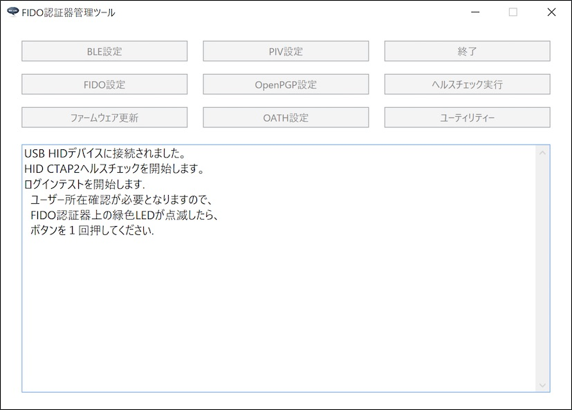

# FIDO2機能動作確認手順書（HID）

最終更新日：2023/2/8

## 概要

[管理ツール](../../../MaintenanceTool/README.md)を使用し、[nRF52840アプリケーション](../../../nRF52840_app/firmwares/secure_device_app)のFIDO2機能に関する動作確認を行う手順について、以下に掲載いたします。

本ドキュメントでは、FIDO2機能のうち、USB HIDインターフェースを経由する機能の動作確認を実施します。

## 作業の準備

動作確認の前に、以下の項目について準備します。

#### MDBT50Q Dongleの準備

[nRF52840アプリケーション](../../../nRF52840_app/firmwares/secure_device_app)が書き込まれたMDBT50Q Dongleを、あらかじめ準備します。 
具体的な手順は、別ドキュメント「[nRF52840アプリケーション初回導入手順書](../../../nRF52840_app/firmwares/secure_device_app/WRITEAPP.md)」をご参照ください。

MDBT50Q Dongleを、PCのUSBポートに装着すると、下図のように、基板上の緑色のLEDが点滅している状態になります。

#### 管理ツールのインストール

あらかじめ、最新バージョンのベンダー向け管理ツールをPCにインストールしておきます。 
手順につきましては下記ドキュメントをご参照ください。 
　・[インストール手順（Windows版）](../../../MaintenanceTool/dotNET/DEVTOOLINST.md) 
　・[インストール手順（macOS版）](../../../MaintenanceTool/macOSApp/DEVTOOLINST.md)

MDBT50Q DongleがPCのUSBポートに装着されている状態だと、管理ツール起動時、下図のようなメッセージ「USB HIDデバイスに接続されました。」が表示されます。

#### 鍵・証明書の準備

本プロジェクトでは、FIDO2機能動作確認のために、テスト用の秘密鍵／証明書ファイルを用意しております。 
GitHubリポジトリーの「[`certForFido2.zip`](../../../Research/provisionalCA/certForFido2.zip)」に配置しましたので、ダウンロード／解凍してご利用ください。

解凍されたファイルの内容は下記の通りです。

| # |ファイル名 |説明 |
|:-:|:-|:-|
|1|`fido2test.pem`|ヘルスチェック実行用秘密鍵ファイル（PEM形式）|
|2|`fido2test.crt`|ヘルスチェック実行用証明書ファイル（DER形式）[注1]|

[注1] [仮設認証局](../../../Research/provisionalCA/README.md)による署名が行われています（自己署名証明書ではありません）。ただし、[仮設認証局の証明書](../../../Research/provisionalCA/demoCA/cacert.pem)自体は自己署名になります。

## 動作確認の実施

FIDO2機能の動作確認は、管理ツールの「ヘルスチェック実行（USB）」メニューで実行できます。

#### 鍵・証明書のインストール

管理ツール画面の「FIDO鍵・証明書設定」機能により、FIDO秘密鍵ファイル（PEM形式）、証明書ファイル（DER形式）を認証器にインストールします。

手順につきましては下記ドキュメントをご参照ください。 
　・[鍵・証明書の導入手順（Windows版）](../../../MaintenanceTool/dotNET/ATTESTATION.md) 
　・[鍵・証明書の導入手順（macOS版）](../../../MaintenanceTool/macOSApp/ATTESTATION.md)

#### PIN番号の設定

管理ツール画面の「PINコード設定」機能により、FIDO機能で使用する６桁数字のPIN番号を、認証器に設定します。

手順につきましては下記ドキュメントをご参照ください。 
　・[鍵・証明書の導入手順（Windows版）](../../../MaintenanceTool/dotNET/ATTESTATION.md) 
　・[鍵・証明書の導入手順（macOS版）](../../../MaintenanceTool/macOSApp/ATTESTATION.md)

#### CTAP2ヘルスチェック実行

FIDO2のWebAuthn機能で使用される「CTAP2」のヘルスチェックを実行します。

手順につきましては下記ドキュメントをご参照ください。 
　・[CTAP2ヘルスチェック実行手順（Windows版）](../../../MaintenanceTool/dotNET/CTAP2HCHECK.md) 
　・[CTAP2ヘルスチェック実行手順（macOS版）](../../../MaintenanceTool/macOSApp/CTAP2HCHECK.md)
