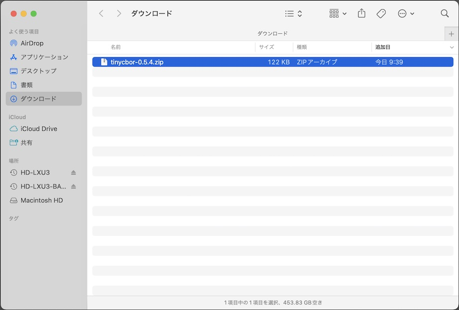
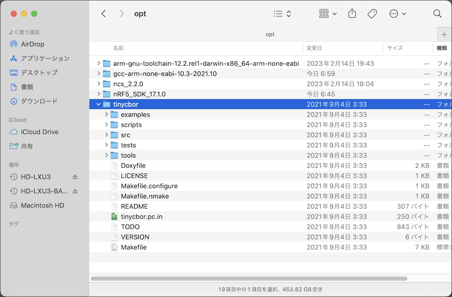
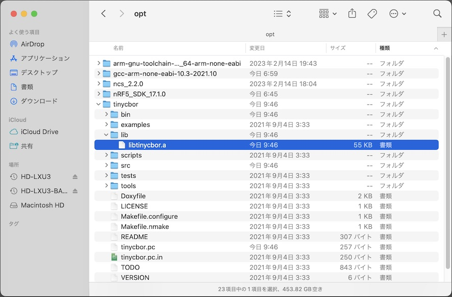
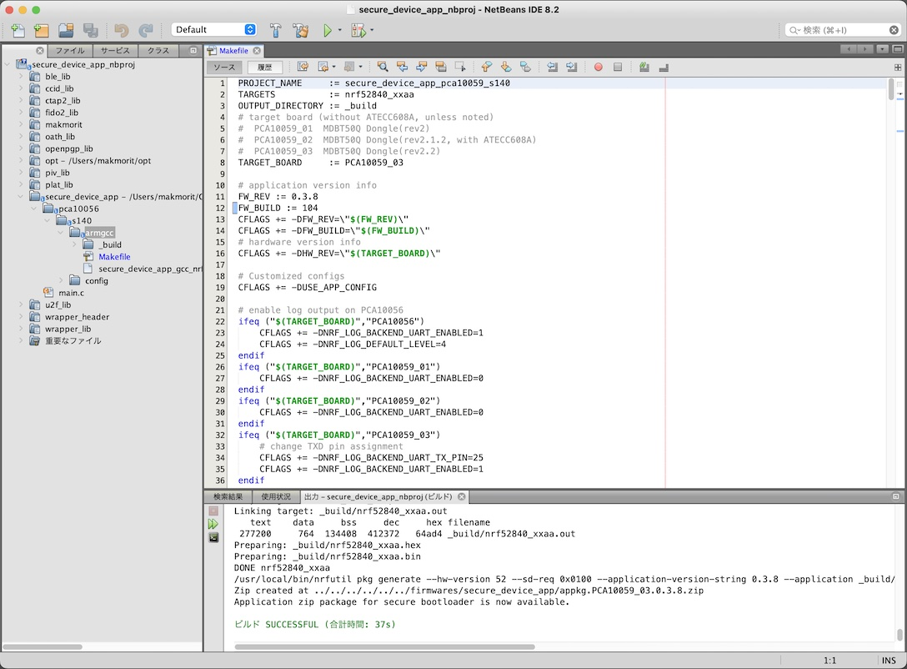

# tinycbor導入手順

Intel社が無償公開しているCBORライブラリー「<b>[tinycbor](https://github.com/intel/tinycbor)</b>」を、NetBeansプロジェクトに導入する手順について掲載しています。

## CBORライブラリーの作成

CBORライブラリーファイル「libtinycbor.a」を作成する手順は下記になります。

### tinycborのソースコード取得

tinycborのソースコードを、GitHubリポジトリー（[https://github.com/intel/tinycbor](https://github.com/intel/tinycbor)）からチェックアウトします。<br>
最新版ではなく、<b>v0.5.4のコードを取得</b>することに注意してください。


圧縮ファイル`tinycbor-0.5.4.zip`がダウンロードされます。



ダウンロードされた圧縮ファイル`tinycbor-0.5.4.zip`を、`${HOME}/opt/tinycbor`配下に解凍します。<br>
下図のような配置イメージになるかと存じます。



### tinycborのビルド

以下のコマンドを実行します。<br>
arm gccコマンドのパスは、適宜読み替えてください。

```
cd ${HOME}/opt/tinycbor
make clean

export GNU_COMMAND_PREFIX="${HOME}/opt/gcc-arm-none-eabi-10.3-2021.10/bin/arm-none-eabi"
make CC="${GNU_COMMAND_PREFIX}-gcc" AR="${GNU_COMMAND_PREFIX}-ar" LDFLAGS="-lc -lnosys --specs=nosys.specs -mcpu=cortex-m4 -mfloat-abi=hard -mfpu=fpv4-sp-d16 -mthumb -mabi=aapcs" CFLAGS="-mcpu=cortex-m4 -mfloat-abi=hard -mfpu=fpv4-sp-d16 -mthumb -mabi=aapcs -DFLOAT_ABI_HARD -std=gnu11 -D__GLIBC__"
```

下記は実行例になります。

```
bash-3.2$ cd ${HOME}/opt/tinycbor
bash-3.2$ make clean
.config file not yet created
/Library/Developer/CommandLineTools/usr/bin/make -f ./Makefile.configure OUT='>&9' configure 9> .config
rm -f src/cborerrorstrings.o src/cborencoder.o src/cborencoder_close_container_checked.o src/cborparser.o src/cborpretty.o src/cborparser_dup_string.o src/cborpretty_stdio.o src/cbortojson.o src/cborvalidation.o
rm -f src/cborerrorstrings.pic.o src/cborencoder.pic.o src/cborencoder_close_container_checked.pic.o src/cborparser.pic.o src/cborpretty.pic.o src/cborparser_dup_string.pic.o src/cborpretty_stdio.pic.o src/cbortojson.pic.o src/cborvalidation.pic.o
rm -f tools/cbordump/cbordump.o
rm -f bin/cbordump
rm -f bin/json2cbor
rm -f lib/libtinycbor.a
rm -f lib/libtinycbor-freestanding.a
rm -f tinycbor.pc
rm -f lib/libtinycbor.so*
test -e tests/Makefile && /Library/Developer/CommandLineTools/usr/bin/make -C tests clean || :
bash-3.2$
bash-3.2$ export GNU_COMMAND_PREFIX="${HOME}/opt/gcc-arm-none-eabi-10.3-2021.10/bin/arm-none-eabi"
bash-3.2$ make CC="${GNU_COMMAND_PREFIX}-gcc" AR="${GNU_COMMAND_PREFIX}-ar" LDFLAGS="-lc -lnosys --specs=nosys.specs -mcpu=cortex-m4 -mfloat-abi=hard -mfpu=fpv4-sp-d16 -mthumb -mabi=aapcs" CFLAGS="-mcpu=cortex-m4 -mfloat-abi=hard -mfpu=fpv4-sp-d16 -mthumb -mabi=aapcs -DFLOAT_ABI_HARD -std=gnu11 -D__GLIBC__"
/Users/makmorit/opt/gcc-arm-none-eabi-10.3-2021.10/bin/arm-none-eabi-gcc  -I./src -std=gnu99 -mcpu=cortex-m4 -mfloat-abi=hard -mfpu=fpv4-sp-d16 -mthumb -mabi=aapcs -DFLOAT_ABI_HARD -std=gnu11 -D__GLIBC__  -c -o src/cborerrorstrings.o src/cborerrorstrings.c
/Users/makmorit/opt/gcc-arm-none-eabi-10.3-2021.10/bin/arm-none-eabi-gcc  -I./src -std=gnu99 -mcpu=cortex-m4 -mfloat-abi=hard -mfpu=fpv4-sp-d16 -mthumb -mabi=aapcs -DFLOAT_ABI_HARD -std=gnu11 -D__GLIBC__  -c -o src/cborencoder.o src/cborencoder.c
/Users/makmorit/opt/gcc-arm-none-eabi-10.3-2021.10/bin/arm-none-eabi-gcc  -I./src -std=gnu99 -mcpu=cortex-m4 -mfloat-abi=hard -mfpu=fpv4-sp-d16 -mthumb -mabi=aapcs -DFLOAT_ABI_HARD -std=gnu11 -D__GLIBC__  -c -o src/cborencoder_close_container_checked.o src/cborencoder_close_container_checked.c
/Users/makmorit/opt/gcc-arm-none-eabi-10.3-2021.10/bin/arm-none-eabi-gcc  -I./src -std=gnu99 -mcpu=cortex-m4 -mfloat-abi=hard -mfpu=fpv4-sp-d16 -mthumb -mabi=aapcs -DFLOAT_ABI_HARD -std=gnu11 -D__GLIBC__  -c -o src/cborparser.o src/cborparser.c
/Users/makmorit/opt/gcc-arm-none-eabi-10.3-2021.10/bin/arm-none-eabi-gcc  -I./src -std=gnu99 -mcpu=cortex-m4 -mfloat-abi=hard -mfpu=fpv4-sp-d16 -mthumb -mabi=aapcs -DFLOAT_ABI_HARD -std=gnu11 -D__GLIBC__  -c -o src/cborpretty.o src/cborpretty.c
/Users/makmorit/opt/gcc-arm-none-eabi-10.3-2021.10/bin/arm-none-eabi-gcc  -I./src -std=gnu99 -mcpu=cortex-m4 -mfloat-abi=hard -mfpu=fpv4-sp-d16 -mthumb -mabi=aapcs -DFLOAT_ABI_HARD -std=gnu11 -D__GLIBC__  -c -o src/cborparser_dup_string.o src/cborparser_dup_string.c
/Users/makmorit/opt/gcc-arm-none-eabi-10.3-2021.10/bin/arm-none-eabi-gcc  -I./src -std=gnu99 -mcpu=cortex-m4 -mfloat-abi=hard -mfpu=fpv4-sp-d16 -mthumb -mabi=aapcs -DFLOAT_ABI_HARD -std=gnu11 -D__GLIBC__  -c -o src/cborpretty_stdio.o src/cborpretty_stdio.c
/Users/makmorit/opt/gcc-arm-none-eabi-10.3-2021.10/bin/arm-none-eabi-gcc  -I./src -std=gnu99 -mcpu=cortex-m4 -mfloat-abi=hard -mfpu=fpv4-sp-d16 -mthumb -mabi=aapcs -DFLOAT_ABI_HARD -std=gnu11 -D__GLIBC__  -c -o src/cbortojson.o src/cbortojson.c
/Users/makmorit/opt/gcc-arm-none-eabi-10.3-2021.10/bin/arm-none-eabi-gcc  -I./src -std=gnu99 -mcpu=cortex-m4 -mfloat-abi=hard -mfpu=fpv4-sp-d16 -mthumb -mabi=aapcs -DFLOAT_ABI_HARD -std=gnu11 -D__GLIBC__  -c -o src/cborvalidation.o src/cborvalidation.c
/Users/makmorit/opt/gcc-arm-none-eabi-10.3-2021.10/bin/arm-none-eabi-ar cqs lib/libtinycbor.a src/cborerrorstrings.o src/cborencoder.o src/cborencoder_close_container_checked.o src/cborparser.o src/cborpretty.o src/cborparser_dup_string.o src/cborpretty_stdio.o src/cbortojson.o src/cborvalidation.o
/Users/makmorit/opt/gcc-arm-none-eabi-10.3-2021.10/bin/arm-none-eabi-gcc  -I./src -std=gnu99 -mcpu=cortex-m4 -mfloat-abi=hard -mfpu=fpv4-sp-d16 -mthumb -mabi=aapcs -DFLOAT_ABI_HARD -std=gnu11 -D__GLIBC__  -c -o tools/cbordump/cbordump.o tools/cbordump/cbordump.c
/Users/makmorit/opt/gcc-arm-none-eabi-10.3-2021.10/bin/arm-none-eabi-gcc -o bin/cbordump -lc -lnosys --specs=nosys.specs -mcpu=cortex-m4 -mfloat-abi=hard -mfpu=fpv4-sp-d16 -mthumb -mabi=aapcs tools/cbordump/cbordump.o lib/libtinycbor.a -lm
sed > tinycbor.pc < tinycbor.pc.in \
		-e 's,@prefix@,/usr/local,' \
		-e 's,@exec_prefix@,/usr/local,' \
		-e 's,@libdir@,/usr/local/lib,' \
		-e 's,@includedir@,/usr/local/include,' \
		-e 's,@version@,0.5.4,'
bash-3.2$ echo $?
0
bash-3.2$
```

CBORライブラリーファイル「libtinycbor.a」が、サブディレクトリー「lib」配下に作成されていることを確認します。




以上で、CBORライブラリーファイル「libtinycbor.a」作成は完了です。

## CBORライブラリーの導入

### メイクファイルの編集

NetBeansを起動して、メイクファイルを開き、以下の２点を追加記述します。

- インクルードファイルディレクトリー `$(TINYCBOR_ROOT)/src` の指定
- リンクするライブラリーファイル `$(TINYCBOR_ROOT)/lib/libtinycbor.a` の指定

具体的には下記のような記述になります。

```
PROJECT_NAME     := secure_device_app_pca10059_s140
TARGETS          := nrf52840_xxaa
:
# tinycbor root directory
TINYCBOR_ROOT := $(HOME)/opt/tinycbor
:
INC_FOLDERS += \
  $(SDK_ROOT)/components/ble/nrf_ble_scan \
  $(SDK_ROOT)/components/libraries/bootloader \
  $(TINYCBOR_ROOT)/src \
:
# Libraries common to all targets
LIB_FILES += \
  $(SDK_ROOT)/external/nrf_cc310/lib/cortex-m4/hard-float/libnrf_cc310_0.9.13.a \
  $(TINYCBOR_ROOT)/lib/libtinycbor.a \
```

### ビルドの実行

メイクファイルの編集が終わったら、NetBeans上でビルドを実行します。



下記ログのように「ビルド SUCCESSFUL」と表示されれば成功です。

```
cd '/Users/makmorit/GitHub/onecard-fido/nRF52840_app/examples/diverta/secure_device_app/pca10056/s140/armgcc'
make
mkdir _build
cd _build && mkdir nrf52840_xxaa
Assembling file: gcc_startup_nrf52840.S
Compiling file: bsp.c
Compiling file: bsp_btn_ble.c
Compiling file: nrf_hw_backend_init.c
:
Compiling file: ccid_oath_list.c
Compiling file: ccid_oath_object.c
Compiling file: ccid_oath_totp.c
Linking target: _build/nrf52840_xxaa.out
   text	   data	    bss	    dec	    hex	filename
 277200	    764	 134408	 412372	  64ad4	_build/nrf52840_xxaa.out
Preparing: _build/nrf52840_xxaa.hex
Preparing: _build/nrf52840_xxaa.bin
DONE nrf52840_xxaa
/usr/local/bin/nrfutil pkg generate --hw-version 52 --sd-req 0x0100 --application-version-string 0.3.8 --application _build/nrf52840_xxaa.hex --key-file /Users/makmorit/secure_bootloader_prvkey.pem ../../../../../../firmwares/secure_device_app/appkg.PCA10059_03.0.3.8.zip
Zip created at ../../../../../../firmwares/secure_device_app/appkg.PCA10059_03.0.3.8.zip
Application zip package for secure bootloader is now available.

ビルド SUCCESSFUL (合計時間: 37s)
```

以上で、tinycborのNetBeansプロジェクト導入は完了です。
