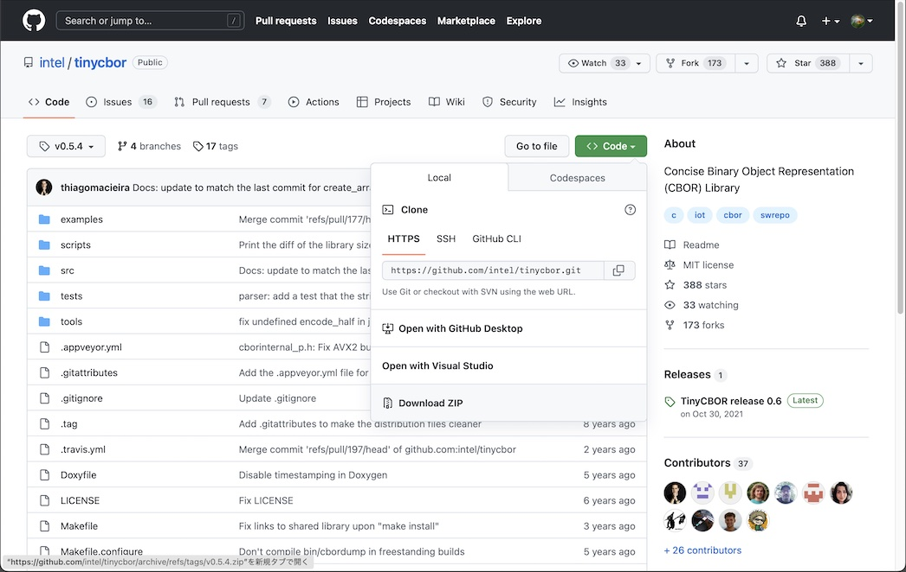

# MDBT50Q Dongleファームウェア（version 0.3.0）導入手順書

## 概要

[MDBT50Q Dongle](../../../FIDO2Device/MDBT50Q_Dongle/README.md)に導入されている、[nRF52840アプリケーション](../../../nRF52840_app/firmwares/secure_device_app)ファームウェアを、<b>[version 0.3.0](https://github.com/diverta/onecard-fido/blob/doc-20210203/nRF52840_app/firmwares/secure_device_app)</b>に更新する手順について、以下に掲載いたします。

#### 経緯・背景

MDBT50Q Dongle新ファームウェア（[version 0.3.0](https://github.com/diverta/onecard-fido/blob/doc-20210203/nRF52840_app/firmwares/secure_device_app)）と旧ファームウェア（[version 0.2.13](https://github.com/diverta/onecard-fido/tree/doc-20210107/nRF5_SDK_v15.3.0/firmwares)）では、稼働ソフトデバイスが異なる（前者＝v7.2、後者＝v6.1.1）ため、旧-->新ファームウェア移行のためには、ソフトデバイスの置き換えが必要となります。

他方、MDBT50Q Dongleファームウェア（version 0.3.0）は、そのFlash ROM内におけるサイズが比較的大きいことが原因となり、管理ツールやnRF Utilによる通常のファームウェア更新機能を使用したソフトデバイス、アプリケーションの同時置き換えが出来ないようです。

したがいまして、旧-->新ファームウェア移行のためには、いったんMDBT50Q Dongleを初期化状態にした上で、ソフトデバイス（v7.2）、アプリケーションを順に導入する必要があります。 
本手順書は、この導入作業の手順について掲載しております。

#### 導入による影響等

- <b>使用機材について</b> 
MDBT50Q Dongleを初期化状態に戻す必要があるため、[MDBT50Q DongleをnRF52840 DKに直接配線](../../../nRF52840_app/firmwares/secure_bootloader/WRITESBL.md)する必要があります。

- <b>データについて</b> 
この導入作業を実施すると、MDBT50Q DongleのFlash ROM全領域が消去されるため、MDBT50Q Dongleに導入した秘密鍵・証明書や、PIN番号、WebAuthn認証情報などは、すべて消去されます。

## 事前準備

MDBT50Q Dongleファームウェア（version 0.3.0、以下単に「ファームウェア」）の導入に必要な環境を準備します。

#### 動作確認時の環境

- macOS Catalina（10.15.5）
- nRF52840 DK（PCA10056）: プログラムの書込みに使用
- MDBT50Q Dongle（rev2）: プログラムの書込み先となるターゲット基板

#### 書込み用ツールのインストール

以下のツールを、あらかじめPCにインストールしておきます。

- <b>nRF Command Line Tools</b> 
詳細につきましては、手順書<b>「[NetBeansインストール手順](../../../nRF52840_app/NETBEANSINST.md)」</b>内のトピック<b>「nRFコマンドラインツール」</b>をご参照ください。

- <b>nRF Connect for Desktop</b> 
詳細につきましては、手順書<b>「[nRF Connect for Desktop導入手順](../../../nRF52840_app/NRFCONNECTINST.md)」</b>をご参照ください。

#### 管理ツールのインストール

ファームウェア書込みは、管理ツールを使用して行いますので、あらかじめ、[バージョン0.1.35](https://github.com/diverta/onecard-fido/blob/doc-20210203/MaintenanceTool/macOSApp/MaintenanceTool.pkg)以降の管理ツールをPCにインストールしておきます。 
具体的な手順は、別ドキュメント<b>「[管理ツールインストール手順](../../../MaintenanceTool/macOSApp/INSTALLPRG.md)」</b>をご参照ください。

## MDBT50Q Dongleの初期化

MDBT50Q Dongleを初期状態（ブートローダーとソフトデバイスだけが書き込まれた状態）に戻す作業を行います。 
詳細につきましては、別途ドキュメント<b>「[USBブートローダー書込み手順書](../../../nRF52840_app/firmwares/secure_bootloader/WRITESBL.md)」</b>をご参照ください。

前述手順により、MDBT50Q Dongleの初期化が完了すると、基板上で緑色・橙色のLEDが同時点灯している状態となります。

## ファームウェアの書込み

[管理ツール](../../../MaintenanceTool)を使用し、MDBT50Q Dongleに、ファームウェアを書込みます。

#### ブートローダーモードに遷移

<b>MDBT50Q Dongle〜nRF52840 DKとの配線が外してあり、かつ、nRF52840 DKの電源がOffになっていることを確認</b>後、MDBT50Q DongleをPCのUSBポートに装着します。 
ブートローダーモードに遷移し、MDBT50Q Dongleの基板上で、緑色・橙色のLEDが同時点灯します。

ブートローダーモードに遷移させると、管理ツールでファームウェアの書込みができるようになります。

#### 書込みの実行

[管理ツール](../../../MaintenanceTool)の「ファームウェア新規導入」機能を実行し、MDBT50Q Dongleにファームウェアを書込みます。 
詳細につきましては、別途ドキュメント<b>「[ファームウェア新規導入手順](../../../MaintenanceTool/macOSApp/INSTALLFIRMWARE.md)」</b>をご参照ください。

書込処理が終了すると、MDBT50Q Dongleが自動的にリセットされ、[nRF52840アプリケーション](../../../nRF52840_app/firmwares/secure_device_app)がスタートします。 
アイドル時であることを表示する緑色のLEDが点滅していることを確認します。

以上で、MDBT50Q Dongleファームウェア（version 0.3.0）の導入は完了です。
