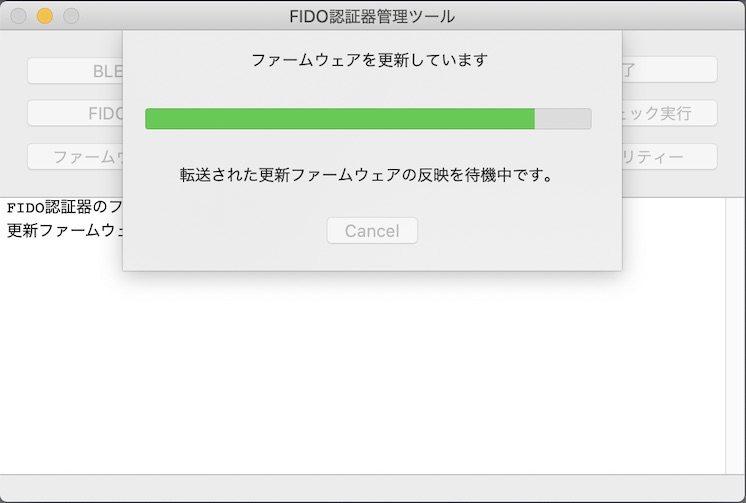

# ファームウェア更新機能（BLE）

## 概要
ブートローダー「[MCUboot](https://www.mcuboot.com/documentation/readme-zephyr/)」を導入した[MDBT50Q Dongle](../FIDO2Device/MDBT50Q_Dongle/README.md)に対し、管理ツールから、ファームウェアを更新できる機能です。<br>
ZephyrアプリケーションのBLE DFU機能（[BLE SMPサービス](https://developer.nordicsemi.com/nRF_Connect_SDK/doc/1.1.0/nrf/include/bluetooth/services/dfu_smp_c.html)）を使用して実装されています。

## 前提

[MDBT50Q Dongle](../FIDO2Device/MDBT50Q_Dongle/README.md)に、<b>BLE SMPサービスを組み込んだ[Zephyrアプリケーション](../nRF5340_app/secure_device_app)</b>が導入されていることが前提となります。

## プログラムの実装

プログラム実装に関する情報を掲載いたします。

#### 関連モジュール

macOS版管理ツールの関連モジュール配下になります。

|# |モジュール名 |内容 |備考|
|:-:|:-|:-|:-|
|1|BLEDFUDefine|各種定義を収容||
|2|BLEDFUProcessingWindow|処理進捗画面||
|3|BLEDFUStartWindow|処理開始画面||
|4|ToolBLEDFUCommand|DFUコマンドクラス||
|5|ToolBLESMPCommand|DFUトランザクションクラス||
|6|mcumgr_app_image|ファームウェア更新イメージを扱うモジュール||
|7|mcumgr_cbor_decode|DFUレスポンス（CBOR形式）を解析するモジュール||

#### メニュー選択〜処理開始画面の表示

管理ツールの<b>ファームウェア更新（以下「DFU」）</b>機能は`ToolBLEDFUCommand`というクラス（以下「DFU処理クラス」）で実装されています。<br>
メイン画面クラスに、以下のようなプロパティーを定義し、DFU処理クラスをインスタンス化します。

```
//
// MaintenanceTool/macOSApp/MaintenanceToolCommon/ToolAppCommand.m
//
@interface ToolAppCommand () <ToolHIDCommandDelegate, ToolBLECommandDelegate>
    @property (nonatomic) ToolBLEDFUCommand     *toolBLEDFUCommand;
    :

@implementation ToolAppCommand
    - (id)initWithDelegate:(id<ToolAppCommandDelegate>)delegate {
        self = [super init];
        if (self) {
            :
            // DFU機能の初期設定
            [self setToolBLEDFUCommand:[[ToolBLEDFUCommand alloc] initWithDelegate:self]];
            :
```

メイン画面のメニュー選択により、メソッド`bleDfuProcessWillStart`を呼び出すと、DFU処理実行が開始されます。<br>
事前に、`checkUSBHIDConnection`により、MDBT50Q DongleがPCのUSBポートに装着されているかチェックします。

```
@implementation ToolAppCommand
    - (void)bleDfuProcessWillStart:(id)sender parentWindow:(NSWindow *)parentWindow {
        // ファームウェア更新処理を実行するため、DFU開始画面を表示
        [[self delegate] disableUserInterface];
        [[self toolBLEDFUCommand] bleDfuProcessWillStart:sender parentWindow:parentWindow toolBLECommandRef:[self toolBLECommand]];
    }
```

`bleDfuProcessWillStart`が呼び出されると、事前にBLE経由でバージョン情報を取得します。

```
//
// MaintenanceTool/macOSApp/BLEDFU/ToolBLEDFUCommand.m
//
@implementation ToolBLEDFUCommand
    - (void)bleDfuProcessWillStart:(id)sender parentWindow:(NSWindow *)parentWindow toolBLECommandRef:(id)toolBLECommandRef {
        :
        // 事前にBLE経由でバージョン情報を取得
        [self setToolBLECommand:(ToolBLECommand *)toolBLECommandRef];
        [[self toolBLECommand] bleCommandWillProcess:COMMAND_BLE_GET_VERSION_INFO forCommand:self];
    }
```

バージョン情報が応答されると、認証器のバージョンが、管理ツールに同梱されているファームウェア更新イメージのバージョンより古いことを確認します。<br>
その後、処理開始画面（下図ご参照）がモーダル表示されます。

```
@implementation ToolBLEDFUCommand
    - (void)notifyFirmwareVersionForStart:(NSData *)response {
        :
        // 戻りメッセージからバージョン情報を抽出し内部保持
        [self extractVersionAndBoardnameFrom:response];
        // 認証器の現在バージョンと基板名が取得できたら、ファームウェア更新画面を表示
        [self resumeDfuProcessStart];
    }

    - (void)resumeDfuProcessStart {
        // 基板名に対応するファームウェア更新イメージファイルから、バイナリーイメージを読込
        if ([self readDFUImageFile] == false) {
        ：
        // ツール同梱のイメージファイルのバージョンが、稼働中のファームウェアのバージョンより古い場合は処理を中止
        if ([self dfuImageIsAvailable] == false) {
        ：
        // 処理開始画面を表示
        [self dfuStartWindowWillOpen];
    }
```

処理開始画面（`BLEDFUStartWindow`）は下図のようなイメージになります。


#### 処理開始画面〜処理進捗画面の表示

処理開始画面上でOKボタンをクリックすると、処理開始画面が自動的に閉じられたのち、DFU処理クラスのメソッド`commandWillChangeToBootloaderMode`が呼び出されます。

```
@implementation ToolBLEDFUCommand
    - (void)dfuStartWindowDidClose:(id)sender modalResponse:(NSInteger)modalResponse {
        // 画面を閉じる
        [[self bleDfuStartWindow] close];
        ：
        // DFU処理開始
        [self invokeDFUProcess];
    }
```

DFU処理クラスは、処理開始画面クローズ時に、処理進捗画面（下図ご参照）をモーダル表示し、DFU処理を別スレッドで開始させます。

```
@implementation ToolBLEDFUCommand
    - (void)invokeDFUProcess {
        :
        // 処理進捗画面（ダイアログ）をモーダルで表示
        [self bleDfuProcessingWindowWillOpen];
        :
        // サブスレッドでDFU処理を実行開始
        [self startDFUProcess];
    }
```

処理進捗画面（`BLEDFUProcessingWindow`）は下図のようなイメージになります。


#### 更新イメージ転送開始

ファームウェア更新イメージは、BLE SMPサービスを使用して送信します。

`startDFUProcess`では、まずBLE SMPサービスに接続する処理を実行します。<br>
同時にタイムアウト監視（300秒）を開始します。

```
@implementation ToolBLEDFUCommand
    - (void)startDFUProcess {
        // 処理タイムアウト監視を開始
        [self startDFUTimeoutMonitor];
        // BLE DFU処理を開始
        [self doConnect];
        :

    - (void)doConnect {
        // リセット要求済みフラグをクリア
        [self setResetApplicationRequested:false];
        // BLE SMPサービスに接続 --> doRequestGetSlotInfoが呼び出される
        [[self toolBLESMPCommand] commandWillConnect];
    }
```

BLE SMPサービスに接続すると、最初にスロット照会を実行し、スロット（認証器内部のFlash ROM領域）に関する情報を取得します。<br>
取得したスロット情報をチェックし、OKであれば、転送処理が開始されます。

```
@implementation ToolBLEDFUCommand
    - (void)doRequestGetSlotInfo {
        ：
        // BLE経由でスロット照会を実行
        [[self toolBLESMPCommand] commandWillProcess:COMMAND_BLE_DFU_GET_SLOT_INFO request:nil forCommand:self];
    }

    - (void)doResponseGetSlotInfo:(bool)success response:(NSData *)response {
        ：
        // スロット照会情報を参照し、チェックでNGの場合、BLE接続を切断
        if ([self checkSlotInfoWith:response] == false) {
        ：
        // 転送イメージ全体を取得
        [self setImageToUpload:[[NSData alloc] initWithBytes:mcumgr_app_image_bin() length:mcumgr_app_image_bin_size()]];
        ：
        // 転送処理に移行
        [self doRequestUploadImage];
    }

```

#### 更新イメージ転送

転送処理では、ファームウェア更新イメージを240バイト前後のフレームに分割して送信します。[注1]<br>
同時に、処理進捗画面のプログレスバーを更新するための進捗値（0〜125）を、処理進捗画面に通知します。[注2]

```
@implementation ToolBLEDFUCommand
    - (void)doRequestUploadImage {
        // BLE経由でイメージ転送を実行
        [[self toolBLESMPCommand] commandWillProcess:COMMAND_BLE_DFU_UPLOAD_IMAGE request:[self imageToUpload] forCommand:self];
    }

    - (void)doResponseUploadImage:(bool)success response:(NSData *)response {
        ：
        // 転送結果情報の off 値を転送済みバイト数に設定
        size_t imageBytesSent = mcumgr_cbor_decode_result_info_off();
        [[self toolBLESMPCommand] setImageBytesSent:imageBytesSent];
        // 転送比率を計算
        size_t imageBytesTotal = [[self imageToUpload] length];
        int percentage = (int)imageBytesSent * 100 / (int)imageBytesTotal;
        [[ToolLogFile defaultLogger] debugWithFormat:@"DFU image sent %d bytes (%d%%)", imageBytesSent, percentage];
        // 転送状況を画面表示
        NSString *progressMessage = [NSString stringWithFormat:MSG_DFU_PROCESS_TRANSFER_IMAGE_FORMAT, percentage];
        [self notifyProgress:progressMessage progressValue:percentage];
        // イメージ全体が転送されたかどうかチェック
        if (imageBytesSent < imageBytesTotal) {
            :
            // 転送処理を続行
            [self doRequestUploadImage];
        } else {
            :
            // 反映要求に移行
            [self doRequestChangeImageUpdateMode];
        }
    }
```

処理進捗画面は、進捗通知（`notifyProgress`）により、画面上の進捗メッセージを切り替えます。<br>
下図は、ファームウェア更新イメージ転送中の様子です。


[注1] １回あたりの転送バイト数は、下位クラスの`ToolBLESMPCommand`内部で、データ本体が240バイトに収まるよう計算されます。<br>
[注2] 進捗値通知のステップは、転送率（0-100）の通知と、転送完了後に行われる反映待ち経過秒数（25秒間）の通知に分かれています。すなわち、転送中は進捗値が0〜100で推移し、転送後の反映待ちでは進捗値が101〜125で推移します。

#### 更新イメージ転送完了

ファームウェア更新イメージが全て転送されると、反映要求が実行されます。<br>
レスポンスのスロット情報をチェックし、OKであれば、ファームウェア更新イメージを反映させるためのリセット要求が実行されます。

```
@implementation ToolBLEDFUCommand
    - (void)doRequestChangeImageUpdateMode {
        ：
        // BLE経由で反映要求を実行
        [[self toolBLESMPCommand] commandWillProcess:COMMAND_BLE_DFU_CHANGE_IMAGE_UPDATE_MODE request:hash forCommand:self];
    }

    - (void)doResponseChangeImageUpdateMode:(bool)success response:(NSData *)response {
        ：
        // スロット照会情報を参照し、チェックでNGの場合、BLE接続を切断
        if ([self checkUploadedSlotInfoWith:response] == false) {
        ：
        // リセット要求処理に移行
        [self doRequestResetApplication];
    }
```

リセット要求を実行すると、BLE接続が自動的に切断されます。

```
@implementation ToolBLEDFUCommand
    - (void)doRequestResetApplication {
        // BLE経由でリセット要求を実行
        [[self toolBLESMPCommand] commandWillProcess:COMMAND_BLE_DFU_RESET_APPLICATION request:nil forCommand:self];
    }

    - (void)doResponseResetApplication:(bool)success response:(NSData *)response {
        ：
        // nRF側が自動的にリセット --> 切断検知によりDFU反映待ち処理に移行
        [[ToolLogFile defaultLogger] debug:@"Requested to reset application"];
    }
```

BLE切断検知時は`bleSmpCommandDidDisconnectWithError`が実行されます。<br>
管理ツール側はファームウェア更新イメージの反映待ち（25秒間の待機状態）に入ります。

```
@implementation ToolBLEDFUCommand
    - (void)bleSmpCommandDidDisconnectWithError:(NSError *)error {
        // リセット要求中に接続断が検知された場合
        if (error && [self resetApplicationRequested]) {
            // リセット要求済みフラグをクリア
            [self setResetApplicationRequested:false];
            // DFU反映待ち処理に移行
            dispatch_async([self subQueue], ^{
                [self performDFUUpdateMonitor];
            });
            ：
    }

    - (void) performDFUUpdateMonitor {
        // 反映待ち（リセットによるファームウェア再始動完了まで待機）
        for (int i = 0; i < DFU_WAITING_SEC_ESTIMATED; i++) {
            // 処理進捗画面に通知
            [self notifyProgress:MSG_DFU_PROCESS_WAITING_UPDATE progressValue:(100 + i)];
            [NSThread sleepForTimeInterval:1.0];
        }
        // 処理進捗画面に通知
        [self notifyProgress:MSG_DFU_PROCESS_CONFIRM_VERSION progressValue:(100 + DFU_WAITING_SEC_ESTIMATED)];
        ：
    }
```

下図は、ファームウェア更新が反映されるのを待機している様子です。



#### 更新イメージ反映完了

DFU処理クラスは、25秒間の待機後、BLE経由でバージョン情報照会を実行し、現在バージョン（MDBT50Q Dongle上に反映されているバージョン）を問い合わせます。

```
    - (void) performDFUUpdateMonitor {
        // 反映待ち（リセットによるファームウェア再始動完了まで待機）
        for (int i = 0; i < DFU_WAITING_SEC_ESTIMATED; i++) {
            :
            [NSThread sleepForTimeInterval:1.0];
        }
        :
        // BLE経由でバージョン情報を取得 --> notifyFirmwareVersionが呼び出される
        [[self toolBLECommand] bleCommandWillProcess:COMMAND_BLE_GET_VERSION_INFO forCommand:self];
    }
```

MDBT50Q Dongleからバージョン情報が応答されると、MDBT50Q Dongleに転送したファームウェアのバージョンと、現在バージョンを比較します。

```
    - (void)notifyFirmwareVersionForComplete:(NSData *)response {
        :
        // 戻りメッセージからバージョン情報を抽出し内部保持
        [self extractVersionAndBoardnameFrom:response];
        // バージョン情報を比較して終了判定
        [self compareUpdateVersion];
    }

    - (void)compareUpdateVersion {
        :
        // バージョン情報を比較
        bool ret = [self compareUpdateCurrentVersionToAppImage:[self currentVersion]];
        :
    }

    - (bool)compareUpdateCurrentVersionToAppImage:(NSString *)update {
        // バージョン情報を比較
        char *fw_version = mcumgr_app_image_bin_version();
        NSString *expected = [[NSString alloc] initWithUTF8String:fw_version];
        if (strcmp([update UTF8String], fw_version) == 0) {
            // バージョンが同じであればDFU処理は正常終了とする
            [self notifyMessage:
             [NSString stringWithFormat:MSG_DFU_FIRMWARE_VERSION_UPDATED, expected]];
            return true;
        :
    }
```

前述の比較結果、バージョンが同じであれば反映確認OKと判定し、DFU処理が正常終了します。


## プログラムの仕様

プログラムの仕様に関する情報を掲載いたします。

#### DFUの流れについて

DFU機能は、以下の流れで行われます。

| # |項目 |処理内容 |
|:-:|:-|:-|
|1|処理タイムアウト監視開始|300秒経過でタイムアウトと判定します。<br>（DFUの所要時間は240秒前後です）|
|2|DFU処理開始指示|サブスレッド上で行われます。|
|3|DFUイメージ抽出|ファームウェア更新イメージファイルを読込み、DFUイメージを抽出します。<br>また、イメージファイル名から更新バージョン文字列を取得します。<br>ファイル名は`app_update.<基板名>.<バージョン文字列>.bin`になります。|
|4|DFU対象デバイスに接続|認証器に、BLE経由で接続します。|
|5|DFUトランザクション実行|認証器に、前述のファームウェア更新イメージを転送します。|
|6|DFU対象デバイスから切断|Zephyrアプリケーション側のリセットにより、自動的に切断されます|
|7|反映待機|DFUイメージ転送完了後、Zephyrアプリケーションが自動起動し、<br>再度BLE接続が可能になるまで、25秒間待機します。|
|8|バージョン情報照会|認証器と再度BLE接続し、BLE経由でバージョン情報照会を実行します。|
|9|バージョンチェック|バージョン情報照会で取得したバージョン文字列をチェックし、<br>イメージファイル名から取得した更新バージョン文字列と等しければ、<br>DFU処理は完了となります。|


前述の `5`「DFUトランザクション実行」は、以下の流れで行われます。

| # |項目 |処理内容 |
|:-:|:-|:-|
|1|スロット情報照会|スロット（認証器のFlash ROM領域）の情報を取得します。|
|2|ファームウェア更新イメージ転送|Flash ROMに配置されるプログラムイメージを転送します。|
|3|反映要求|転送されたファームウェアをリセット後に反映させるよう、<br>BLE SMPサービスに指示します。|
|4|リセット要求|転送されたファームウェアを反映させるために、Zephyr<br>アプリケーションをリセット（再始動）させます。|

#### [DFUトランザクションの内容](../nRF5340_app/BLEDFU_TRANSACTION.md)

DFUの処理において受け渡しされるデータ（DFUトランザクションデータ）について掲載しています。

#### [参考プログラム](../nRF5340_app/BLEDFU_FUNC_IOS.md)

このプログラムを制作するにあたり、参考にしたプログラムの詳細について掲載しています。
