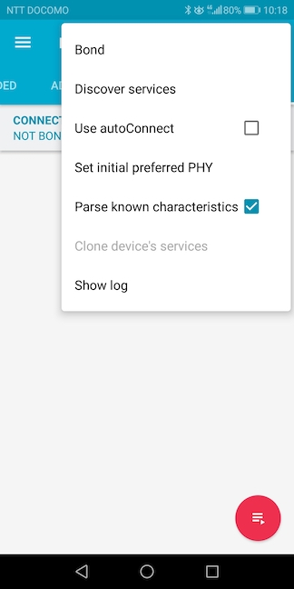

# nRF Connect SDK動作確認手順書

macOSにインストールされた「[nRF Connect SDK v1.8.0](https://developer.nordicsemi.com/nRF_Connect_SDK/doc/1.8.0/nrf/)」の動作確認手順について掲載します。

## 手順の概要

- <b>ソフトウェアのインストール</b><br>
本手順書で必要となる各種ソフトウェアを、macOSにインストールします。

- <b>サンプルアプリのビルド／書込み</b><br>
Nordic社から公開されているサンプルアプリ「[Peripheral UART](https://developer.nordicsemi.com/nRF_Connect_SDK/doc/1.8.0/nrf/samples/bluetooth/peripheral_uart/README.html#bluetooth-peripheral-uart)」を、nRF Connect SDKでビルドし、nRF5340に書込みます。

- <b>サンプルアプリの動作確認</b><br>
Androidアプリ「nRF Connect」を使用し、nRF5340に書き込んだ「Peripheral UART」が正常に動作することを確認します。

## ソフトウェアのインストール

本手順書で必要となるソフトウェア「nRF Command Line Tools」を、macOSにインストールします。<br>
具体的な手順につきましては、別途手順書<b>「[nRF Command Line Toolsインストール手順](../nRF52840_app/NRFCLTOOLINST.md)」</b>をご参照願います。

## サンプルアプリのビルド／書込み

Nordic社から公開されているサンプルアプリ「[Peripheral UART](https://developer.nordicsemi.com/nRF_Connect_SDK/doc/1.8.0/nrf/samples/bluetooth/peripheral_uart/README.html#bluetooth-peripheral-uart)」を、nRF Connect SDKでビルドし、nRF5340に書込みます。

### サンプルアプリのコピー

nRF Connect SDKのサンプルアプリを、適宜フォルダーにコピーします。

```
bash-3.2$ cd ${HOME}/GitHub/onecard-fido/nRF5340_app/
bash-3.2$ cp -pr ${HOME}/opt/ncs_1.9.1/nrf/samples/bluetooth/peripheral_uart .
bash-3.2$ ls -al
total 344
drwxr-xr-x  22 makmorit  staff    704  3 16 10:05 .
drwxr-xr-x  19 makmorit  staff    608  3 14 16:35 ..
：
drwxr-xr-x  13 makmorit  staff    416  3 16 09:49 peripheral_uart
：
bash-3.2$
```

### ビルド用スクリプトを配置

ビルド用スクリプト`westbuild.sh`を作成し、プロジェクトフォルダー配下に配置したのち、実行権限を付与します。<br>
（実行時のスクリプト`westbuild.sh`は<b>[こちら](assets01/westbuild.sh)</b>）

```
bash-3.2$ cd ${HOME}/GitHub/onecard-fido/nRF5340_app/peripheral_uart
bash-3.2$ ls -al
total 80
drwxr-xr-x  14 makmorit  staff   448  3 16 10:07 .
drwxr-xr-x  22 makmorit  staff   704  3 16 10:05 ..
：
-rw-r--r--   1 makmorit  staff   946  3 16 10:07 westbuild.sh
bash-3.2$
bash-3.2$ chmod +x westbuild.sh
bash-3.2$ ls -al
total 88
drwxr-xr-x  15 makmorit  staff   480  3 16 10:10 .
drwxr-xr-x  22 makmorit  staff   704  3 16 10:05 ..
：
-rwxr-xr-x   1 makmorit  staff   946  3 16 10:07 westbuild.sh
bash-3.2$
```

### ビルド実行

ビルド用スクリプト`westbuild.sh`を実行し、プロジェクトをビルド（コンパイル、リンク）します。<br>
（実行時のログ`westbuild.log`は<b>[こちら](assets01/westbuild.log)</b>）

```
bash-3.2$ cd ${HOME}/GitHub/onecard-fido/nRF5340_app/peripheral_uart
bash-3.2$ ./westbuild.sh > westbuild.log 2>&1
bash-3.2$ echo $?
0
bash-3.2$
```

### 書込み

ビルド用スクリプト`westbuild.sh -f`を実行し、ビルドしたファームウェアを、nRF5340に書込みます。<br>
（実行時のログ`westbuild.log`は<b>[こちら](assets01/westbuild_f.log)</b>）

```
bash-3.2$ cd ${HOME}/GitHub/onecard-fido/nRF5340_app/peripheral_uart
bash-3.2$ ./westbuild.sh -f > westbuild_f.log 2>&1
bash-3.2$ echo $?
0
bash-3.2$
```

### ファームウェア起動確認

nRF5340開発ボード（`PCA10095`）に接続し、`screen`コマンドでデバッグプリントを監視すると、ファームウェア書込み完了後に以下のようなログが出力されます。

```
*** Booting Zephyr OS build v2.7.99-ncs1-1  ***
Starting Nordic UART service example
```

## サンプルアプリの動作確認

Androidアプリ「nRF Connect」を使用し、nRF5340に書き込んだ「Peripheral UART」が正常に動作することを確認します。

### 接続とデータ送受信

Androidアプリ「nRF Connect」を起動します。<br>
デバイス一覧に「Nordic_UART_Service」がリストされていることを確認します。

その後、右横の「CONNECT」ボタンをタップします。


画面右上のメニューを表示させ、「Discover services」をタップします。



サービス一覧が表示されます。<br>
一覧の中から「Nordic UART Service」をタップします。


下部に３点のキャラクタリスティックが一覧表示されます。

「TX Charactaristic」の右横のアイコンをタップすると、DescriptorsのValueが「Notifications enabled」に切り替わります。<br>
この状態で、nRF5340から文字列データを受信することができるようになります。

まずは、AndroidからnRF5340へ、文字列データを送信してみます。<br>
「RX Charactaristic」の右横のアイコンをタップします。


下図のようなポップアップが表示されるので、任意の文字列（`qwerty`）を入力し「SEND」をタップします。


Android側から送信した文字列データが、nRF5340側で受信されます。<br>
下図のように、受信した文字列データ（`qwerty`）がデバッグ出力されます。

次に、nRF5340からAndroidへ、文字列データを送信してみます。<br>
screenコマンドが実行中のターミナル画面上で、任意の文字列（`asdfg`）を入力し、Enterキーを押します。<br>
（入力した`asdfg`は、ターミナル画面上にエコーバックされないのでご注意ください）


nRF5340側から送信した文字列データが、Android側で受信されます。<br>
「TX Charactaristic」のValueに、受信した文字列データ（`asdfg`）が表示されます。


以上で、サンプルアプリの動作確認は完了です。
