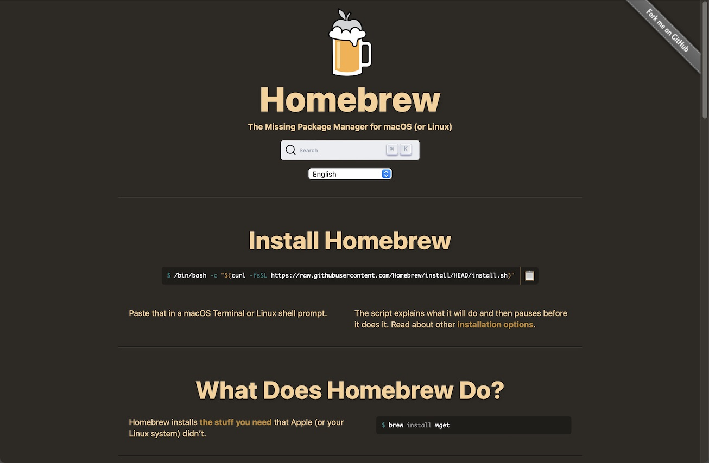

# Homebrew＋ツール群インストール手順

最終更新日：2023/02/13

「Homebrew」およびnRF Connect SDKに必要なツール群のインストール手順について記載します。

## 使用したシステム

PC: iMac (Retina 5K, 27-inch, 2019)<br>
OS: macOS 12.6.3

## Homebrewのインストール

[Homebrewポータルページ](https://brew.sh)を開きます。



ページ中央部にあるインストール用コマンドを、コピー＆ペーストでmacOSのターミナル上で実行します。<br>
完了まで数分を要するので待ちます。<br>
（実行例は<b>[こちら](assets01/install_brew.log)</b>）

```
bash-3.2$ /bin/bash -c "$(curl -fsSL https://raw.githubusercontent.com/Homebrew/install/HEAD/install.sh)"
==> Checking for `sudo` access (which may request your password)...
Password:
==> This script will install:
/usr/local/bin/brew
/usr/local/share/doc/homebrew
/usr/local/share/man/man1/brew.1
:
From https://github.com/Homebrew/homebrew-core
 * [new branch]              master     -> origin/master
HEAD is now at b2a2121bd37 gst-plugins-rs: update 0.9.8 bottle.
==> Installation successful!
:
```

## ツール群のインストール

Homebrewを使用し、nRF Connect SDKに必要なツール群をインストールします。

#### Pythonのインストール

nRF Connect SDKで使用するPythonは、仮想環境により管理したいため[注1]、`pyenv`-->`Python`の順に導入します。<br>
以下のコマンドを実行します。（実行例は<b>[こちら](assets01/install_python.log)</b>）

```
brew install pyenv
pyenv install -l
pyenv install 3.8.16
pyenv global 3.8.16
```

また、ホームディレクトリー配下に、必ず以下のスクリプトを作成しておきます。

<b>`${HOME}/.bashrc`</b>

```
export PYENV_ROOT=${HOME}/.pyenv
if [ -d "${PYENV_ROOT}" ]; then
    export PATH=${PYENV_ROOT}/bin:$PATH
    eval "$(pyenv init -)"
fi
```

<b>`${HOME}/.bash_profile`</b>

```
if [ -f ~/.bashrc ]; then
    . ~/.bashrc
fi
```

以上で、一旦ターミナルを終了させるようにします。

[注1] nCSのバージョンにより、必要となるパッケージが異なることが今後予測されます。またバージョン更改によるデグレード調査も必要となります。これらの事を考慮した結果、前バージョンのnCS環境を残しつつ、新バージョンのnCS環境を再構築できるよう、複数のPython環境（＝仮想環境）を用意する運用としています。

#### コマンド群のインストール

ビルドで使用するコマンド群をインストールします。<br>
以下のコマンドを実行します。（実行例は<b>[こちら](assets01/install_brew_tools.log)</b>）

```
brew install ninja gperf ccache qemu dtc wget libmagic
brew install cmake
```

以上で、Homebrewと必要ツール群のインストールは完了となります。
