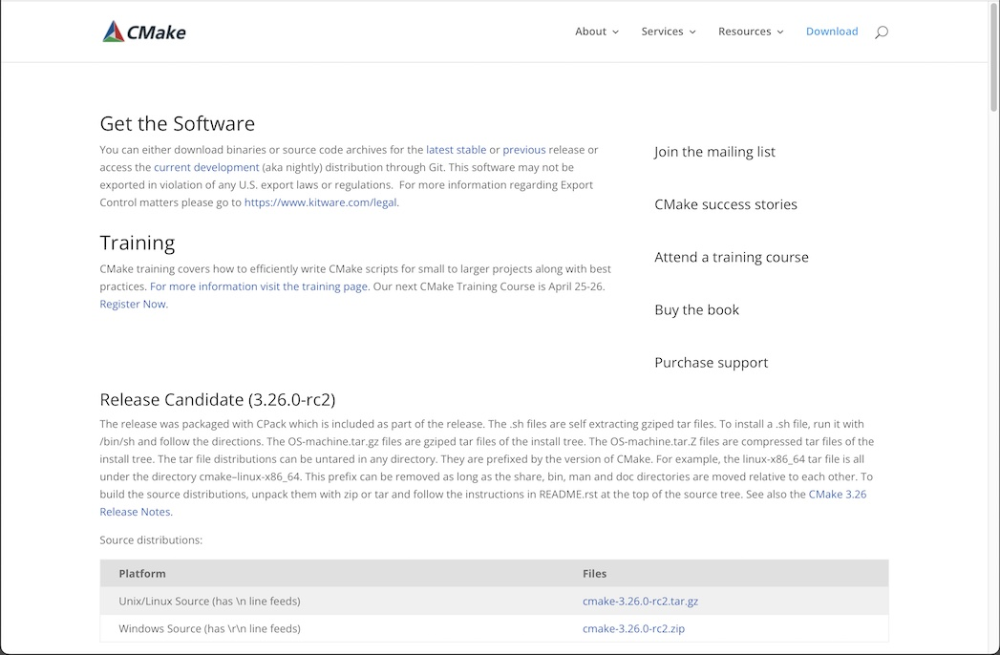
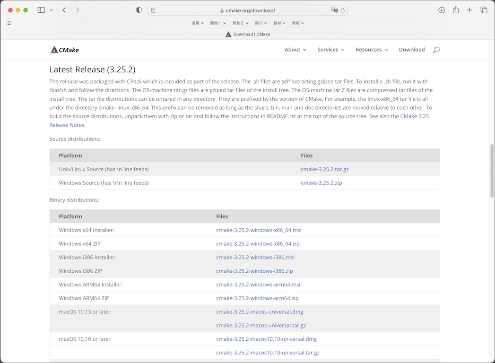
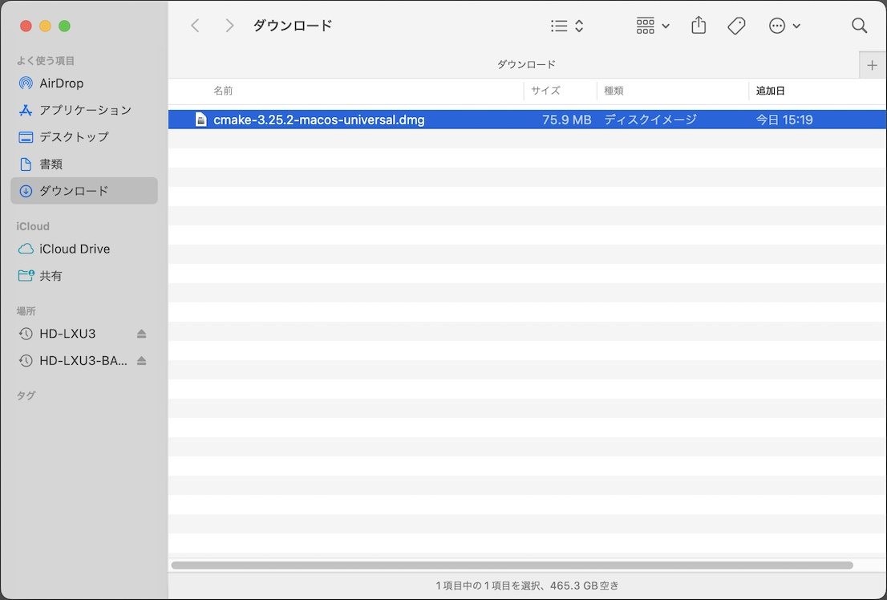
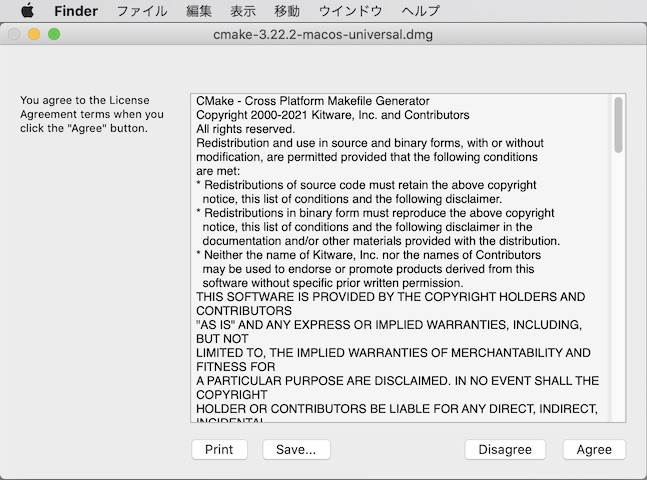
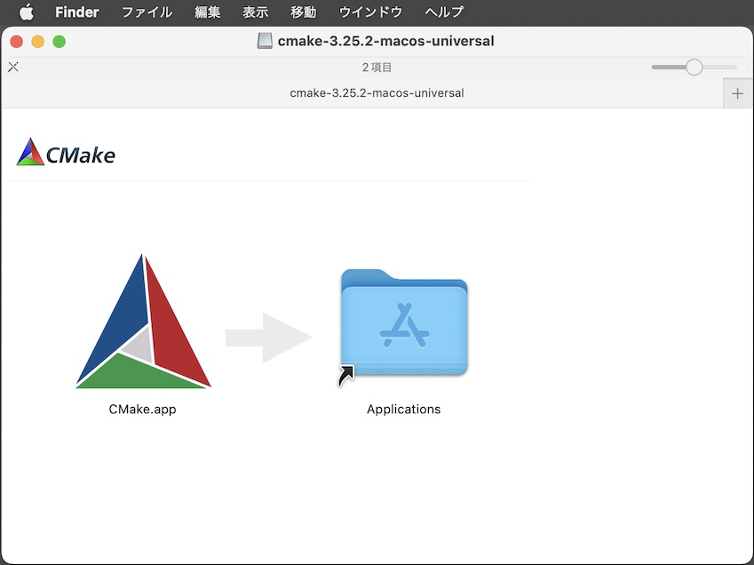
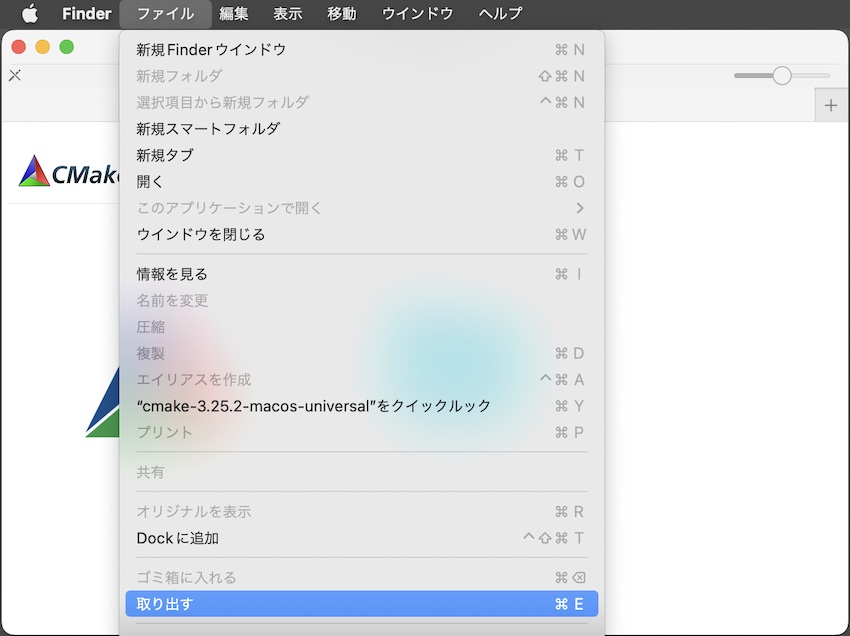

# CMakeインストール手順

メイクファイル生成コマンド「cmake」を含むツール「CMake」のインストール手順を掲載いたします。

## インストール媒体の取得

CMakeの[ダウンロードページ](https://cmake.org/download/)を開きます。

ダウンロードページを下にスクロールし、ファイルの一覧を表示させます。 
macOS環境にインストールする場合は、ファイル「`cmake-3.22.2-macos-universal.dmg`」をダウンロードします。

### CMakeのインストール

ダウンロードした`cmake-3.22.2-macos-universal.dmg`を右クリックして「開く」を実行します。

以下のようなダイアログが表示された場合は「Agree」をクリックします。

インストーラーが起動しますので、画面左側のアイコン「CMake.app」をドラッグし「Applications」にドロップしてください。

アプリケーションフォルダーにCMakeのアイコンができていれば、インストールは成功です。

最後に、ファイルメニューから「"cmake-3.22.2-macos-universal"を取り出す」を選択し、パッケージフォルダーを閉じます。

以上で、CMakeのインストールは完了です。
