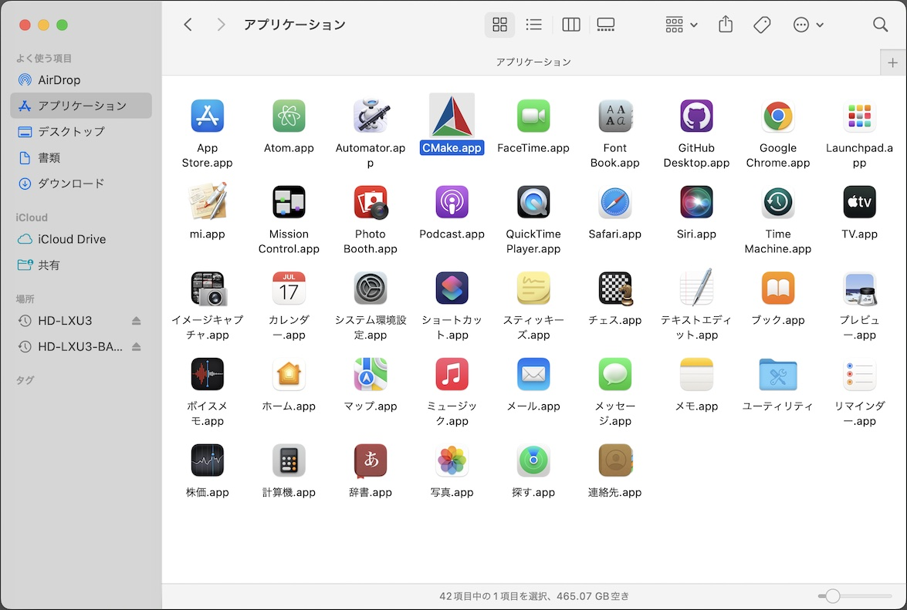

# ファームウェア更新手順（USB）

最終更新日：2021/10/14

nRF5340アプリケーションを、USB経由でインストールする手順について掲載しています。

## 前提条件

nRF5340アプリケーションのビルド時、USB DFU機能を搭載するように指示する必要があります。<br>
（BLE DFU機能を搭載しているアプリケーションでは、USB DFU機能は動作しません。）

ビルド時はスクリプト[`westbuild.sh`](../nRF5340_app/secure_device_app/westbuild.sh)に下記のような記述を行います。

```
    ${NCS_HOME}/bin/west build -c -b ${BUILD_TARGET} -d build_signed -- -DOVERLAY_CONFIG=overlay-usb-dfu.conf
```

## ツールの準備

USB経由でのファームウェア更新は、`dfu-util`というツールにより行います。

コマンド`brew install dfu-util`を実行してインストールします。<br>
以下は実行例になります。

```
bash-3.2$ brew install dfu-util
Updating Homebrew...
==> Auto-updated Homebrew!
Updated 3 taps (homebrew/core, homebrew/cask and homebrew/services).
：
==> Downloading https://ghcr.io/v2/homebrew/core/libusb/manifests/1.0.24
######################################################################## 100.0%
==> Downloading https://ghcr.io/v2/homebrew/core/libusb/blobs/sha256:034ae259f17afb5894860cdb1786fd6d391359e8d221c0f765e
==> Downloading from https://pkg-containers.githubusercontent.com/ghcr1/blobs/sha256:034ae259f17afb5894860cdb1786fd6d391
######################################################################## 100.0%
==> Downloading https://ghcr.io/v2/homebrew/core/dfu-util/manifests/0.10
######################################################################## 100.0%
==> Downloading https://ghcr.io/v2/homebrew/core/dfu-util/blobs/sha256:3baa1c97498ad73a60b12c1d1ffa192a9b57946be6ced7ab8
==> Downloading from https://pkg-containers.githubusercontent.com/ghcr1/blobs/sha256:3baa1c97498ad73a60b12c1d1ffa192a9b5
######################################################################## 100.0%
==> Installing dependencies for dfu-util: libusb
==> Installing dfu-util dependency: libusb
==> Pouring libusb--1.0.24.catalina.bottle.tar.gz
🍺  /usr/local/Cellar/libusb/1.0.24: 22 files, 516.7KB
==> Installing dfu-util
==> Pouring dfu-util--0.10.catalina.bottle.tar.gz
🍺  /usr/local/Cellar/dfu-util/0.10: 13 files, 231.4KB
==> `brew cleanup` has not been run in 30 days, running now...
Removing: /usr/local/Cellar/autoconf/2.69... (67 files, 3.0MB)
：
Removing: /Users/makmorit/Library/Logs/Homebrew/python@3.9... (2 files, 4.4KB)
bash-3.2$
```

## 更新ファームウェアイメージの書込み

nRF5340アプリケーションの更新ファームウェアイメージ`app_update.bin`は、ディレクトリー[`nRF5340_app/firmwares/secure_device_app`](../nRF5340_app/firmwares/secure_device_app)配下に格納されています。

この`app_update.bin`を、`dfu-util`を使用し、nRF5340に書込みます。

#### ブートローダーモードに遷移

nRF5340をPCのUSBポートに接続し、ブートローダーモードに遷移させます。<br>
最終更新日現在、管理ツールのメニュー「ブートローダーモード遷移」の実行により、ブートローダーモードに遷移させることができます。



この直後、コマンド`dfu-util -l`を実行すると、接続されたnRF5340が、PCに認識されているかどうか確認できます。<br>
下記は、認識されている場合の実行例になります。

```
bash-3.2$ dfu-util -l
dfu-util 0.10

Copyright 2005-2009 Weston Schmidt, Harald Welte and OpenMoko Inc.
Copyright 2010-2020 Tormod Volden and Stefan Schmidt
This program is Free Software and has ABSOLUTELY NO WARRANTY
Please report bugs to http://sourceforge.net/p/dfu-util/tickets/

Found Runtime: [2fe3:0100] ver=0206, devnum=31, cfg=1, intf=0, path="20-1", alt=0, name="UNKNOWN", serial="DD25B4A2039693C9"
bash-3.2$
```

#### 書込み実行

ブートローダーモードに遷移した後、コマンド`dfu-util --alt 1 --download <ファイル名>`を実行すると、更新ファームウェアイメージがnRF5340に転送されます。<br>
下記は実行例になります。

```
bash-3.2$ export BIN_FILE=${HOME}/GitHub/onecard-fido/nRF5340_app/firmwares/secure_device_app/app_update.bin
bash-3.2$ dfu-util --alt 1 --download ${BIN_FILE}
dfu-util 0.10

Copyright 2005-2009 Weston Schmidt, Harald Welte and OpenMoko Inc.
Copyright 2010-2020 Tormod Volden and Stefan Schmidt
This program is Free Software and has ABSOLUTELY NO WARRANTY
Please report bugs to http://sourceforge.net/p/dfu-util/tickets/

dfu-util: Warning: Invalid DFU suffix signature
dfu-util: A valid DFU suffix will be required in a future dfu-util release!!!
Opening DFU capable USB device...
ID 2fe3:0100
Run-time device DFU version 0110
Claiming USB DFU Runtime Interface...
Determining device status: state = appIDLE, status = 0
Device really in Runtime Mode, send DFU detach request...
Resetting USB...
Opening DFU USB Device...
Claiming USB DFU Interface...
Setting Alternate Setting #1 ...
Determining device status: state = dfuIDLE, status = 0
dfuIDLE, continuing
DFU mode device DFU version 0110
Device returned transfer size 128
Copying data from PC to DFU device
Download	[=========================] 100%       152384 bytes
Download done.
state(2) = dfuIDLE, status(0) = No error condition is present
Done!
bash-3.2$
```

#### 転送ファームウェアの受け入れ

nRF5340側では、更新ファームウェアイメージの転送が完了すると、自動的に更新後のアプリケーションが始動します。

ただし、ブートローダー側では、明示的に転送ファームウェアの受け入れが行われない場合、次回リセット時に、更新前のアプリケーションを復元／再始動させる仕様となっています。<br>
このため、nRF5340アプリケーション側で、転送ファームウェアの受け入れを実行します。

転送ファームウェア受け入れが実行された場合、自動的にファームウェアが再始動され、以降のリセット時も、更新前のアプリケーションへの復元は行われません。

最終更新日現在、基板上のボタン２押下時、nRF5340アプリケーションの下記処理により、転送ファームウェア受け入れが実行できます。

```
#include "app_dfu.h"

//
// ボタン押下時の処理
//
void app_main_button_1_pressed(void)
{
    // DFUによる変更内容のコミットを指示
    app_dfu_commit();
}
```
