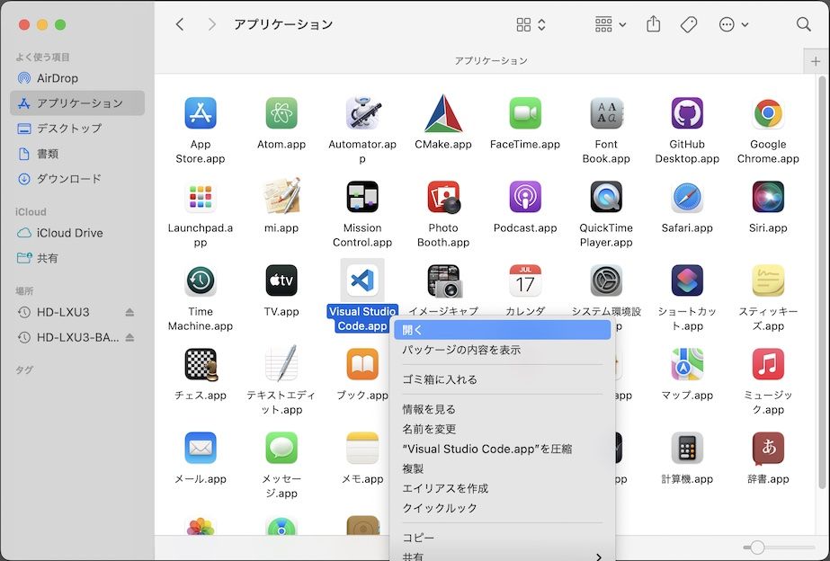

# Visual Studio Codeインストール手順

最終更新日：2023/02/14

コードエディター「Visual Studio Code」のインストール手順について記載します。

## 使用したシステム

PC: iMac (Retina 5K, 27-inch, 2019) 
OS: macOS 12.6.3

## インストール媒体の取得

Visual Studio Codeの[ダウンロードページ](https://code.visualstudio.com/download)を開きます。

「Mac」の青いアイコンをクリックして、ダウンロードを開始します。[注1] 
下図のようなポップアップが表示されたら「許可」をクリックします。

[注1] 今回使用したシステムに合わせたリンクをクリックします。

### CMakeのインストール

ダウンロードした`VSCode-darwin-universal.zip`をダブルクリックして解凍します。

`Visual Studio Code.app`を、アプリケーションフォルダーに移動します。

`Visual Studio Code.app`を右クリックして開きます。

Visual Studio Codeが起動すれば、インストールは成功です。

