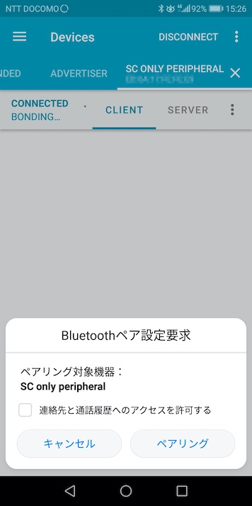
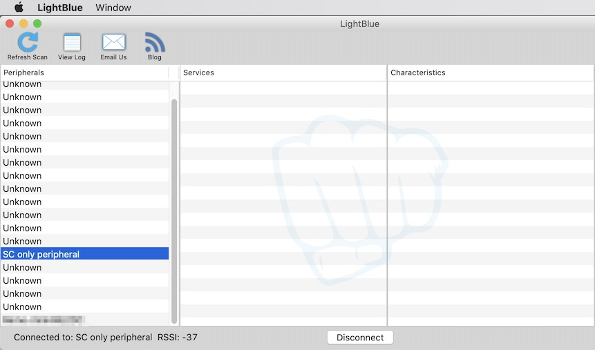
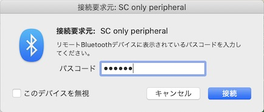
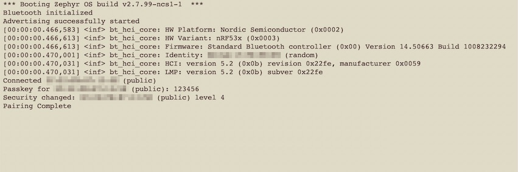

# BLEペアリングサンプル動作確認手順書

Nordic社から公開されている、BLEペアリングのサンプルアプリ「[Bluetooth: Peripheral SC-only](http://developer.nordicsemi.com/nRF_Connect_SDK/doc/latest/zephyr/samples/bluetooth/peripheral_sc_only/README.html)」の動作確認手順について掲載します。

## 手順の概要

- <b>ソフトウェアのインストール</b><br>
本手順書で必要となる各種ソフトウェアを、macOSにインストールします。

- <b>サンプルアプリのビルド／書込み</b><br>
サンプルアプリ「Bluetooth: Peripheral SC-only」を、nRF Connect SDKでビルドし、nRF5340に書込みます。

- <b>サンプルアプリの動作確認</b><br>
Androidアプリ「nRF Connect」を使用し、<b>PIN番号を使用したBLEペアリング</b>が正常に動作することを確認します。

## ソフトウェアのインストール

本手順書で必要となるソフトウェア「nRF Command Line Tools」を、macOSにインストールします。<br>
具体的な手順につきましては、別途手順書<b>「[nRF Command Line Toolsインストール手順](../nRF52840_app/NRFCLTOOLINST.md)」</b>をご参照願います。

## サンプルアプリのビルド／書込み

サンプルアプリ「Bluetooth: Peripheral SC-only」を、nRF Connect SDKでビルドし、nRF5340に書込みます。

### サンプルアプリのコピー

nRF Connect SDKのサンプルアプリを、適宜フォルダーにコピーします。

```
bash-3.2$ cd ${HOME}/GitHub/onecard-fido/nRF5340_app/
bash-3.2$ cp -pr ${HOME}/opt/ncs_1.9.1/zephyr/samples/bluetooth/peripheral_sc_only .
bash-3.2$ ls -al
total 392
drwxr-xr-x  23 makmorit  staff    736  3 23 15:18 .
drwxr-xr-x  19 makmorit  staff    608  3 14 16:35 ..
:
drwxr-xr-x   9 makmorit  staff    288  3 23 15:13 peripheral_sc_only
:
bash-3.2$
```

### ビルド用スクリプトを配置

ビルド用スクリプト`westbuild.sh`を作成し、プロジェクトフォルダー配下に配置したのち、実行権限を付与します。<br>
（実行時のスクリプト`westbuild.sh`は<b>[こちら](assets01/westbuild.sh)</b>）

```
bash-3.2$ cd ${HOME}/GitHub/onecard-fido/nRF5340_app/peripheral_sc_only
bash-3.2$ ls -al
total 56
drwxr-xr-x  10 makmorit  staff   320  3 23 15:19 .
drwxr-xr-x  23 makmorit  staff   736  3 23 15:18 ..
:
-rw-r--r--@  1 makmorit  staff   946  3 16 11:07 westbuild.sh
bash-3.2$ chmod +x westbuild.sh
bash-3.2$ ls -al
total 56
drwxr-xr-x  10 makmorit  staff   320  3 23 15:19 .
drwxr-xr-x  23 makmorit  staff   736  3 23 15:18 ..
:
-rwxr-xr-x@  1 makmorit  staff   946  3 16 11:07 westbuild.sh
bash-3.2$
```

### ビルド実行

ビルド用スクリプト`westbuild.sh`を実行し、プロジェクトをビルド（コンパイル、リンク）します。<br>
（実行時のログ`westbuild.log`は<b>[こちら](assets01/westbuild_2.log)</b>）

```
bash-3.2$ cd ${HOME}/GitHub/onecard-fido/nRF5340_app/peripheral_sc_only
bash-3.2$ ./westbuild.sh > westbuild.log 2>&1
bash-3.2$ echo $?
0
bash-3.2$
```

### 書込み

ビルド用スクリプト`westbuild.sh -f`を実行し、ビルドしたファームウェアを、nRF5340に書込みます。<br>
（実行時のログ`westbuild_f.log`は<b>[こちら](assets01/westbuild_f_2.log)</b>）

```
bash-3.2$ cd ${HOME}/GitHub/onecard-fido/nRF5340_app/peripheral_sc_only
bash-3.2$ ./westbuild.sh -f > westbuild_f.log 2>&1
bash-3.2$ echo $?
0
bash-3.2$
```

### ファームウェア起動確認

nRF5340開発ボード（`PCA10095`）に接続し、`screen`コマンドでデバッグプリントを監視すると、ファームウェア書込み完了後に以下のようなログが出力されます。

```
*** Booting Zephyr OS build v2.7.99-ncs1-1  ***
Bluetooth initialized
Advertising successfully started
[00:00:00.464,721] <inf> bt_hci_core: HW Platform: Nordic Semiconductor (0x0002)
[00:00:00.464,752] <inf> bt_hci_core: HW Variant: nRF53x (0x0003)
[00:00:00.464,752] <inf> bt_hci_core: Firmware: Standard Bluetooth controller (0x00) Version 14.50663 Build 1008232294
[00:00:00.468,170] <inf> bt_hci_core: Identity: ED:6A:17:FE:FE:E9 (random)
[00:00:00.468,170] <inf> bt_hci_core: HCI: version 5.2 (0x0b) revision 0x22fe, manufacturer 0x0059
[00:00:00.468,170] <inf> bt_hci_core: LMP: version 5.2 (0x0b) subver 0x22fe
```

## サンプルアプリの動作確認

Androidアプリ「nRF Connect」を使用し、<b>PIN番号を使用したBLEペアリング</b>が正常に動作することを確認します。

### 接続

Androidアプリ「nRF Connect」を起動します。<br>
デバイス一覧に「SC only peripheral」がリストされていることを確認します。

その後、右横の「CONNECT」ボタンをタップします。


「Bluetoothペア設定要求」というポップアップ画面が表示されます。<br>
画面下部のボタン「ペアリング」をタップします。



「Bluetoothペア設定要求」画面の表示が下図のように変わります。<br>
「通常は0000または1234です」と記されたテキストボックスをタップします。


screenコマンドが実行中のターミナル画面上を参照し、<b>６桁のPIN番号が表示</b>されていることを確認します。


テキストボックスに、前述のPIN番号を入力し、画面下部のボタン「OK」をタップします。


「CONNECTED」「BONDED」と表示されれば、ペアリングは成功です。


screenコマンドが実行中のターミナル画面上では「`Pairing Complete`」と表示されたことを確認します。


以上で、BLEペアリングサンプルの動作確認は完了です。

## 固定PIN番号によるBLEペアリング

本書で使用したサンプルアプリ「Bluetooth: Peripheral SC-only」を、あらかじめ決めておいたPIN番号でペアリングさせるよう、作り替えることができます。

### ファームウェアの修正

コード／定義ファイルを修正し、ファームウェアを再書込みします。

#### コード修正

アドバタイズ開始前に固定PIN番号を設定しておくよう、`main`関数を修正します。

```
//
// peripheral_sc_only/src/main.c
//
void main(void)
{
    :
	printk("Bluetooth initialized\n");

    // 固定のPIN番号（123456）を設定
    unsigned int passkey = 123456;
    bt_passkey_set(passkey);
    :
	err = bt_le_adv_start(BT_LE_ADV_CONN_NAME, ad, ARRAY_SIZE(ad), NULL, 0);
    :
}
```

#### 定義ファイル修正

固定PIN番号を使用するよう、`prj.conf`に下記の定義を追加します。

```
#
# peripheral_sc_only/prj.conf
#
CONFIG_BT_FIXED_PASSKEY=y
```

#### ビルドと書込み

前述の手順で、修正したプロジェクトをビルドし、生成されたファームウェアをnRF5340に書込みます。

### 動作確認

まだペアリングされていない任意の端末（PC or スマートフォン）を用意します。<br>
今回の例では、macOS環境にインストールされた「LightBlue」というソフトウェアを使用しました。

#### 接続

デバイス一覧にリストされた「SC only peripheral」を選択し、接続を実行します。



ほどなく、PIN番号を入力させるためのポップアップ画面が表示されます。<br>
パスコード欄に、先ほど指定した「`123456`」を入力し「接続」ボタンをクリックします。



screenコマンドが実行中のターミナル画面上で「`Pairing Complete`」と表示されたことを確認します。



以上で、固定PIN番号によるBLEペアリングの動作確認は完了です。
