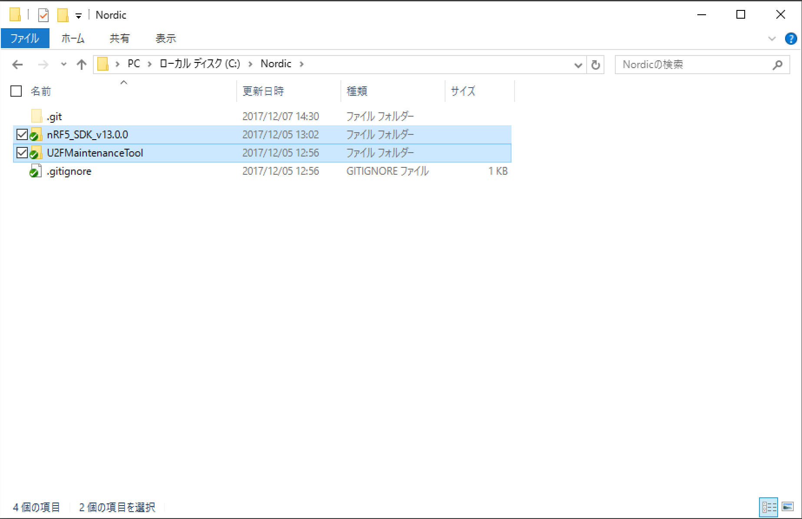
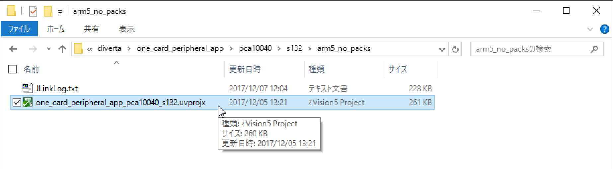
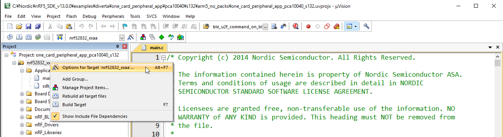
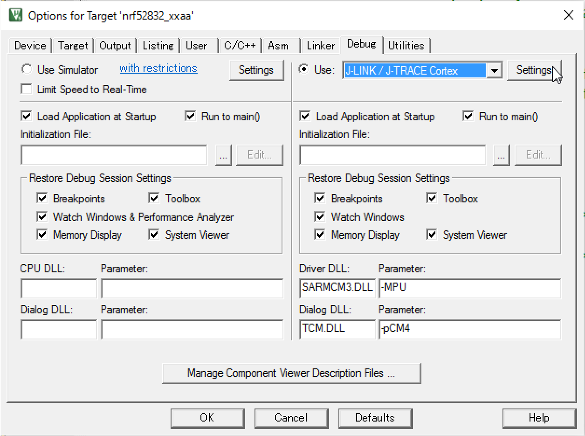
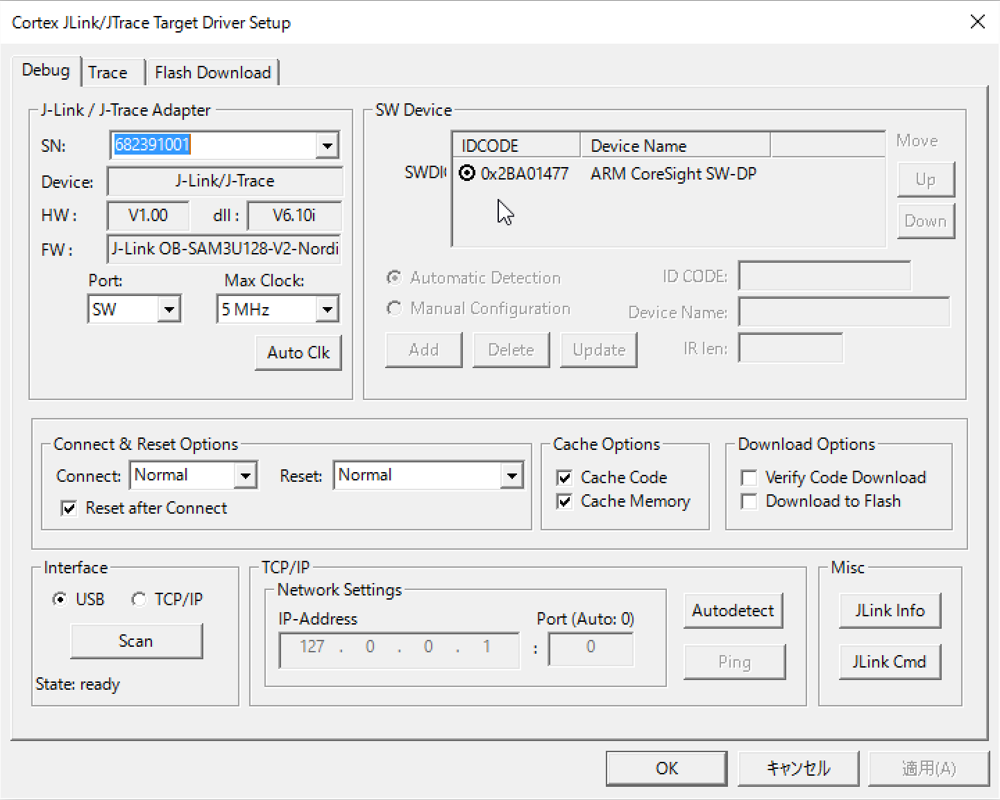
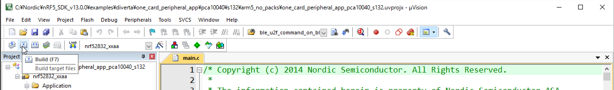
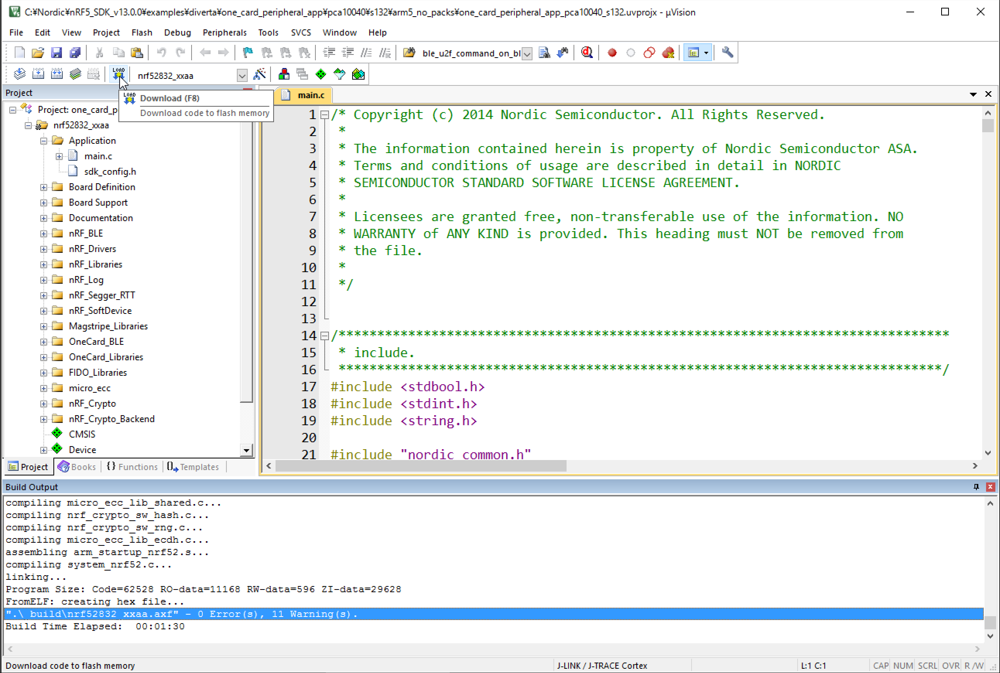
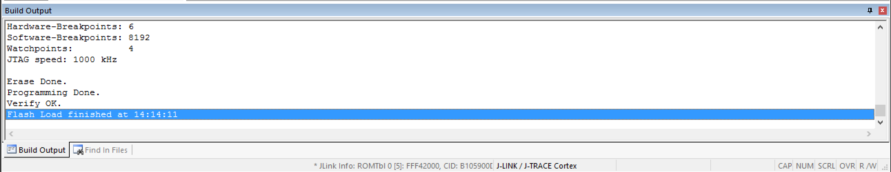

# ビルド手順

## プロジェクト構成
* `components/` 
依存ライブラリーを収容 （ソースのカスタマイズはありません）

* `examples/diverta/` 
One Cardアプリケーションと、それにマージされたFIDO対応のコードを収容

* `examples/diverta/ble_u2f_lib` 
BLE U2Fサービスのコードを収容

* `external/` 
依存パッケージを収容 （ソースのカスタマイズはありません）

## 開発環境
nRF52DKを使用しています。
* BLE - nRF52832
* MCU - PCA10040
* ソフトデバイス - S132
* IDE - μVision 5

下記手順書を参照して、初期セットアップを行います。 
[../assets/nRF5開発環境インストール_V3.pdf](nRF5開発環境インストール_V3)

## μVisionを使用したビルド

### コードのチェックアウト

c:¥nordic（ディレクトリーがない場合は作成）配下に移動し、GitHubからコードをチェックアウトします。 
エクスプローラで見ると、下図のような感じになります。

### プロジェクト設定の確認

nRF52DKとPCを、USBケーブルで接続したのち、one_card_peripheral_app_pca10040_s132.uvprojx というファイルをダブルクリックします。

μVisionが起動したら、プロジェクト設定を確認します。

プロジェクト設定のポップアップを確認します。 
JLINK / J-TRACE Cortexが選択されていることを確認し、Settingsボタンをクリックします。

表示されたポップアップの、SW DeviceにDevice Nameが表示されていることを確認します。

### ビルドとプログラム書込み(Download)

ビルドを実行します。

ビルドの結果「0 Error(s)」となっていることを確認し、プログラムの書込みを実行します。

エラーが発生しなければ、下図のようになります。

これでプログラムの書込みは完了です。
