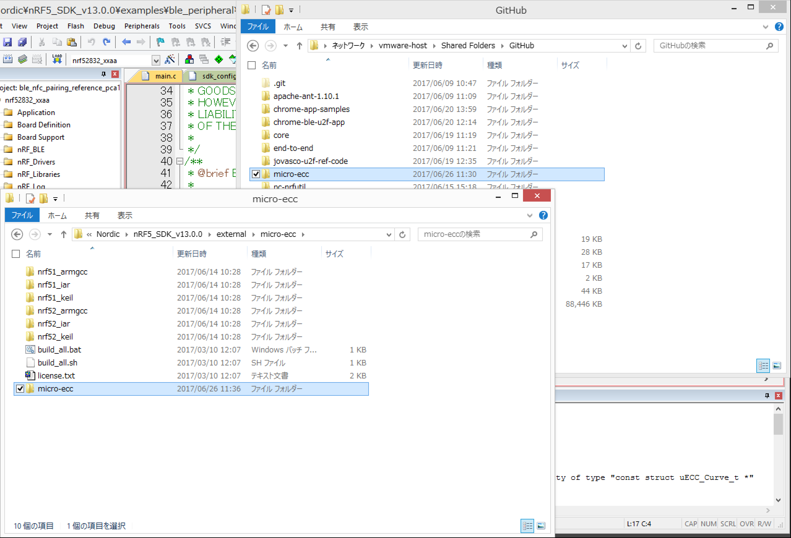
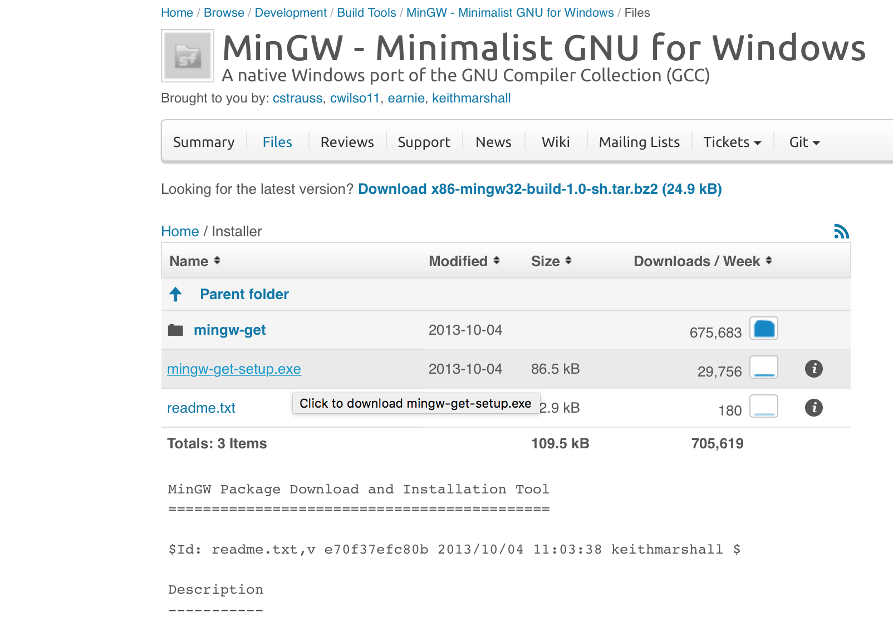
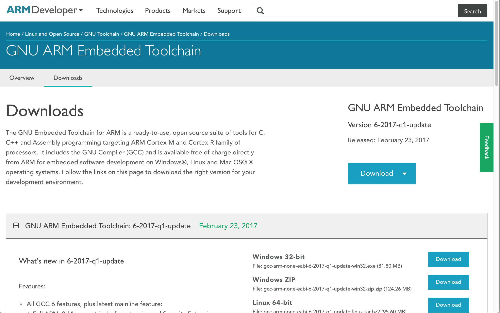
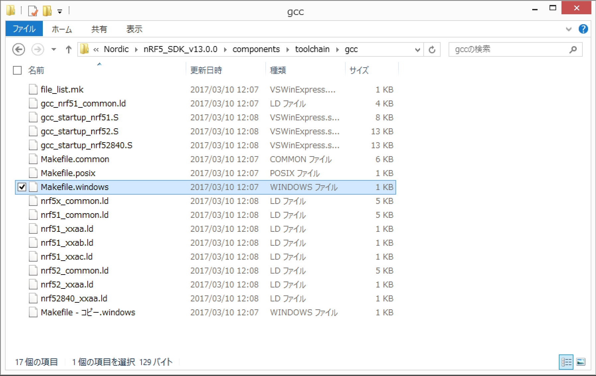
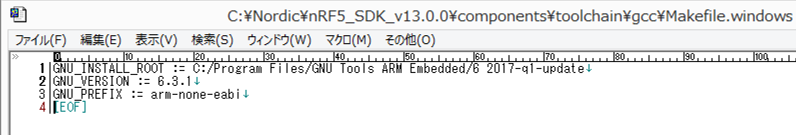
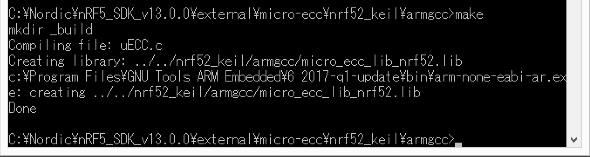
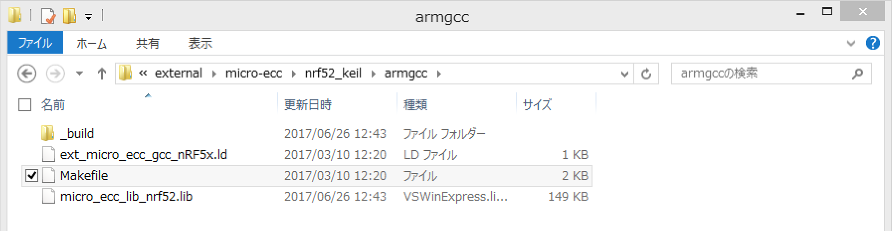

# micro-eccビルド手順

BLE U2Fサービスで使用する暗号化ライブラリー「micro-ecc」について、ビルド手順を以下に掲載いたします。

* 参考文献<br>
Installing micro-ecc<br>
http://infocenter.nordicsemi.com/index.jsp?topic=%2Fcom.nordic.infocenter.sdk5.v12.0.0%2Flib_crypto.html&anchor=lib_crypto_installing

## ビルドの準備

### ソースのチェックアウト

GitHubに公開されているものをチェックアウトします。<br>
https://github.com/kmackay/micro-ecc

```
Last login: Mon Jun 26 10:04:40 on console
MacBookPro-makmorit-jp:~ makmorit$ cd GitHub
MacBookPro-makmorit-jp:GitHub makmorit$ git clone https://github.com/kmackay/micro-ecc
Cloning into 'micro-ecc'...
remote: Counting objects: 1086, done.
remote: Compressing objects: 100% (6/6), done.
remote: Total 1086 (delta 1), reused 5 (delta 1), pack-reused 1079
Receiving objects: 100% (1086/1086), 651.99 KiB | 257.00 KiB/s, done.
Resolving deltas: 100% (634/634), done.
MacBookPro-makmorit-jp:GitHub makmorit$ ls -al
total 177120
drwxr-xr-x  20 makmorit  staff       680 Jun 26 11:29 .
drwxr-xr-x+ 29 makmorit  staff       986 Jun 26 10:04 ..
-rw-r--r--@  1 makmorit  staff     14340 Jun 23 17:19 .DS_Store
drwxr-xr-x   9 makmorit  staff       306 Jun  9 10:47 .git
drwxr-xr-x@ 18 makmorit  staff       612 Jun  9 11:09 apache-ant-1.10.1
-rwxr-xr-x   1 makmorit  staff     28538 Jun 21 14:40 ble_srv_common.h
-rwxr-xr-x   1 makmorit  staff     16594 Jun 23 15:43 ble_u2f.c
-rwxr-xr-x   1 makmorit  staff      1607 Jun 23 15:41 ble_u2f.h
drwxr-xr-x  11 makmorit  staff       374 Jun 20 13:59 chrome-app-samples
drwxr-xr-x  12 makmorit  staff       408 Jun 20 12:14 chrome-ble-u2f-app
drwxr-xr-x  51 makmorit  staff      1734 Jun 19 11:19 core
drwxr-xr-x  22 makmorit  staff       748 Jun  9 11:21 end-to-end
drwxr-xr-x  15 makmorit  staff       510 Jun 19 12:35 jovasco-u2f-ref-code
-rwxr-xr-x   1 makmorit  staff     44290 Jun 23 15:38 main.c
drwxr-xr-x  23 makmorit  staff       782 Jun 26 11:29 micro-ecc
-rwxr-xr-x   1 makmorit  staff  90568441 Jun 22 17:00 nRF5_SDK_v13.0.0.rar
drwxr-xr-x  11 makmorit  staff       374 Jun 15 15:18 pc-nrfutil
drwxr-xr-x  19 makmorit  staff       646 Jun 21 11:35 u2f-ble-helper
drwxr-xr-x  11 makmorit  staff       374 Jun 15 14:18 u2f-embedded
drwxr-xr-x  13 makmorit  staff       442 Jun  9 10:55 u2f-ref-code
MacBookPro-makmorit-jp:GitHub makmorit$
```

### nRF52のプロジェクト・ディレクトリーに配置

「プロジェクトルート¥external¥micro-ecc」の配下に、GitHubから取得した「micro-ecc」ディレクトリーを丸ごとコピーして配置します。



### MinGWの導入

MinGWのWindows版インストールメディアを取得します。<br>
http://www.mingw.org の「Downloads」のリンクをクリックすると、https://sourceforge.net/projects/mingw/files/ のページに遷移するので、そこからダウンロードして導入します。



### GNU ARMツールチェインの導入

GNU ARMツールチェイン（クロスコンパイラーを同梱）のWindows版インストールメディアを取得します。<br>
https://developer.arm.com/open-source/gnu-toolchain/gnu-rm/downloads のページから、Windows32bit版をダウンロードして導入します。



導入が完了したら、toolchainのパス記述が間違っているので、正しく修正します。<br>
Makefile.windowsというファイルを修正します。<br>
配置場所は下図のようになります。



GNU_INSTALL_ROOTとGNU_VERSIONを修正します。<br>
修正後のイメージは下図のようになります。



## ライブラリーのビルド

MSYSにパスを通しておきます。<br>
（c:¥mingw¥msys¥1.0¥bin;c:¥mingw¥bin）

armgcc配下のMakefileを使用してビルドします。<br>
（armgcc配下に移動し「C:¥MinGW¥msys¥1.0¥bin¥make.exe」を実行）



上図のように「Done」と表示されればビルドは成功です。

本プロジェクトでは、配下に作成された「micro_ecc_lib_nrf52.lib」というファイルをライブラリーとして使用します。



以上で、micro-eccビルドは完了です。
