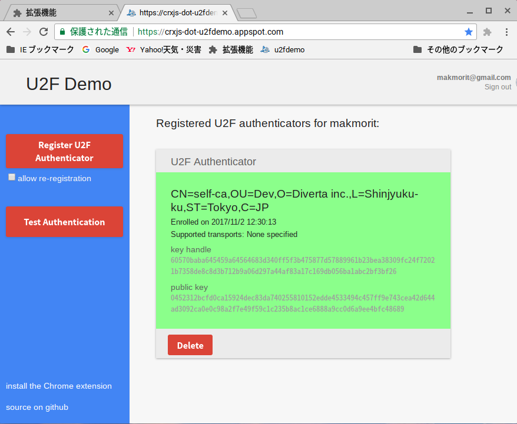

# BLE U2Fサービス

## 概要
FIDO U2Fの仕様に準拠したBLEサービスです。 
One Card機能の一部として稼働します。

FIDO U2Fに関する情報 : https://fidoalliance.org/download/

FIDO U2F対応デバイスは、USBポートに挿して使用する「YubiKey」が有名ですが、BLE U2Fサービスは、USBポートではなく、One CardのBLEを使用しています。

機能スコープとしては下図の 2.Processing の部分に該当します。
 

 
(上図は https://fidoalliance.org/specs/fido-u2f-v1.2-ps-20170411/fido-u2f-raw-message-formats-v1.2-ps-20170411.html から引用)

## 機能
### 初期設定機能
* ペアリング情報削除
* 鍵・証明書削除
* 鍵・証明書インストール

FIDO U2F対応のために必要な初期設定を行います。

### FIDO U2F機能
* 認証情報登録（Registration）
* 認証（Authentication）
* U2Fバージョン照会 (U2F Version)
* デバイス情報照会 (Device Information Service)

FIDO U2F対応のメイン機能です。

## 動作環境

BLE (Bluetooth Low Energy) 4.2以上が推奨されます。

ただし、4.0でも動作することを確認しています。
 
（この場合は、LTKを使用した暗号化通信はできません。STKを使用した暗号化通信のみとなります）

## サポート状況

2017/12/11現在で、こちらでBLE U2Fサービスで認証情報登録／認証ができることを確認しているサイトは以下になります。

Google U2F Demo : https://crxjs-dot-u2fdemo.appspot.com/

他のPC環境（Windows、macOS等）では、ChromeブラウザーがFIDO U2FのBLEエクステンションをサポートしていないので、2017/12/11時点では動作確認できておりません。

## TODO

### Android環境でのサポート状況確認

Android向けGoogle Playで既にサポートずみ（とのこと）である、BLE U2Fサービスが利用できるかどうかを、実機で確認する予定です。

[ご参考] Googleサポート状況に関する議論：
 
https://groups.google.com/a/fidoalliance.org/forum/#!topic/fido-dev/-hT1UF0FKTo

### ブラウザーエクステンションの調査・開発

PC環境で動作するFIDO U2F BLEエクステンションの調査・開発を予定しております。

## FIXME

現状顕在化している問題点はございません。

## 各種手順

* [ビルド手順](BUILD.md)  
ソースチェックアウトからμVisionによるビルド／書込みまでの手順を掲載しています。

* [インストール手順](INSTALL.md)  
鍵・証明書インストールなどの手順を掲載しています。
