# AndroidでのU2F Authenticate確認手順

## 概要
Androidスマートフォンを使用し、nRF52840 DongleでGoogleアカウントのログイン（U2F Authenticate）を確認する手順を掲載します。

## 事前準備

### U2F RegisterをPCで実施

Androidスマートフォンでは、現状、U2F Registerができない仕様となっております。

ですので、事前にPCを使用し、nRF52840 Dongleをセキュリティ キーとして、Googleアカウントに登録（U2F Register）しておいてください。

<b>[PCでのU2F Register手順はこちら](README.md)</b>

#### ご参考：AndroidでU2F Registerが実行できない件について

Androidスマートフォンからは、U2F Register（＝BLE経由の「セキュリティ キー追加」）ができない仕様のようです。 
具体的には、Googleアカウントの「セキュリティ キー追加」機能は「モバイル端末以外の端末」だけで使用できるとのことです。

ですので、Android上でU2F Authenticateを使用するためには、USB HIDデバイスを使用し、デスクトップ版Chromeから、U2F Registerを実行する必要があります。 
詳細につきましては下記Issueをご参照いただければ幸いです。 
https://github.com/diverta/onecard-fido/issues/69

### nRF52840 Dongleとのペアリング

U2F Authenticateを実行する前に、AndroidのBluetooth設定で、nRF52840 Dongleとのペアリングをおこないます。

AndroidのBluetooth設定画面を開き、Onに設定します。

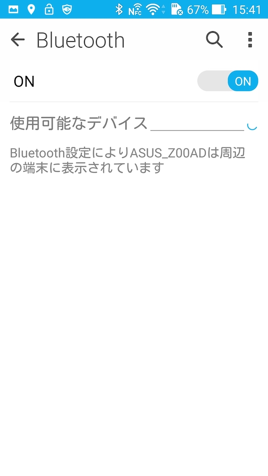

nRF52840 Dongleに電源を供給します。 
現時点では、外部バッテリーから電源供給する仕組みが未検討ですので、さしあたりPCのUSBプラグから電源を供給させます。

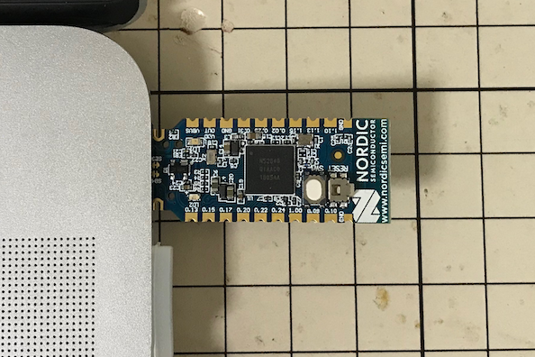

その後、nRF52840 Dongle上の白いボタンを５秒間押下し、ペアリング・モードに転化させます。 
基板上の赤いLEDが点灯します。

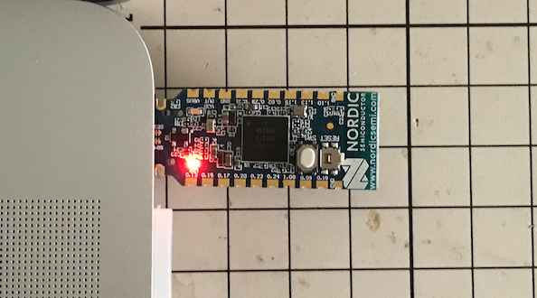

AndroidのBluetooth設定画面に「FIDO_Authenticator_dongle」というデバイスが表示されます。

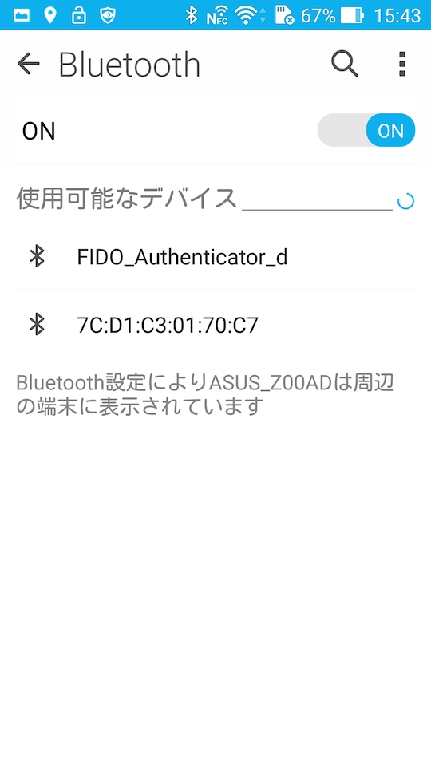

画面をタップすると、ペアリングがスタートします。

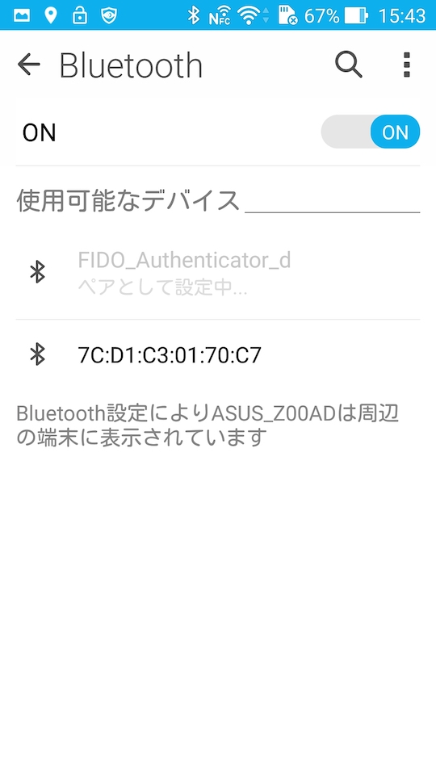

設定画面のデバイス名の右横に歯車マークが表示されたら、ペアリングは成功です。

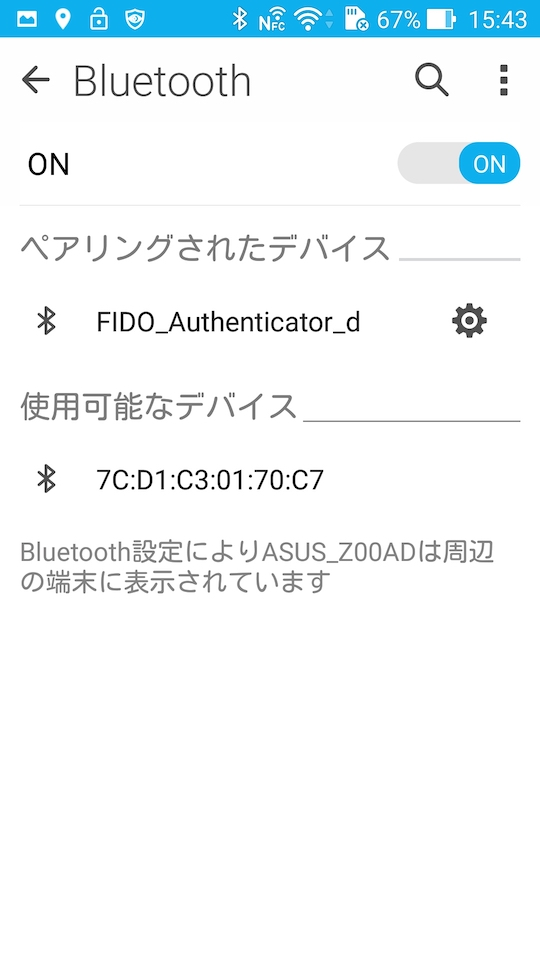

nRF52840 Dongle上の赤いLEDが消灯していることを確認します。

以上でペアリングは完了となります。

## U2F Authenticate手順

Googleアカウントを使用して、U2F Authenticateを確認する手順は以下になります。

### Googleアカウント登録

Android設定の「アカウント」をタップします。

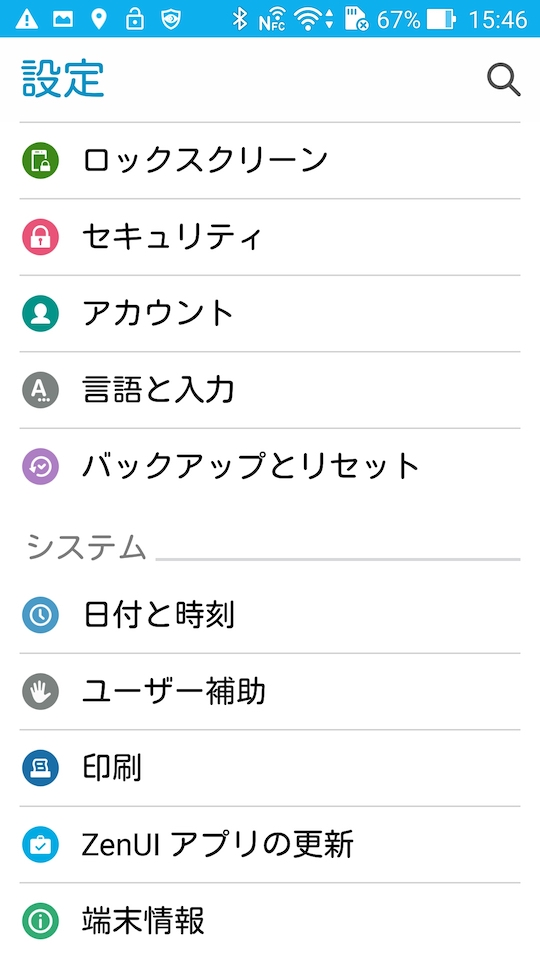

「アカウントを追加」をタップします。

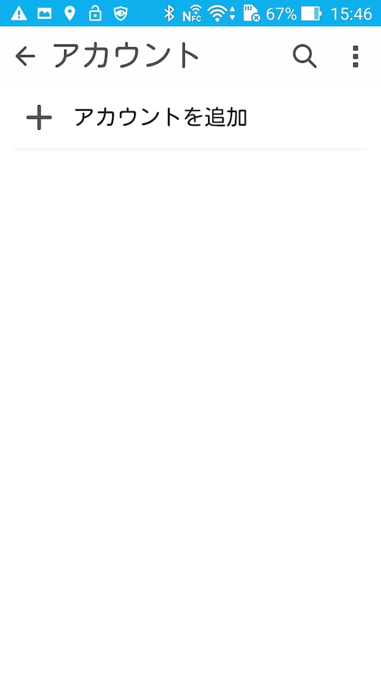

Googleアカウントを追加したいので「Google」をタップします。

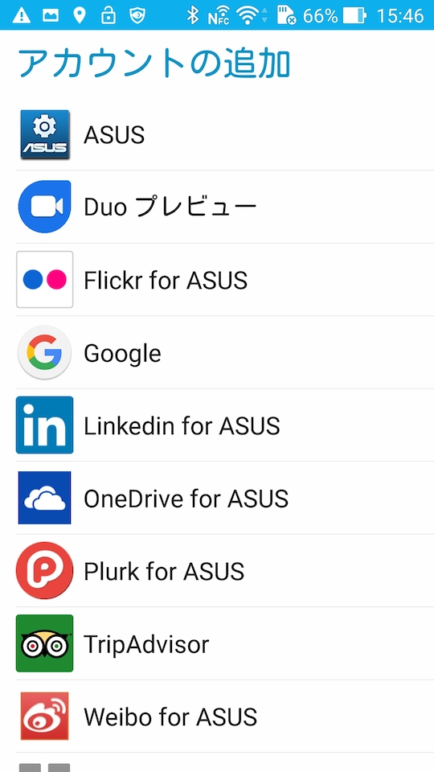

ログイン画面に遷移しますので、ユーザー／パスワードを入力して進めます。

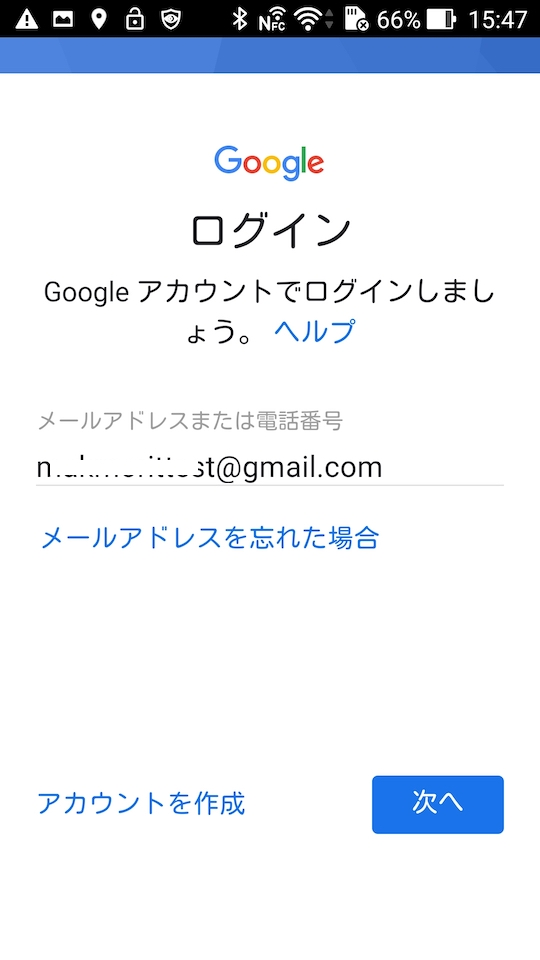

２段階認証プロセス画面に遷移します。

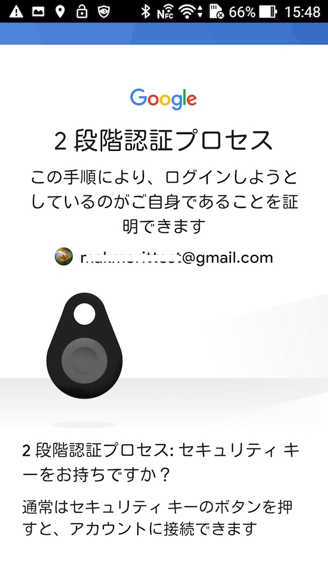

nRF52840 Dongle上の青緑色のLEDが点滅しますので、nRF52840上の白いボタンを１回プッシュします。

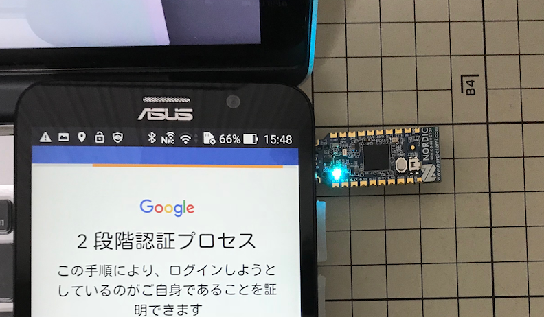

ほどなく、以下の利用規約同意画面に遷移すれば、U2F Authenticateは成功します。

「同意する」をタップして処理を進めます。

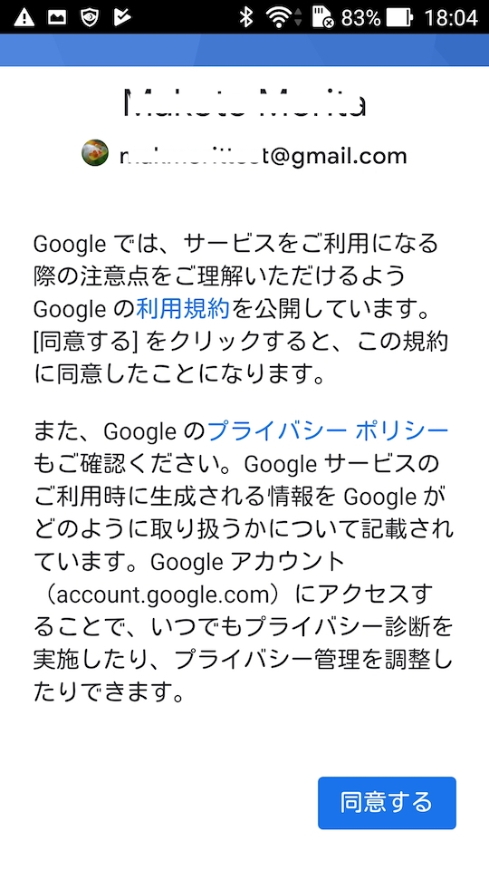

こちらのGoogleサービス画面でも「同意する」をタップします。

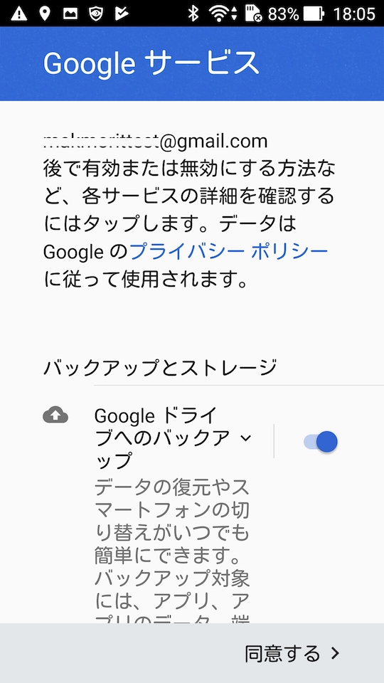

正常にGoogleアカウントが追加されていることを確認します。

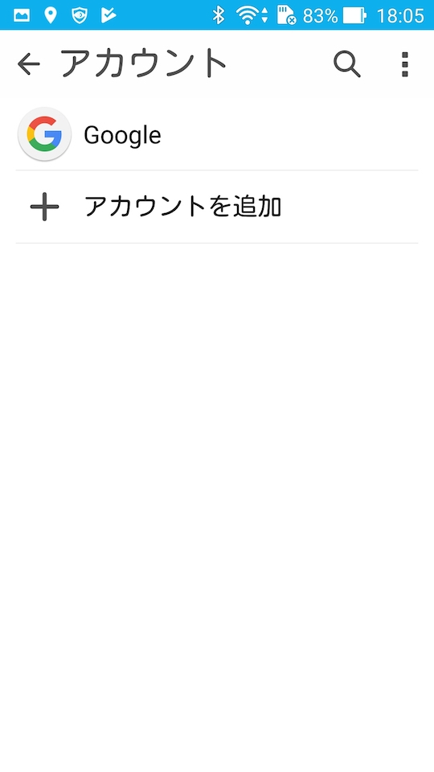

以上で、Android上でのU2F Authenticateの確認は完了になります。
