# Diverta FIDO Authenticator

## 概要
FIDO U2Fの仕様に準拠したUSB HID／BLEサービスです。

- PCにおけるU2F Register／Authenticate実行時：ドングルをUSBポートに挿すと、nRF52840のUSB HIDサービスを経由して処理が行われます。

- AndroidにおけるU2F Authenticate実行時：ドングルに外部電源を供給すると、nRF52840のBLEサービスを経由して処理が行われます。

FIDO U2Fに関する情報 : https://fidoalliance.org/download/

### ハードウェア

nRF52840 Dongleでの動作を想定しています。

ただし、nRF52840 DK（開発用ボード）でも動作させることが可能です。 
この場合は、USB経由のUARTにより、デバッグログを表示させることができます。

### ファームウェア

「Diverta FIDO Authenticator」で使用するファームウェアは下記の２本になります。 
フォルダー `firmwares` に格納しています。

- s140_nrf52_6.1.0_softdevice.hex - ソフトデバイス

- nrf52840_xxaa.hex - アプリケーション

これらのファームウェアは、Nordic社から提供されているアプリ「nRF Connect」を使い、nRF52840 Dongleにダウンロードするようにします。 
「nRF Connect」を使用したダウンロード手順は、別ドキュメント<b>「[nRF52840 Dongleプログラミング手順](../Development/nRF52840/NRFCONNECTINST.md)」</b>をご参照願います。 
　
## 動作確認手順

nRF52840 Dongleと、Googleアカウント、Chromeブラウザーを使用して、U2F Register／Authenticateの動作確認をする場合は、以下の手順で進めるようにします。

<b>[AndroidでのU2F Authenticate確認手順はこちら](ANDROID.md)</b>

### 事前準備

Googleアカウントが必要になります。 
また、使用するGoogleアカウントについて、２段階認証を有効にしておく必要があります。

下図は、Googleアカウントの２段階認証が有効になっていて、かつセキュリティ・キーがまだ登録（Register）されていない状態の例です。

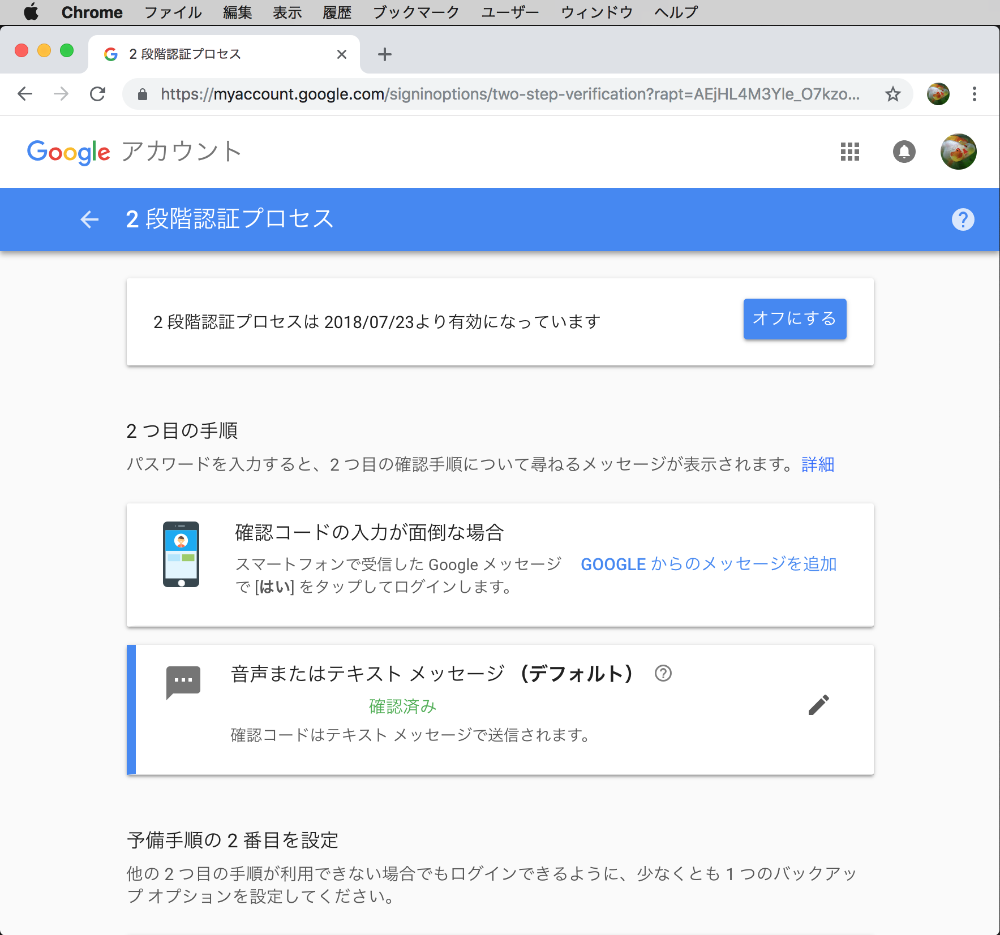

### 鍵・証明書のインストール

U2F管理ツールを使用して、U2F Registerに必要な鍵・証明書のインストールを行います。

U2F管理ツールを使用した鍵・証明書のインストール手順は、別ドキュメント<b>「[鍵・証明書インストール手順（macOS版）](../Usage/INSTALL.md)」</b>、または<b>「[鍵・証明書インストール手順（Windows版）](../Usage/INSTALL_WINDOWS.md)」</b>をご参照願います。 

### セキュリティ キーの登録(U2F Register)

Chromeブラウザーを開き、２段階認証プロセスの設定ページ（https://myaccount.google.com/signinoptions/two-step-verification）に移動します。

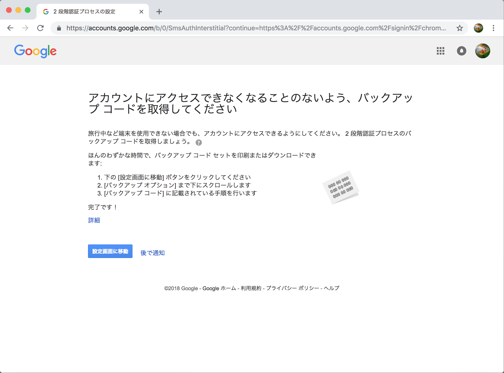

「設定画面に移動」をクリックし、ユーザー／パスワードを入力すると、下図のような設定画面に遷移します。 
「セキュリティ キーを追加」をクリックして処理を進めます。

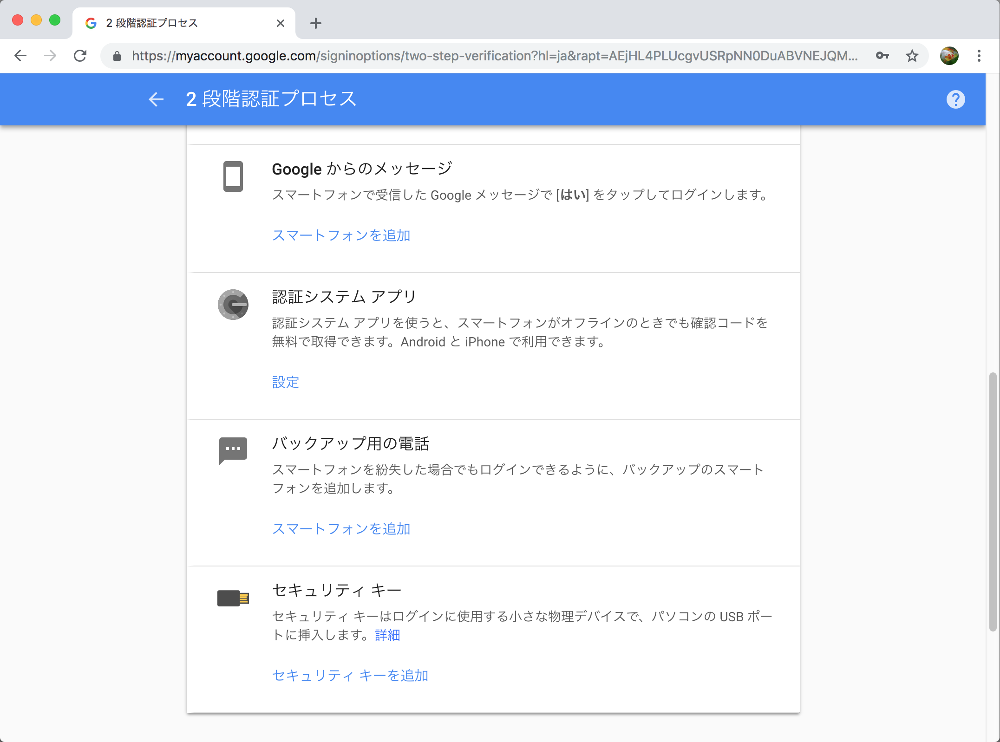

下図のような画面に遷移しますが、この時点ではまだ、nRF52840 Dongleを接続しないようにします。 
「次へ」をクリックします。

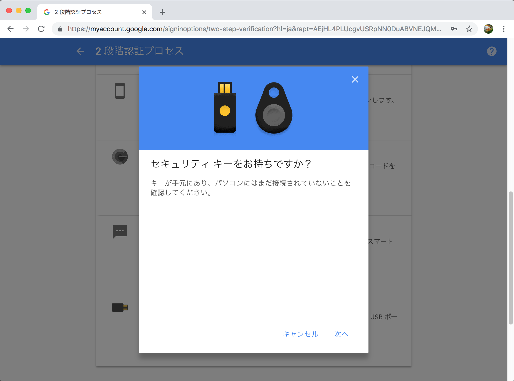

下図のような画面に遷移します。

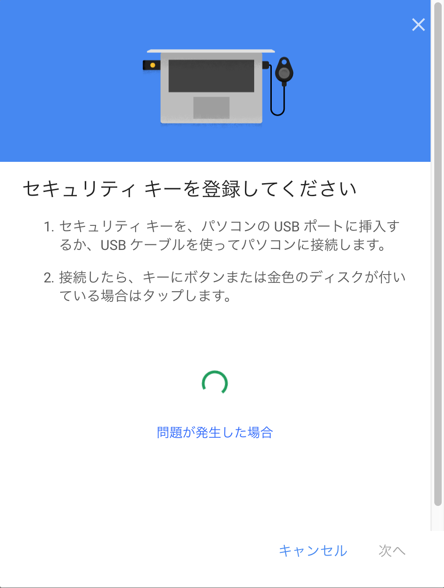

ここでnRF52840 DongleをPCに挿入します。 
程なく、緑色のLEDが点滅を始めます。

nRF52840 Dongle上の白いボタンを１回プッシュすると、下図のようなポップアップが表示されます。 
「許可」をクリックします。

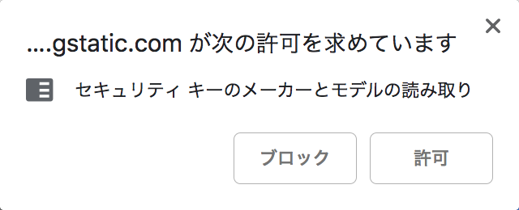

下図のような画面に遷移しますので、任意の名称を入力して「完了」をクリックします。

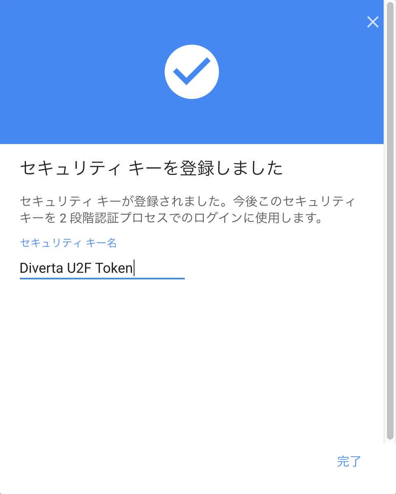

下図のような画面に、登録されたセキュリティ キーが表示されたら、U2F Registerは完了となります。

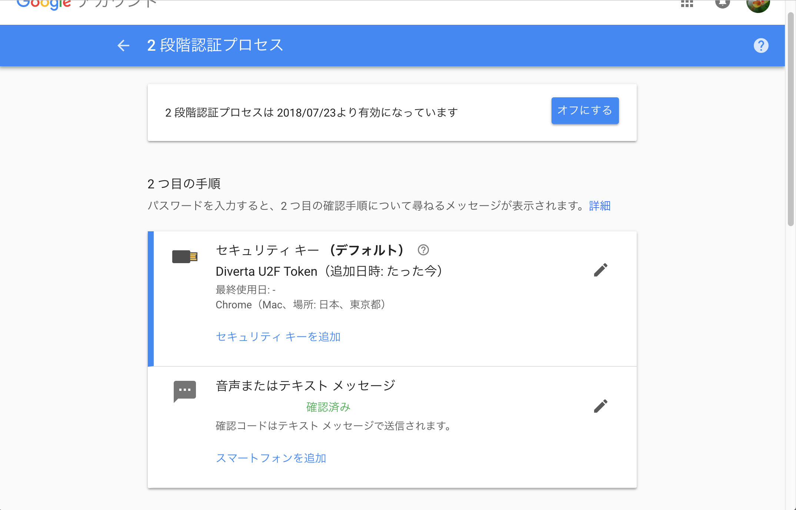

適宜、nRF52840 DongleをPCのUSBポートから外してください。

### セキュリティ キーを使ったログイン(U2F Authenticate)

Chromeブラウザーを開き、Googleアカウントログインページ（https://www.google.com/accounts/login?hl=ja）に移動します。 
下図のような画面に遷移しますので、ユーザー／パスワードを入力して画面を進めます。

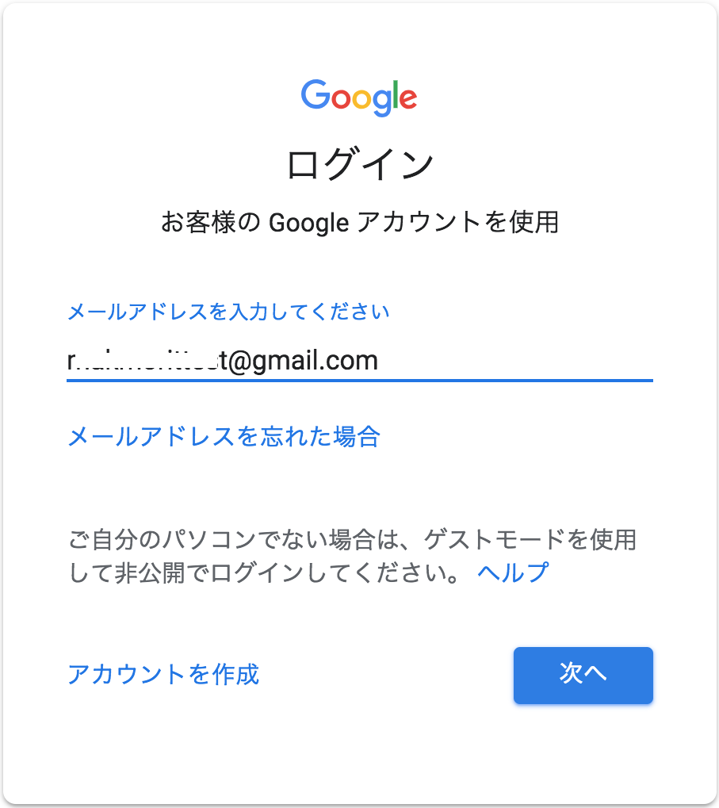

下図のような画面に遷移します。

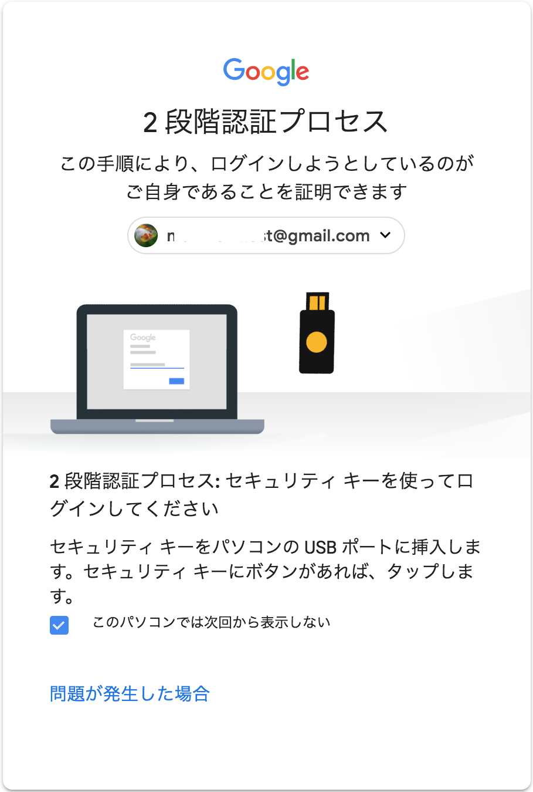

ここで再び、nRF52840 DongleをPCに挿入します。 
程なく、緑色のLEDが点滅を始めます。

nRF52840 Dongle上の白いボタンを１回プッシュすると、Chromeの画面がクリアされ、下図のようにメッセージだけが表示される画面に変わりますが、しばらく待ちます。

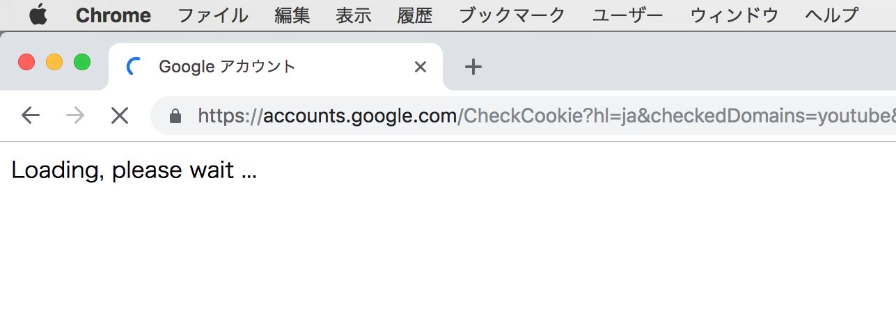

下図のように、Googleアカウントのホームページが表示されたら、U2F Authenticateは完了となります。

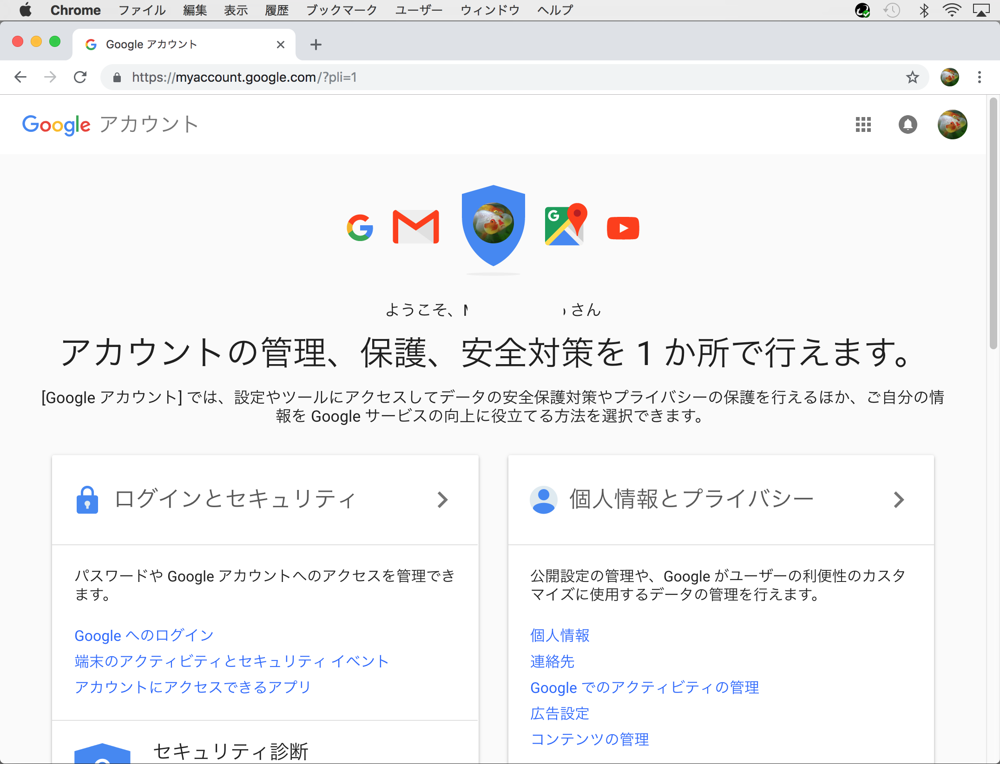

適宜、nRF52840 DongleをPCのUSBポートから外してください。

## スリープについて

nRF52840 Dongleは、スリープ状態でない（＝アイドル状態の）場合、基板上の青色LEDが約２秒ごとに点滅するようになっております。

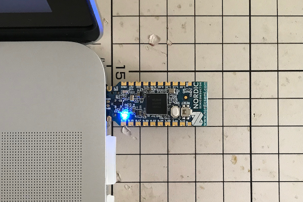

本ファームウェアでは、nRF52840 Dongleが無操作／無通信後３分が経過すると、スリープするように設定されています。 
この動作は、Dongle単体で動作時も、PCのUSBポートに装着してある状態でも、一緒になります。

スリープ状態に入ると、基板上の青色LEDが消灯した状態となります。

### スリープ状態からの解除

スリープ状態では、U2F Register／Authenticateはもちろん、U2F管理ツールによる諸機能（鍵・証明書管理機能、ヘルスチェック機能）が実行できなくなります。

スリープ状態から解除させる場合は、<b>nRF52840 Dongleの基板上の白いボタンをプッシュ</b>してください。

スリープが解除されアイドル状態に戻り、基板上の青色LEDが、再び約２秒ごとに点滅し始めます。

