# nRF52832 BLE NUSサンプル

## ble_app_uart_test

Nordicのサンプルアプリ[`Nordic UART Service (NUS) Application`](https://infocenter.nordicsemi.com/index.jsp?topic=%2Fcom.nordic.infocenter.sdk5.v15.2.0%2Fble_sdk_app_nus_c.html&cp=4_0_0_4_1_0_7)をノンカスタマイズで使用しています。

BLE Peripheralデバイス上で、UARTサービスを実装するサンプルです。

### 動作確認環境

- macOS Sierra（10.12.6）
- NetBeans IDE（8.2）
- Java SE Runtime Environment（1.8.0_131）
- nRF52832 DK（PCA10040）

### 動作確認準備

あらかじめnRF52832 DKから、One Cardの開発用シールド（上部にスタックしている基板）を外します。<br>
でないと、BLE NUSサンプルが正しく動作しないようです。

## ファームウェアの準備（nRF52832版）

<b>[ファームウェアの準備（nRF52840版）はこちら](README_nRF52840.md)</b>

NetBeansを導入のうえ、NetBeansでプロジェクトを作成し、ビルド＆書込みを行います。<br>
（NetBeans導入に関しては、[こちらのドキュメント](../../../Development/nRF52840/NETBEANS.md)をご参照）

### プロジェクト作成

NetBeansを起動し、ファイル--->新規プロジェクトを実行します。

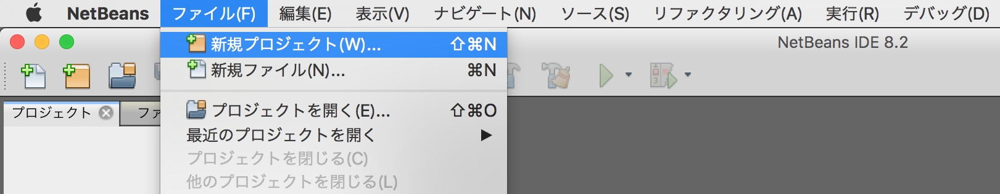

新規プロジェクト画面が表示されますので、一覧から「既存のソースを使用するC/C++プロジェクト」を選択し「次 >」をクリックします。

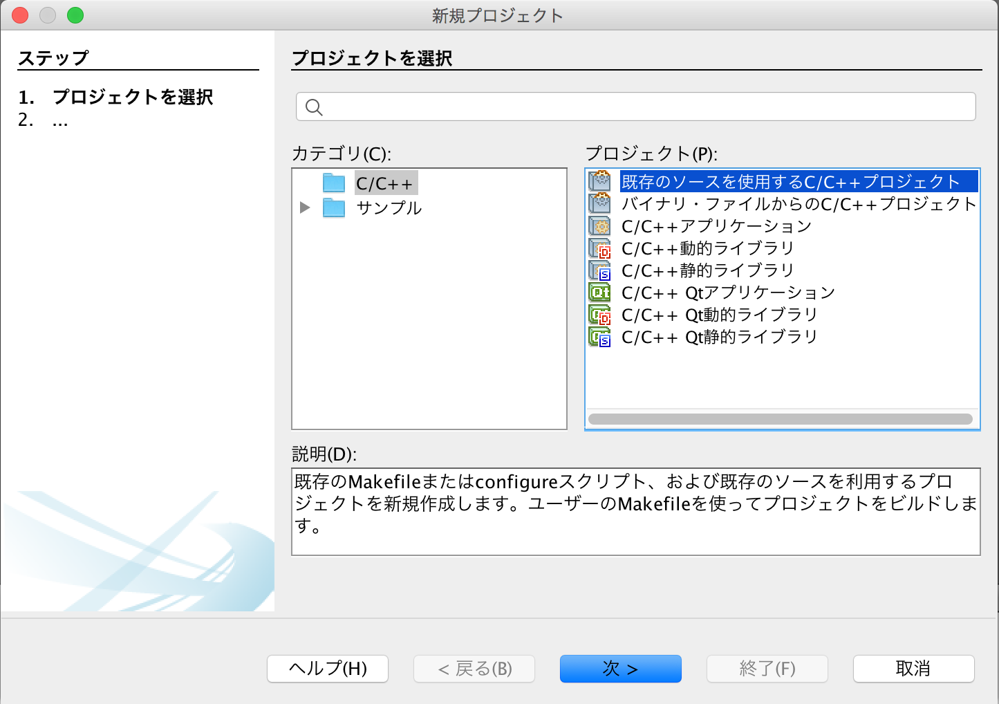

下図のような画面に遷移しますので、以下のように設定します。

- 既存のソースを含むフォルダを指定 - サンプルアプリが格納されているフォルダー「examples/ble_peripheral/ble_app_uart」を指定します。
下図の例では「/Users/makmorit/GitHub/onecard-fido/nRF5_SDK_v15.2.0/examples/ble_peripheral/ble_app_uart」という文字列が設定されています。

- 「ツール・コレクション(T)」で「GNU Mac」を選択

- 「ビルド・アナライザの使用(S)」のチェックを外す

- 構成モードを選択 - 「カスタム(C)」をチェックします。

設定が完了したら「次 >」をクリックします。

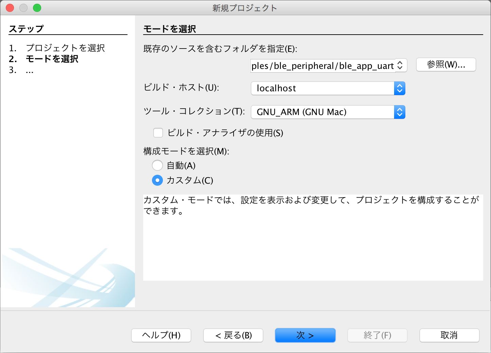

下図のような画面に遷移しますので、以下のように設定します。

- 「事前ビルド・ステップが必要」にチェック

- フォルダで実行(U) - サンプルアプリのサブフォルダー「pca10040/s132/armgcc」を指定します。<br>
下図の例では「/Users/makmorit/GitHub/onecard-fido/nRF5_SDK_v15.2.0/examples/ble_peripheral/ble_app_uart/pca10040/s132/armgcc」という文字列が設定されています。

- 「カスタム・コマンド」にチェック
コマンド(O) - 「make」と入力します。

設定が完了したら「次 >」をクリックします。


「4. ビルド・アクション」に遷移しますが、以降は「7. プロジェクトの名前と場所」に遷移するまではデフォルト設定のまま「次 >」をクリックします。

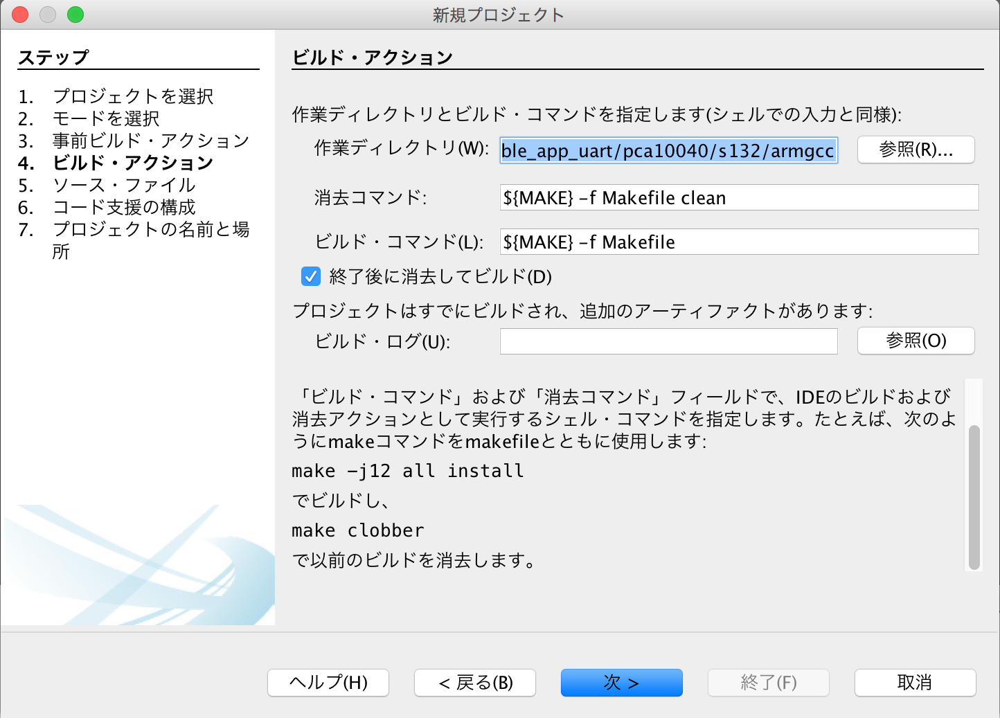

「7. プロジェクトの名前と場所」に遷移したら、プロジェクト名(P)を「ble_app_uart」から「ble_app_uart_test」に変更しておきます。<br>
（オリジナルのプロジェクト「ble_app_uart」を上書きしたくないための措置です）

設定が完了したら「終了(F)」をクリックします。

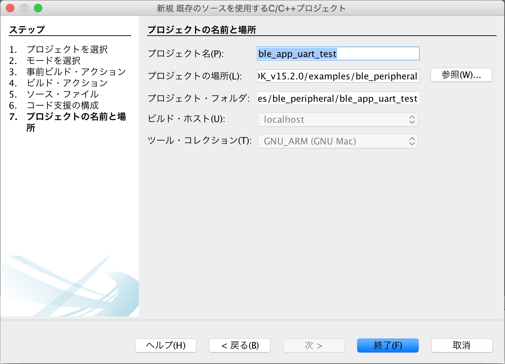

### メイクファイル修正とビルド

この手順では、プロジェクトファイル（GitHub管理ディレクトリー）とサンプルプログラムのディレクトリー構成が異なっているため、メイクファイルにNordic SDK 15.2.0の場所を認識させる必要があります。<br>
メイクファイルは以下のとおり修正します。

- 修正前
```
SDK_ROOT := ../../../../../..
```

- 修正後
```
SDK_ROOT := $(HOME)/opt/nRF5_SDK_15.2.0
```

NetBeans上でメイクファイルを開き、直接編集のうえ、保存します。

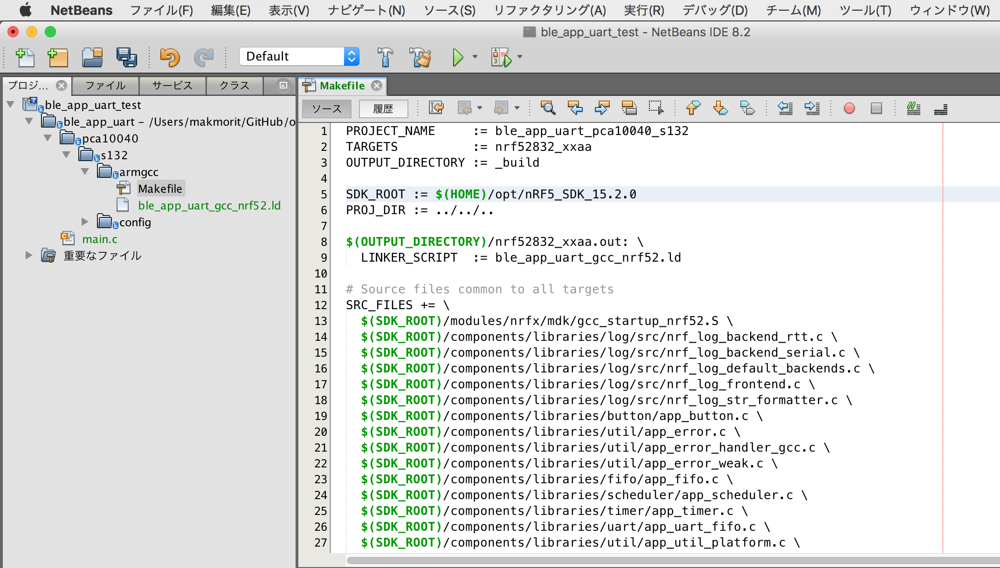

「プロジェクト(ble_app_uart_test)をビルド (F11)」を実行します。<br>
（またはF11キーを押下）

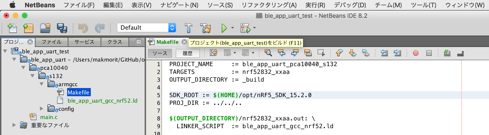

しばらくするとビルドが完了し「ビルド SUCCESSFUL」と表示されれば、ビルドは成功です。


### ファームウェアの書き込み

NetBeansを起動し、プロジェクト「ble_app_uart_test」を右クリックして「プロパティ」を実行します。

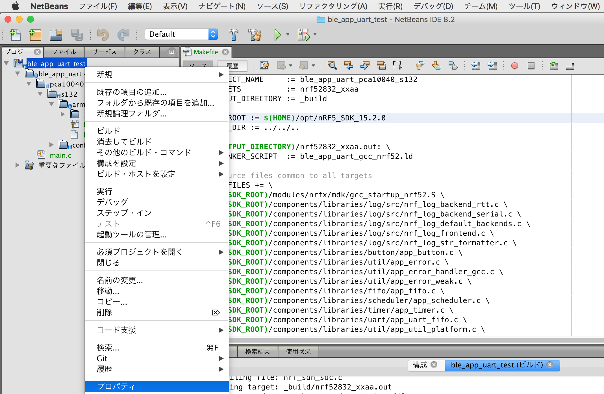

プロジェクト・プロパティ画面が表示されます。

左ペインの「実行」をクリックしで、以下のように設定を変更します。

- コマンドの実行 - 「make flash_softdevice flash」に変更します。

- 実行ディレクトリ - 実行するMakefileが配置されているディレクトリーが表示されていることを確認します。
下図の例では、`../ble_app_uart/pca10040/s132/armgcc`という文字列が設定されています。

変更が完了したら「OK」をクリックして、いったんプロジェクト・プロパティ画面を閉じます。

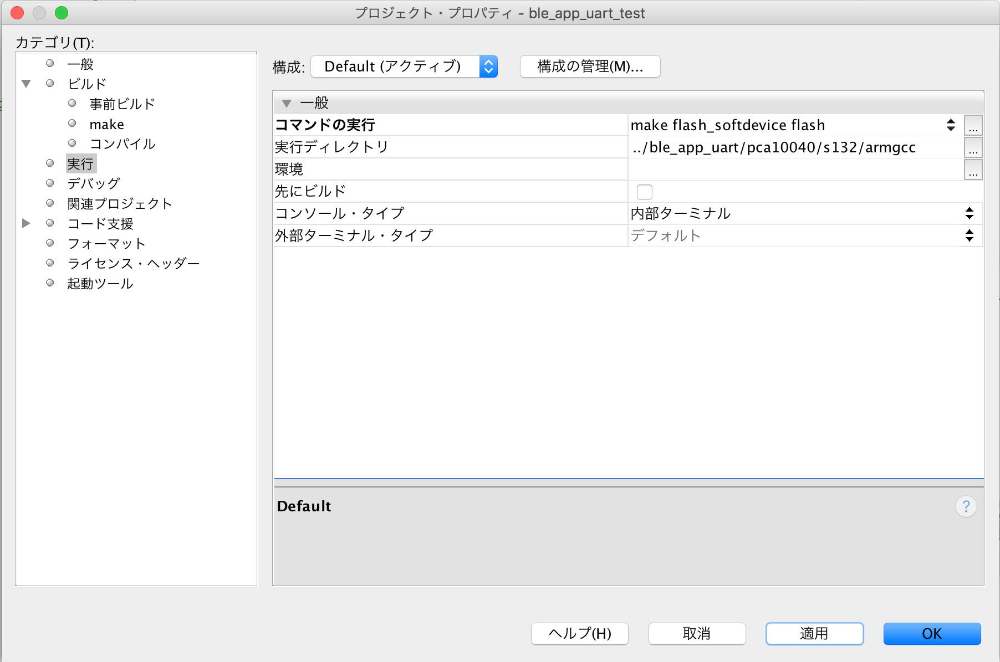

「プロジェクト(ble_app_uart_test)を実行 (F6)」を実行します。<br>
（またはF6キーを押下）

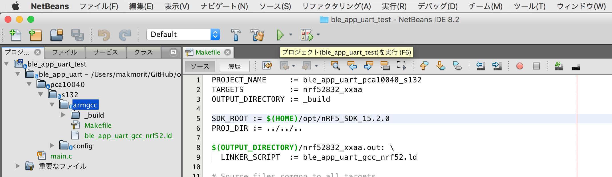

プログラムが自動的に書き込まれ、nRF52832上でアプリケーションが実行されます。<br>
NetBeansの右下部のコンソールには「実行 FINISHED; 終了値0」と表示されます。

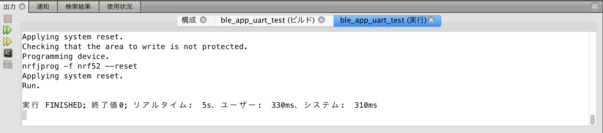

以上で、ファームウェアの準備は完了となります。

## 動作確認手順

まず、nRF52832とPCを、USBケーブル（microB）で接続します。<br>
そして、ターミナルでUARTプリントを表示させたのち、nRF52832ボード上のリセットボタンを押下します。<br>
ほどなく、`UART started.`という文字列が表示されるのを確認します。

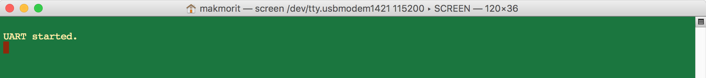

その後、Android端末に導入した`nRF UART v2.0`というアプリを使用して、データの送受信を行います。<br>
下図のように「QWERTY」とテキストを送信してみます。

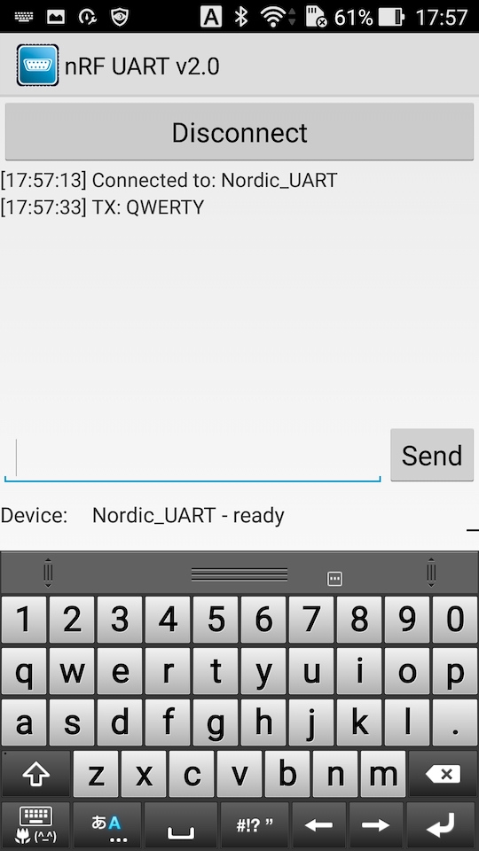

nRF52832のデバッグプリントから同じく「QWERTY」とテキストが表示されれば、動作確認は完了です。

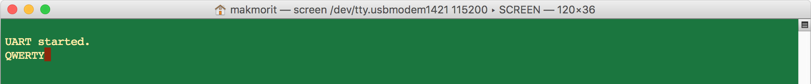
