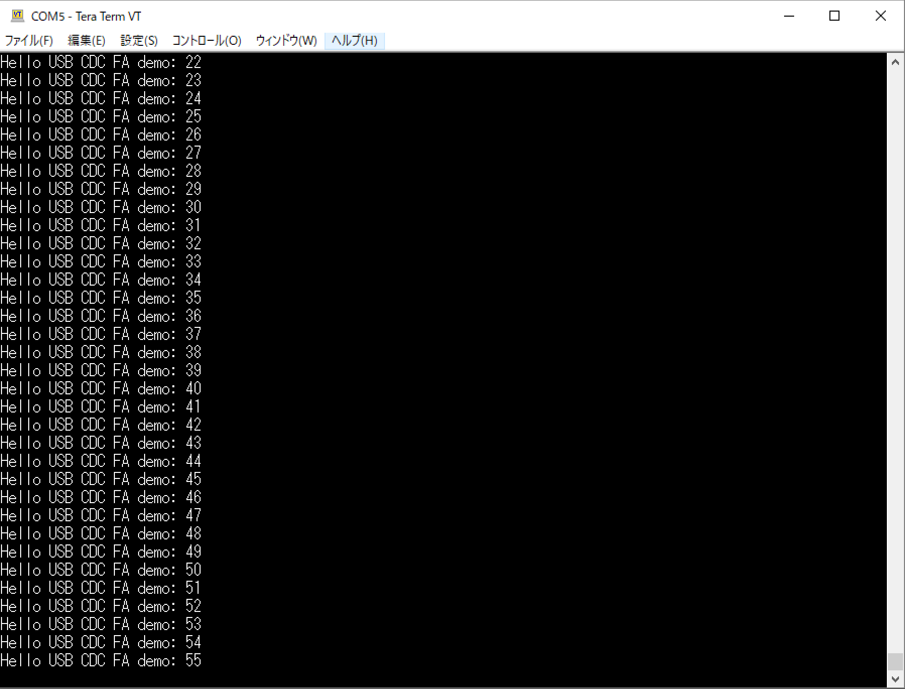

# nRF52840 Dongle調査用アプリ

## ble_peripheral_logger_proj

Nordicの[USB CDCサービスのサンプルアプリ](https://infocenter.nordicsemi.com/index.jsp?topic=%2Fcom.nordic.infocenter.sdk5.v15.2.0%2Fusbd_cdc_acm_example.html&cp=4_0_0_4_5_50_3)を改修し、Dongle側で収集した各種ログを、PCのUSBポート経由で送信できるアプリケーションに転化させています。

<b>[アプリケーション転用手順はこちら](buildFromSample.md)</b>

### 動作確認環境

- macOS または Windows 10
- NetBeans IDE（8.2）
- Java SE Runtime Environment（1.8.0_131）
- nRF52840 Dongle（PCA10059）

### 動作確認準備

NetBeansプロジェクトですので、NetBeansでプロジェクトを開き、ビルド＆書込みを行います。 
（NetBeansに関しては、[こちらのドキュメント](../../../Development/nRF52840/NETBEANS.md)をご参照）

Windows 10環境での確認用としては、シリアル通信用のコンソールアプリ（Tera Term 等）を別途インストールしておきます。 
macOS環境の場合は、システムに同梱のターミナルアプリ上で、screenコマンドを実行すれば確認できます。

### 動作確認方法

まず、nRF52840 Dongleを、PCのUSBポートに装着します。 
その後、シリアル通信用のコンソールアプリ（Tera Term や screenコマンド）を起動します。

コンソールアプリの接続先としましては、nRF52840 Dongleの仮想COMポートを接続するようにしてください。 
接続ボーレートは 115200 になります。

#### Windows環境での確認例
Tera Term Version 4.95 を使用しました。 
`COM5`というのが、仮想COMポート名になります。

#### macOS環境での確認例
screenコマンドを使用しました。 
`/dev/tty.usbmodem1411`というのが、仮想COMポート名になります。

