# [WIP] サンプルアプリ転用手順

## 概要

Nordicの[USB CDCサービスのサンプルアプリ](https://infocenter.nordicsemi.com/index.jsp?topic=%2Fcom.nordic.infocenter.sdk5.v15.2.0%2Fusbd_cdc_acm_example.html&cp=4_0_0_4_5_50_3)を改修し、単純にDongleから周期的にテキストをシリアル出力させるアプリケーションに転化させます。

### 動作確認環境

- macOS または Windows 10
- NetBeans IDE（8.2）
- Java SE Runtime Environment（1.8.0_131）
- nRF52840 Dongle（PCA10059）


## サンプルの初期動作確認

NetBeansを導入のうえ、NetBeansでプロジェクトを作成し、ビルド＆書込みを行います。<br>
（NetBeans導入に関しては、[こちらのドキュメント](../../../Development/nRF52840/NETBEANS.md)をご参照）

注意点としては、<b>USB CDCサービスのサンプルアプリが、nRF52840 Dongleではなく、nRF52840 DK向けに作成されている</b>ということです。<br>
すなわち、初期動作確認は、nRF52840 DKを使用して行うことになります。

### サンプルアプリ取得

[開発環境に導入済みのnRF52 SDK](https://github.com/diverta/onecard-fido/blob/38e6add3f79e98335373e16a23b8186691a3284c/Development/nRF52840/NETBEANS.md#ツールチェインsdkの配置)のサンプルアプリ格納フォルダーから、本件で使用するサンプルアプリをフォルダーごとコピーします。<br>
（サンプルアプリは、`${HOME}/opt/nRF5_SDK_15.2.0/examples/peripheral/usbd_cdc_acm`にあります）

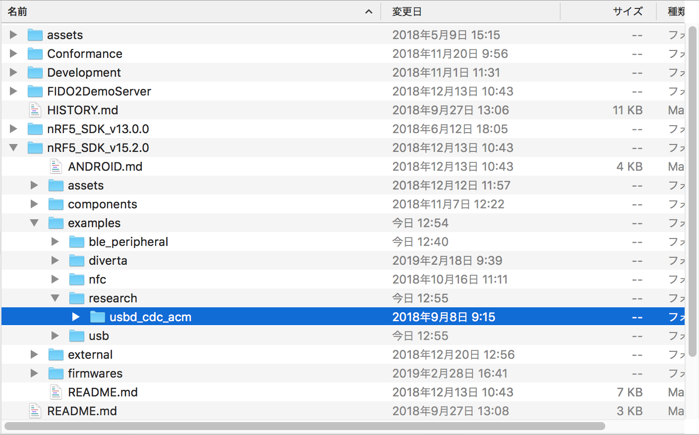

サンプルアプリの名称`usbd_cdc_acm`を、`ble_peripheral_logger`に変更します。

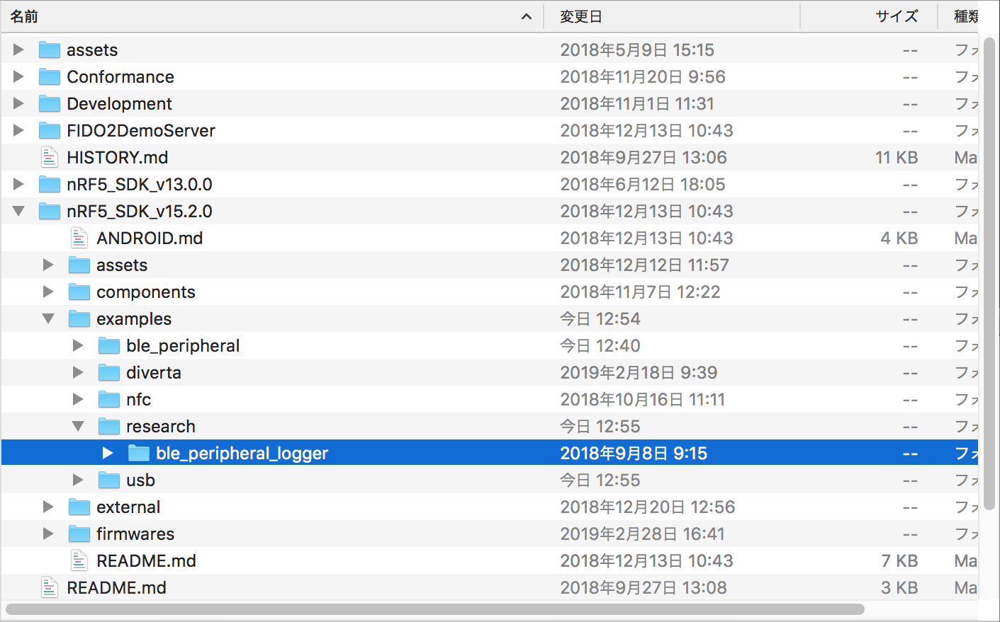

サンプルアプリから、以下のファイル／サブディレクトリーを残して全て削除します。
- `main.c`
- `pca10056/s140/armgcc`（最初は`blank`という名称ですが、`s140`と名称変更します）
- `pca10056/s140/config`（同上）

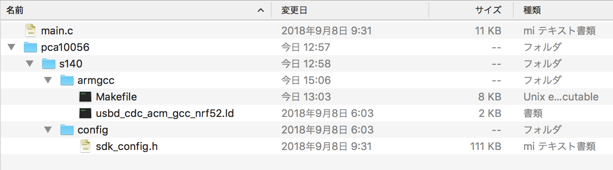

### プロジェクト作成

NetBeansを起動し、ファイル--->新規プロジェクトを実行します。

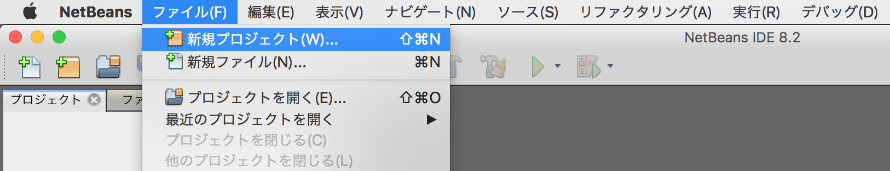

新規プロジェクト画面が表示されますので、一覧から「既存のソースを使用するC/C++プロジェクト」を選択し「次 >」をクリックします。

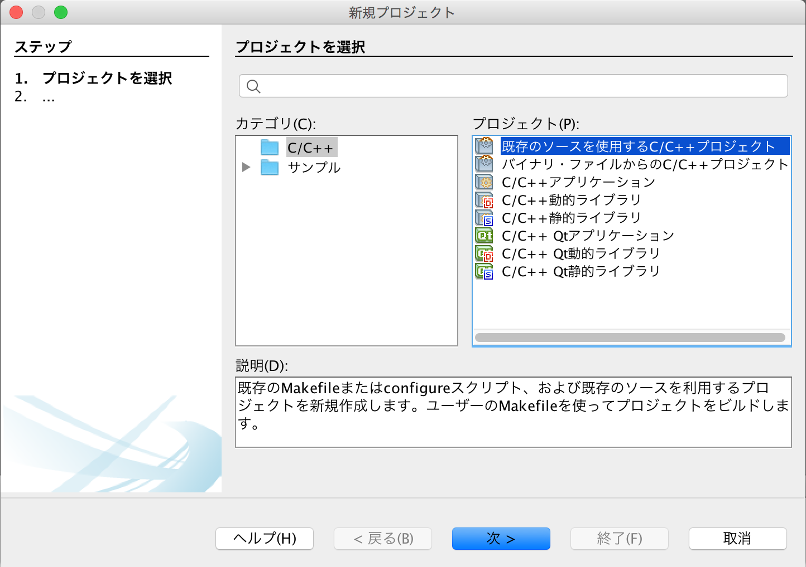

下図のような画面に遷移しますので、以下のように設定します。

- 既存のソースを含むフォルダを指定 - サンプルアプリが格納されているフォルダー「examples/research/ble_peripheral_logger」を指定します。
下図の例では「/Users/makmorit/GitHub/onecard-fido/nRF5_SDK_v15.2.0/examples/research/ble_peripheral_logger」という文字列が設定されています。

- 「ツール・コレクション(T)」で「GNU Mac」を選択

- 「ビルド・アナライザの使用(S)」のチェックを外す

- 構成モードを選択 - 「カスタム(C)」をチェックします。

設定が完了したら「次 >」をクリックします。

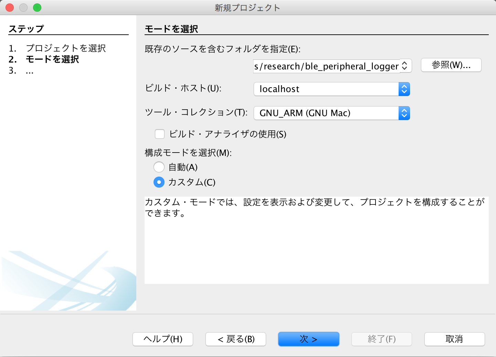

下図のような画面に遷移しますので、以下のように設定します。

- 「事前ビルド・ステップが必要」にチェック

- フォルダで実行(U) - サンプルアプリのサブフォルダー「pca10056/s140/armgcc」を指定します。<br>
下図の例では「/Users/makmorit/GitHub/onecard-fido/nRF5_SDK_v15.2.0/examples/research/ble_peripheral_logger/pca10056/s140/armgcc」という文字列が設定されています。

- 「カスタム・コマンド」にチェック
コマンド(O) - 「make」と入力します。

設定が完了したら「次 >」をクリックします。

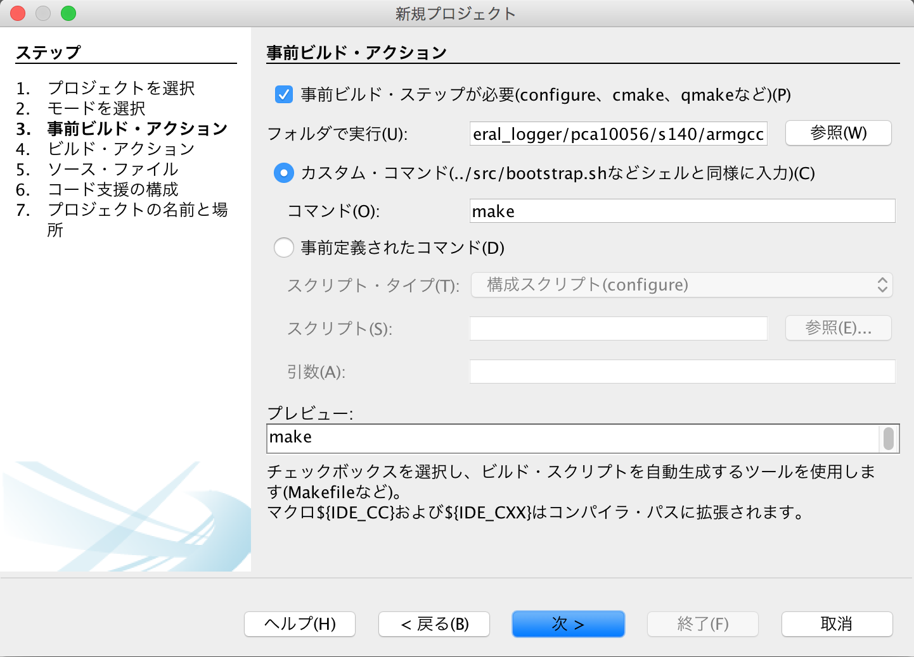

「4. ビルド・アクション」に遷移しますが、以降は「7. プロジェクトの名前と場所」に遷移するまではデフォルト設定のまま「次 >」をクリックします。


「7. プロジェクトの名前と場所」に遷移したら、プロジェクト名(P)を「ble_peripheral_logger」から「ble_peripheral_logger_proj」に変更しておきます。<br>
（オリジナルのプロジェクト「ble_peripheral_logger」を上書きしたくないための措置です）

設定が完了したら「終了(F)」をクリックします。

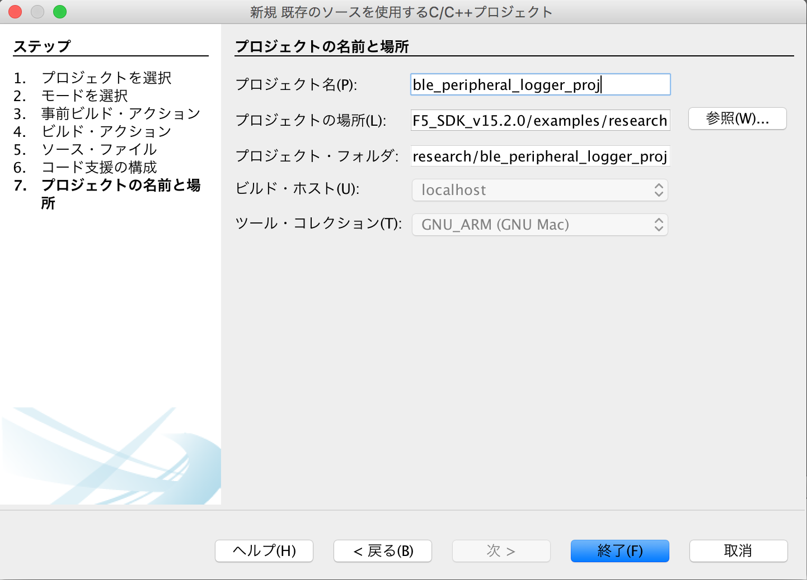

### メイクファイル修正とビルド

この手順では、プロジェクトファイル（GitHub管理ディレクトリー）とサンプルプログラムのディレクトリー構成が異なっているため、メイクファイルにNordic SDK 15.2.0の場所を認識させる必要があります。<br>
また同時に、サンプルプロジェクトの名称を変更しておきます。<br>
メイクファイルは以下のとおり修正します。

- 修正前
```
PROJECT_NAME := usbd_cdc_acm_pca10056
:
SDK_ROOT := ../../../../../..
```

- 修正後
```
PROJECT_NAME := ble_peripheral_logger_pca10056
:
SDK_ROOT := $(HOME)/opt/nRF5_SDK_15.2.0
```

NetBeans上でメイクファイルを開き、直接編集のうえ、保存します。

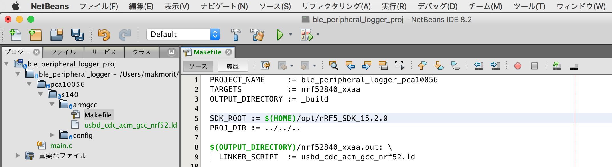

「プロジェクト(ble_peripheral_logger_proj)をビルド (F11)」を実行します。<br>
（またはF11キーを押下）

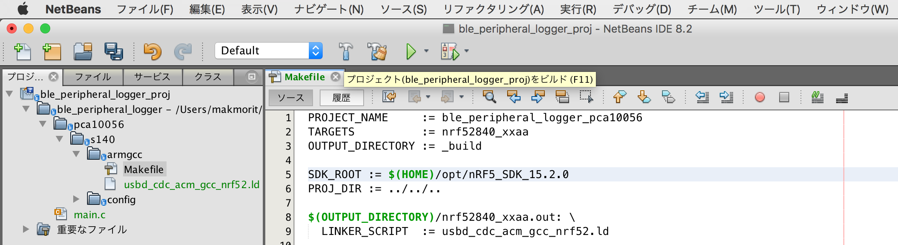

しばらくするとビルドが完了し「ビルド SUCCESSFUL」と表示されれば、ビルドは成功です。

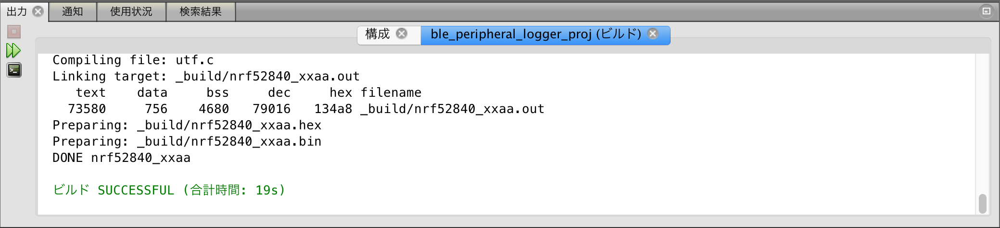

### ファームウェアの書き込み

NetBeansを起動し、プロジェクト「ble_peripheral_logger_proj」を右クリックして「プロパティ」を実行します。

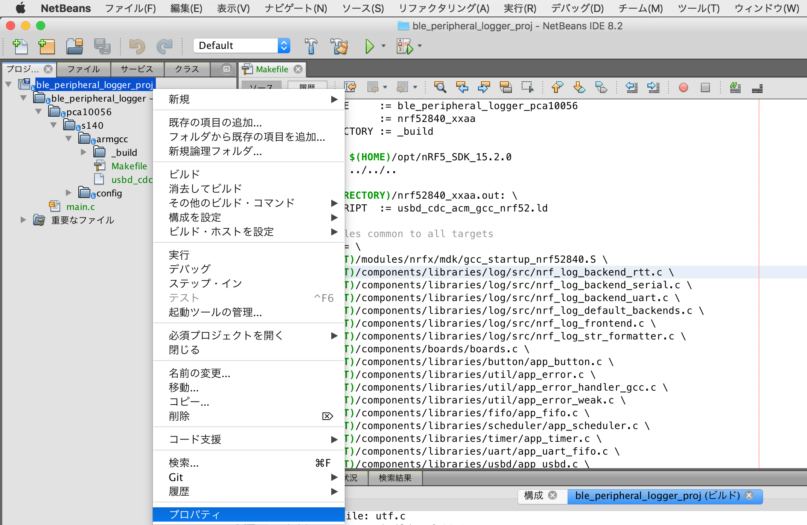

プロジェクト・プロパティ画面が表示されます。

左ペインの「実行」をクリックしで、以下のように設定を変更します。

- コマンドの実行 - 「make flash」に変更します。

- 実行ディレクトリ - 実行するMakefileが配置されているディレクトリーが表示されていることを確認します。
下図の例では、`../ble_peripheral_logger/pca10056/s140/armgcc`という文字列が設定されています。

変更が完了したら「OK」をクリックして、いったんプロジェクト・プロパティ画面を閉じます。

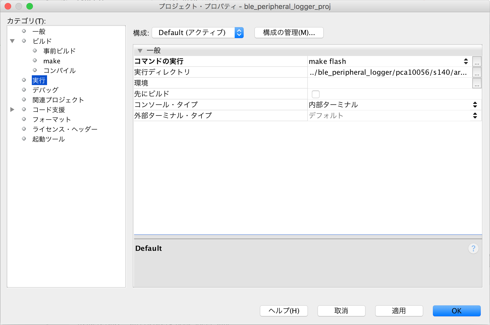

nRF52840 DKを、USBケーブルでPCと接続したのち「プロジェクト(ble_peripheral_logger_proj)を実行 (F6)」を実行します。<br>
（またはF6キーを押下）

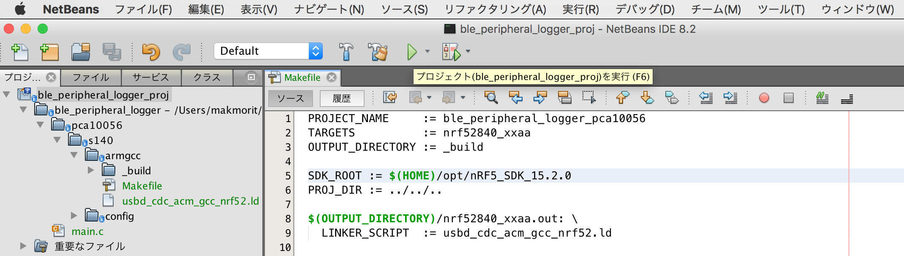

プログラムが自動的に書き込まれ、nRF52840上でアプリケーションが実行されます。<br>
NetBeansの右下部のコンソールには「実行 FINISHED; 終了値0」と表示されます。

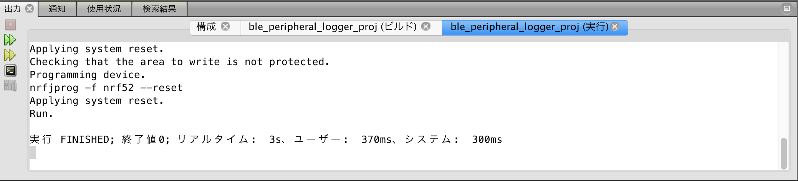

以上で、ファームウェアの準備は完了となります。

### 動作確認手順

まず、nRF52840 DKとPCを、USBケーブル（microB）で接続します。<br>
そして、ターミナルアプリで仮想COMポートに接続させたのち、nRF52840ボード上のボタン１を押下します。<br>
ほどなく、下図のように`Hello USB CDC FA demo: xxxx`（xxxx は半角数字）という文字列が表示されるのを確認します。

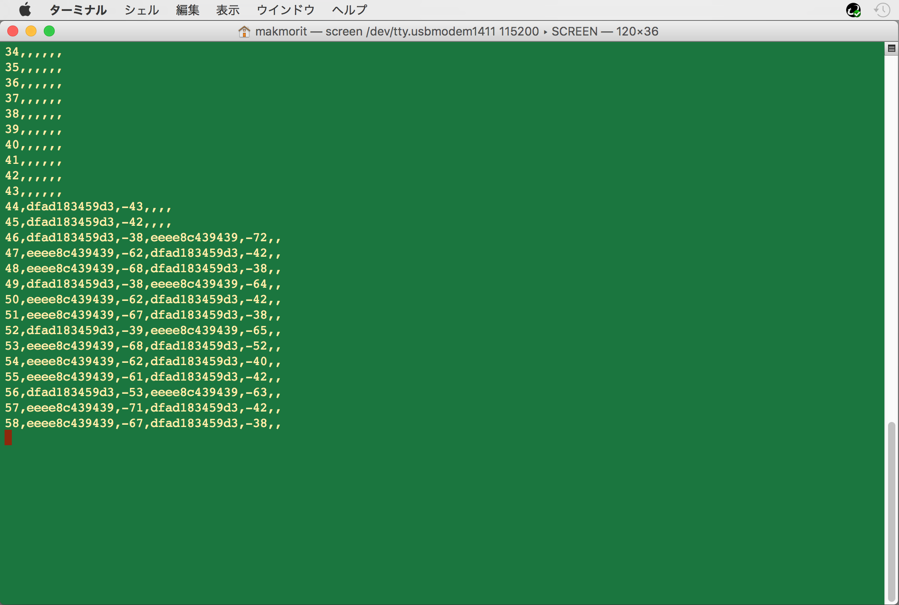

これで初期動作確認は完了です。

## [WIP] ターゲットをnRF52840 Dongleに変更

前述のサンプルアプリは、nRF52840 DKで動作させたものです。

実際の調査には、nRF52840 Dongleで動作させたいため、サンプルアプリのターゲットをnRF52840 Dongleに変更しなければなりません。

そのための手順は後報します。
