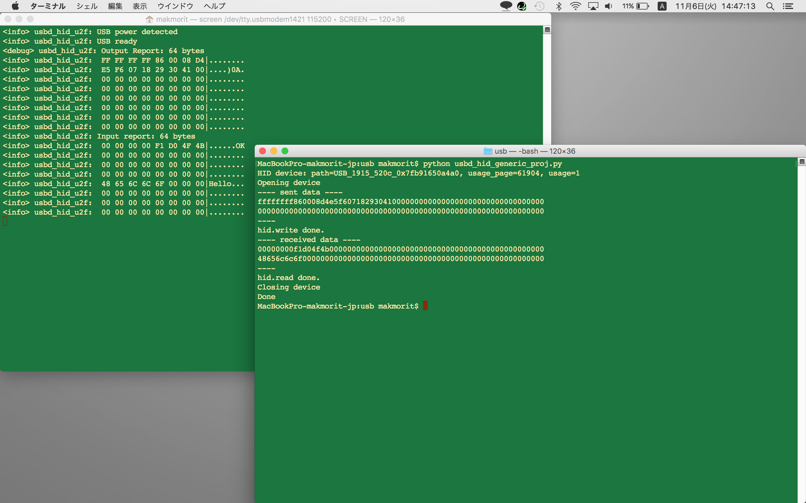

# nRF52840 USBサンプル

## usbd_hid_generic_proj

Nordicのサンプルアプリ[`USB HID Generic Example`](https://infocenter.nordicsemi.com/topic/com.nordic.infocenter.sdk5.v15.2.0/usbd_hid_generic_example.html?cp=4_0_0_4_5_50_6)を改修し、Generic input/output reportが送受信できるUSB HIDデバイスに転化させています。

### 動作確認環境

- macOS Sierra（10.12.6）
- NetBeans IDE（8.2）
- Java SE Runtime Environment（1.8.0_131）
- nRF52840 DK（PCA10056）

### 動作確認準備

NetBeansプロジェクトですので、NetBeansでプロジェクトを開き、ビルド＆書込みを行います。<br>
（NetBeansに関しては、[こちらのドキュメント](../../../Development/nRF52840/NETBEANS.md)をご参照）

また、動作確認のために、Pythonスクリプトを使用するので、[`cython-hidapi`](https://github.com/trezor/cython-hidapi)を導入しておきます。<br>
（Pythonは、macOSにバンドルされている2.7.10が使用できます）

### 動作確認方法

まず、nRF52840とPCを、２本のUSBケーブル（microB）で接続します。


その後、`usbd_hid_generic_proj.py`を使用して、テストデータの送受信を行います。<br>
実行すると、以下のようなデバッグプリントが出力されます。



```
MacBookPro-makmorit-jp:~ makmorit$ cd /Users/makmorit/GitHub/onecard-fido/nRF5_SDK_v15.2.0/examples/usb/
MacBookPro-makmorit-jp:usb makmorit$ python usbd_hid_generic_proj.py
HID device: path=USB_1915_520c_0x7fb91650a4a0, usage_page=61904, usage=1
Opening device
---- sent data ----
ffffffff860008d4e5f607182930410000000000000000000000000000000000
0000000000000000000000000000000000000000000000000000000000000000
----
hid.write done.
---- received data ----
00000000f1d04f4b000000000000000000000000000000000000000000000000
48656c6c6f000000000000000000000000000000000000000000000000000000
----
hid.read done.
Closing device
Done
MacBookPro-makmorit-jp:usb makmorit$
```

一方、nRF52840のUARTコンソールからは、以下のようなデバッグプリントが出力されます。

```
<info> usbd_hid_u2f: USB power detected
<info> usbd_hid_u2f: USB ready
<debug> usbd_hid_u2f: Output Report: 64 bytes
<info> usbd_hid_u2f:  FF FF FF FF 86 00 08 D4|........
<info> usbd_hid_u2f:  E5 F6 07 18 29 30 41 00|....)0A.
<info> usbd_hid_u2f:  00 00 00 00 00 00 00 00|........
<info> usbd_hid_u2f:  00 00 00 00 00 00 00 00|........
<info> usbd_hid_u2f:  00 00 00 00 00 00 00 00|........
<info> usbd_hid_u2f:  00 00 00 00 00 00 00 00|........
<info> usbd_hid_u2f:  00 00 00 00 00 00 00 00|........
<info> usbd_hid_u2f:  00 00 00 00 00 00 00 00|........
<info> usbd_hid_u2f: Input report: 64 bytes
<info> usbd_hid_u2f:  00 00 00 00 F1 D0 4F 4B|......OK
<info> usbd_hid_u2f:  00 00 00 00 00 00 00 00|........
<info> usbd_hid_u2f:  00 00 00 00 00 00 00 00|........
<info> usbd_hid_u2f:  00 00 00 00 00 00 00 00|........
<info> usbd_hid_u2f:  48 65 6C 6C 6F 00 00 00|Hello...
<info> usbd_hid_u2f:  00 00 00 00 00 00 00 00|........
<info> usbd_hid_u2f:  00 00 00 00 00 00 00 00|........
<info> usbd_hid_u2f:  00 00 00 00 00 00 00 00|........
```

双方のデバッグプリントを比較し、送受信データに相違がないことを確認します。
