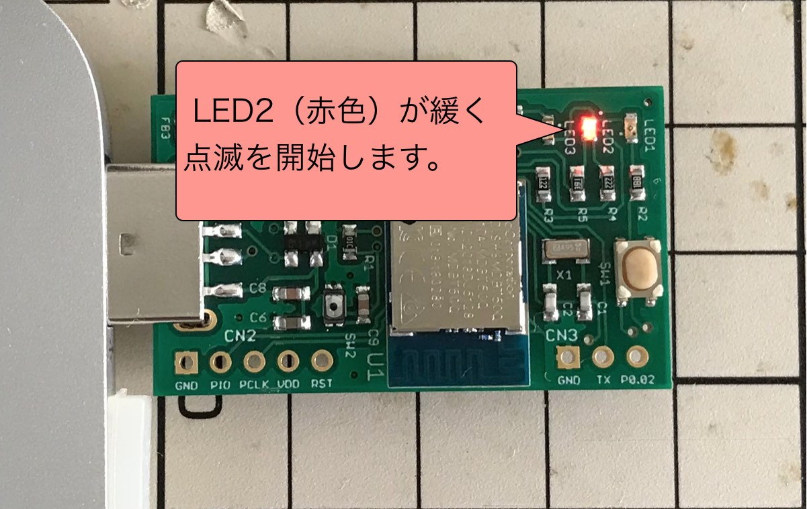

# [開発運用] アプリケーション書込み手順

MDBT50Q Dongleにプレインストールされている[簡易USBブートローダー](../../nRF5_SDK_v15.3.0/examples/dfu/README.md)を使用して、MDBT50Q Dongleに[FIDO2認証器アプリケーション](../../nRF5_SDK_v15.3.0/README.md)を書き込む手順を掲載いたします。

## 書込み準備

### ハードウェアの準備

まず最初に、MDBT50Q Dongleの背面にあるボタン電池ケースに、<b>電池が入っていないこと</b>を必ず確認します。


MDBT50Q DongleをPCのUSBポートに装着したら、Pythonスクリプト「[`HookUpHIDBLMode.py`](HookUpHIDBLMode.py)」を実行し、ブートローダー遷移コマンドを投入します。<br>
下記は実行例になります。

```
MacBookPro-makmorit-jp:~ makmorit$ python HookUpHIDBLMode.py
HID device: path=USB_f055_0001_0x7fe684c062f0, usage_page=61904, usage=1
---- sent data ----
ffffffff860008d4e5f607182930410000000000000000000000000000000000
0000000000000000000000000000000000000000000000000000000000000000
---- received data ----
ffffffff860011d4e5f607182930410100330102050002070000000000000000
0000000000000000000000000000000000000000000000000000000000000000
---- INIT done ----
---- sent data ----
01003301c5000000000000000000000000000000000000000000000000000000
0000000000000000000000000000000000000000000000000000000000000000
---- received data ----
01003301c5000100000000000000000000000000000000000000000000000000
0000000000000000000000000000000000000000000000000000000000000000
---- command done ----
MacBookPro-makmorit-jp:~ makmorit$
```

基板上のLED2（赤色）が緩く点滅し始め、USBブートローダーモード（USBポート経由でアプリケーション書込が可能なモード）に遷移します。



### ファームウェアの準備

ビルド済みのファームウェア更新イメージファイルが、GitHubリポジトリーの以下の場所に格納されています。
- ディレクトリー: [/nRF5_SDK_v15.3.0/firmwares/](../../nRF5_SDK_v15.3.0/firmwares)
- ファームウェア更新イメージファイル: `app_dfu_package.nn.nn.nn.zip`

`app_dfu_package.nn.nn.nn.zip`の`nn.nn.nn`は、バージョン番号になります。<br>
例えば、バージョン`0.2.8`のファームウェア更新イメージファイル名は、`app_dfu_package.0.2.8.zip`となります。

### 書込み用ツールの準備

書込み用ツール「nRFコマンドラインツール」を、あらかじめPCに導入しておきます。<br>
詳細につきましては、手順書[「NetBeansインストール手順」](../../nRF5_SDK_v15.3.0/NETBEANSINST.md)の該当部分をご参照ください。

## アプリケーションの書込み

### 書込み実行

nRFコマンドラインツールで`nrfutil dfu usb-serial`コマンドを実行し、仮想COMポート経由で、ファームウェア更新イメージファイルを転送します。<br>
下記は実行例になります。

```
MacBookPro-makmorit-jp:~ makmorit$ FIRMWARES_DIR="${HOME}/GitHub/onecard-fido/nRF5_SDK_v15.3.0/firmwares"
MacBookPro-makmorit-jp:~ makmorit$ cd ${FIRMWARES_DIR}
MacBookPro-makmorit-jp:firmwares makmorit$ ls -al /dev/tty.*
crw-rw-rw-  1 root  wheel   20,   0  3 24 08:31 /dev/tty.Bluetooth-Incoming-Port
crw-rw-rw-  1 root  wheel   20,  38  3 24 15:59 /dev/tty.usbmodem1421
MacBookPro-makmorit-jp:firmwares makmorit$ nrfutil dfu usb-serial -pkg app_dfu_package.0.2.7.zip -p /dev/tty.usbmodem1421
  [####################################]  100%          
Device programmed.
MacBookPro-makmorit-jp:firmwares makmorit$
```

### 書込み完了

書込処理が終了すると、MDBT50Q Dongleが自動的にリセットされ、アプリケーションがスタートします。<br>
アイドル時であることを表示する緑色のLEDが点滅していることを確認します。


以上で、MDBT50Q Dongleへのアプリケーション書込みは完了になります。
