# NetBeansインストール手順

NetBeansとARM GCC、nRF5 SDKを使用し、nRF52840の開発環境を構築する手順を記載します。

## インストール用媒体の取得

### NetBeans

こちらのサイトにアクセスします。<br>
https://netbeans.org/downloads/8.2/<br>
下図のような画面に遷移します。

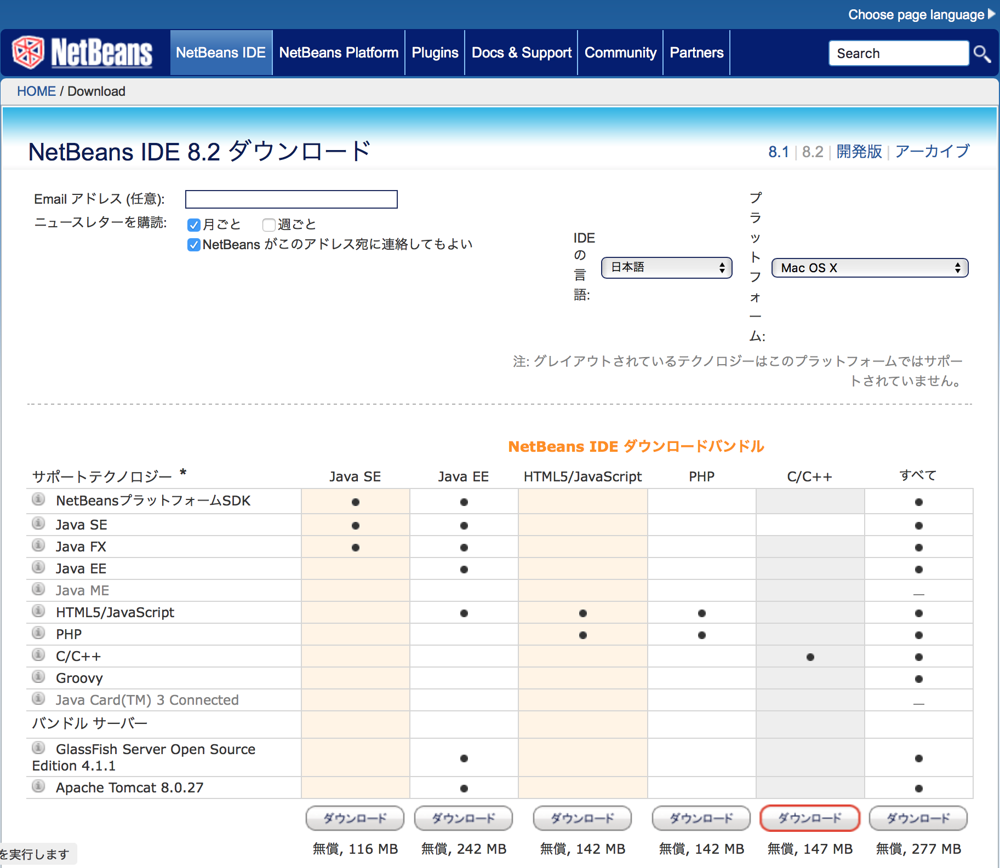

「NetBeans IDE ダウンロードバンドル」の「C/C++」をダウンロードします。<br>
「netbeans-8.2-cpp-macosx.dmg」というファイルがダウンロードされます。

### nRF5 SDK

こちらのサイトにアクセスします。<br>
https://www.nordicsemi.com/Software-and-Tools/Software/nRF5-SDK/Download<br>
下図のような画面に遷移します。

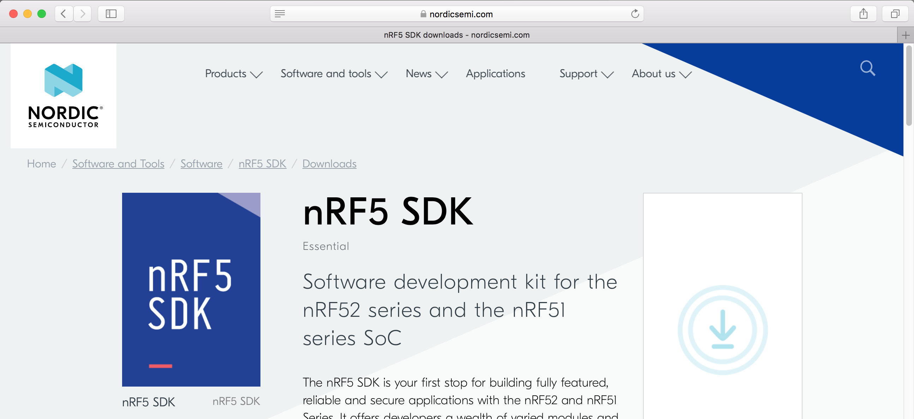

サイト中段のラジオボタン「15.3.0 nRF5 SDK」をチェックします。

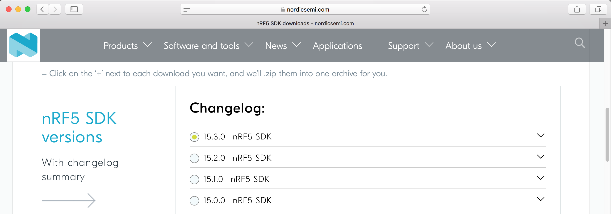

サイト下段のボタン「Download files (.zip)」をクリックし、ダウンロードを開始させます。

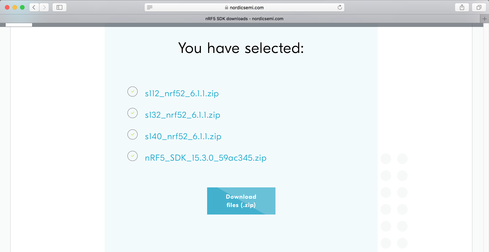

「DeviceDownload.zip」という名前のファイルがダウンロードされます。

### nRFコマンドラインツール

こちらのサイトにアクセスします。<br>
https://www.nordicsemi.com/Software-and-Tools/Development-Tools/nRF5-Command-Line-Tools/Download<br>
下図のような画面に遷移します。

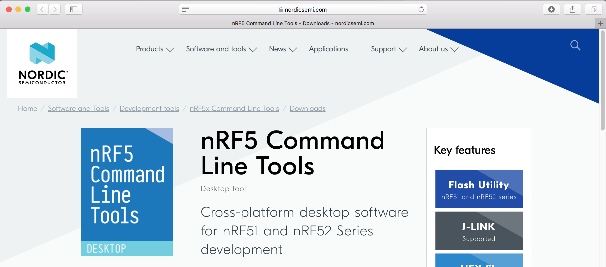

サイト中段のラジオボタン「9.8.1 macOS」をチェックします。<br>
その後、右上にある「Download file」をクリックし、ダウンロードを開始させます。

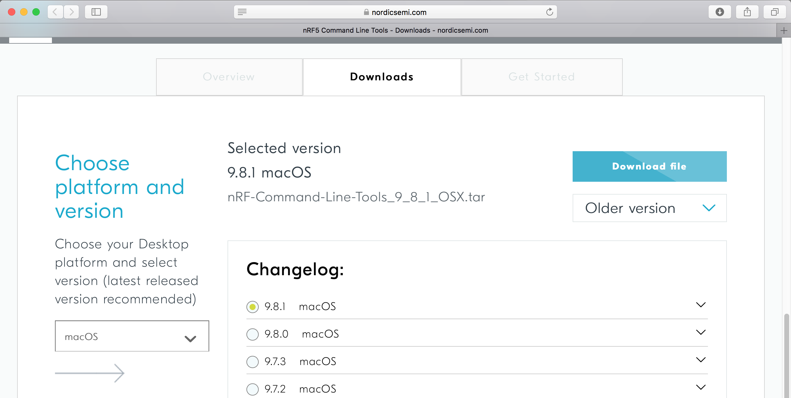

「nRF-Command-Line-Tools_9_8_1_OSX.tar」という名前のファイルがダウンロードされます。

### ARM GCCツールチェイン

こちらのサイトにアクセスします。<br>
https://developer.arm.com/open-source/gnu-toolchain/gnu-rm/downloads<br>
下図のような画面に遷移します。


Downloadボタンのプルダウンを開いて「Mac OS X 64-bit」をクリックすると、ダウンロードが開始されます。<br>
「gcc-arm-none-eabi-7-2018-q2-update-mac.tar.bz2」というファイルがダウンロードされます。

### SEGGER J-Link

こちらのサイトにアクセスします。<br>
https://www.segger.com/downloads/jlink<br>
下図のような画面に遷移します。

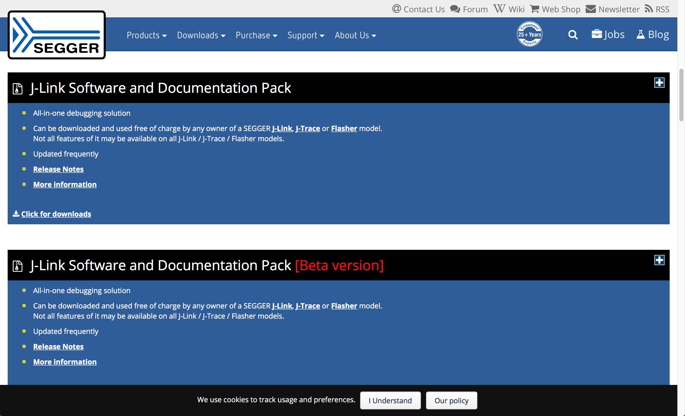

「J-Link Software and Documentation Pack」をクリックすると下図の画面のようになります。

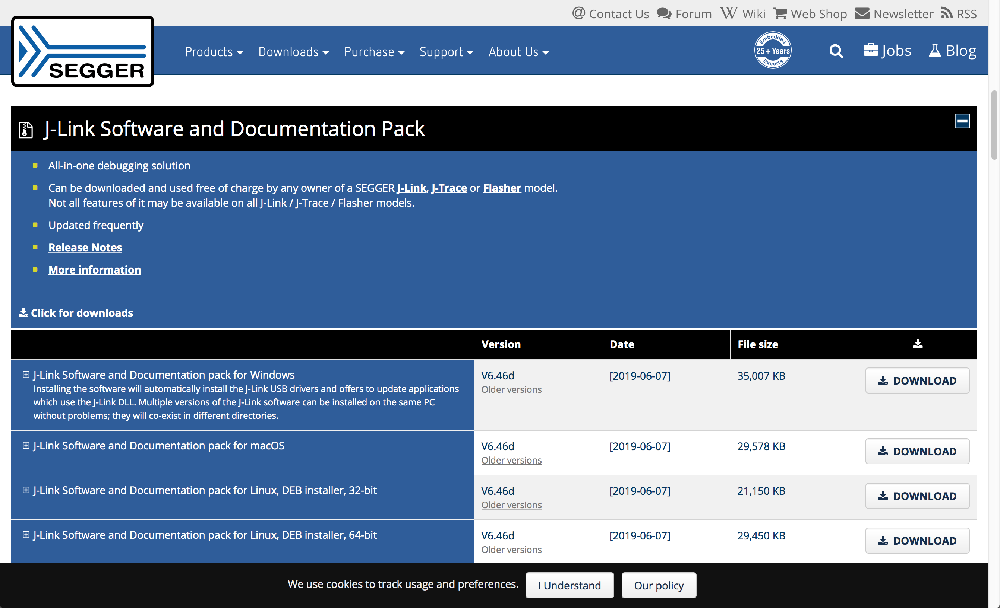

一覧の上から２番目「J-Link Software and Documentation pack for macOS」の、DOWNLOADボタンをクリックし、ツールをダウンロードします。<br>
「JLink_MacOSX_V646d.pkg」というファイルがダウンロードされます。


## ソフトウェアのインストール

### NetBeansのインストール

ダウンロードした「netbeans-8.2-cpp-macosx.dmg」をダブルクリックすると、インストーラーが起動しますので、画面の指示に従い操作を進めます。

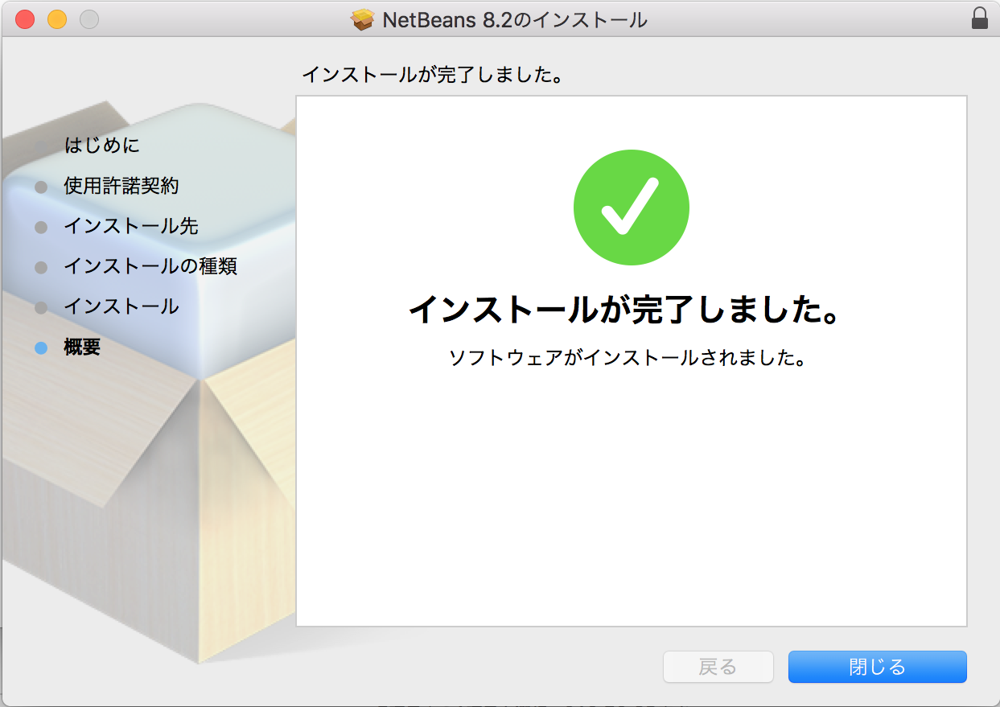

アプリケーションフォルダーに「NetBeans」というサブフォルダーが出来ていればインストールは完了です。


### SEGGER J-Linkのインストール

ダウンロードした「JLink_MacOSX_V646d.pkg」をダブルクリックすると、インストーラーが起動しますので、画面の指示に従い操作を進めます。

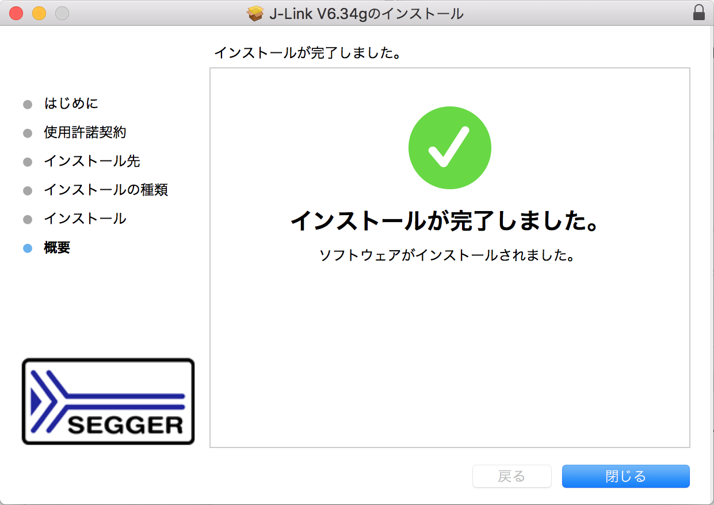

アプリケーションフォルダーに「SEGGER」というサブフォルダーが出来ていればインストールは完了です。

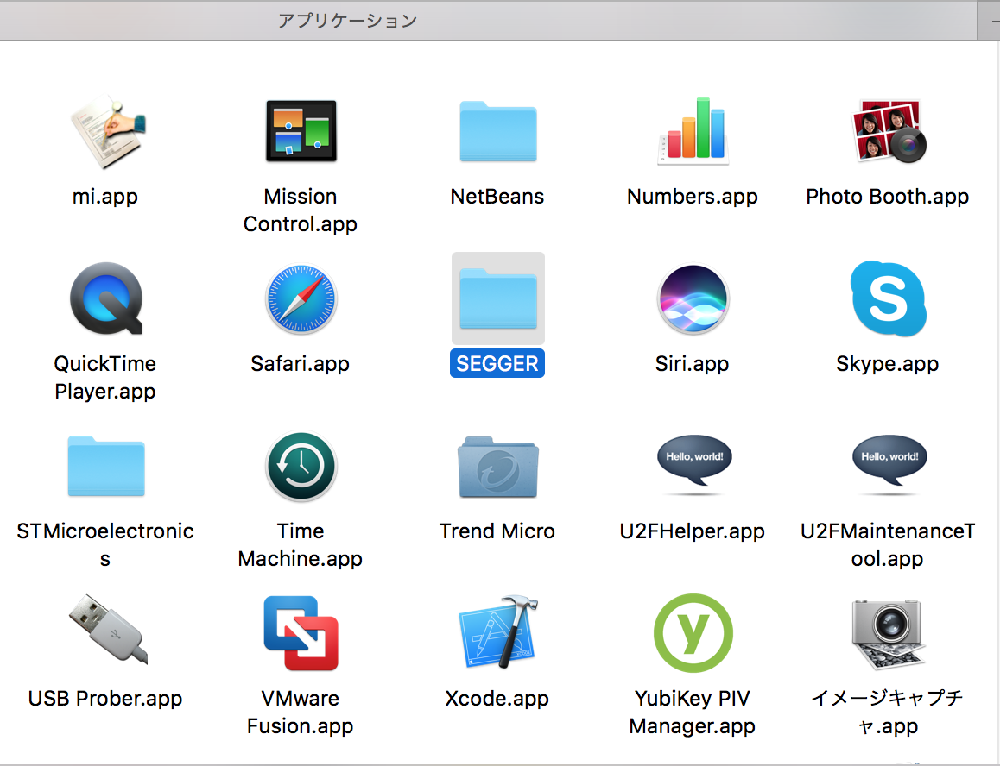

### ツールチェイン／SDKの配置

ARM GCC、nRF5 SDKを任意のフォルダーに配置します。<br>
以下は `$HOME/opt` というディレクトリー配下に配置する例になります。

ターミナルを開き、以下のコマンドを次々と実行していきます。

#### ARM GCCツールチェインの配置
```
mkdir -p ~/opt
cd ~/opt
tar xjvf ~/Downloads/gcc-arm-none-eabi-7-2018-q2-update-mac.tar.bz2
```

#### nRF5 SDKの配置
```
cd ~/Downloads
tar xjvf DeviceDownload.zip
cd ~/opt
tar xjvf ~/Downloads/nRF5SDK153059ac345.zip
mv nRF5_SDK_15.3.0_59ac345 nRF5_SDK_15.3.0
```

#### nRF5xコマンドラインツールの配置
```
cd ~/opt
mkdir -p nRF-Command-Line-Tools_9_8_1_OSX
cd nRF-Command-Line-Tools_9_8_1_OSX
tar xjvf ~/Downloads/nRF-Command-Line-Tools_9_8_1_OSX.tar
```

実行後は以下のようなディレクトリー構成になるかと存じます。

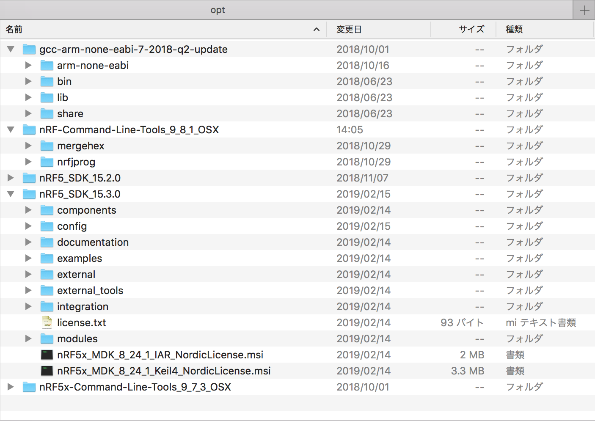

### nRF5 SDKの設定変更

#### バージョンの確認

ターミナルを開き、以下のコマンドを実行してツールチェインのバージョンを確認します。

```
cd ~/opt/gcc-arm-none-eabi-7-2018-q2-update/bin/
./arm-none-eabi-gcc --version
```

下記は実行例になります。<br>
バージョンは「7.3.1」であることが確認できます。

```
MacBookPro-makmorit-jp:opt makmorit$ cd ~/opt/gcc-arm-none-eabi-7-2018-q2-update/bin/
MacBookPro-makmorit-jp:bin makmorit$ ./arm-none-eabi-gcc --version
arm-none-eabi-gcc (GNU Tools for Arm Embedded Processors 7-2018-q2-update) 7.3.1 20180622 (release) [ARM/embedded-7-branch revision 261907]
Copyright (C) 2017 Free Software Foundation, Inc.
This is free software; see the source for copying conditions.  There is NO
warranty; not even for MERCHANTABILITY or FITNESS FOR A PARTICULAR PURPOSE.

MacBookPro-makmorit-jp:bin makmorit$
```

#### nRF5 SDKのMakefileを変更

`$HOME/opt/nRF5_SDK_15.3.0/components/toolchain/gcc` というディレクトリーにある「Makefile.posix」を開いて、以下のように設定します。

```
GNU_INSTALL_ROOT ?= /Users/makmorit/opt/gcc-arm-none-eabi-7-2018-q2-update/bin/
GNU_VERSION ?= 7.3.1
GNU_PREFIX ?= arm-none-eabi
```

ご参考：オリジナルとのdiff
```
MacBookPro-makmorit-jp:~ makmorit$ cd ~/opt/nRF5_SDK_15.3.0/components/toolchain/gcc/
MacBookPro-makmorit-jp:gcc makmorit$ diff Makefile.posix.original Makefile.posix
1c1
< GNU_INSTALL_ROOT ?= /usr/local/gcc-arm-none-eabi-7-2018-q2-update/bin/
---
> GNU_INSTALL_ROOT ?= /Users/makmorit/opt/gcc-arm-none-eabi-7-2018-q2-update/bin/
MacBookPro-makmorit-jp:gcc makmorit$
```

### NetBeansの設定変更

NetBeansを起動し、Preferencesを実行します。

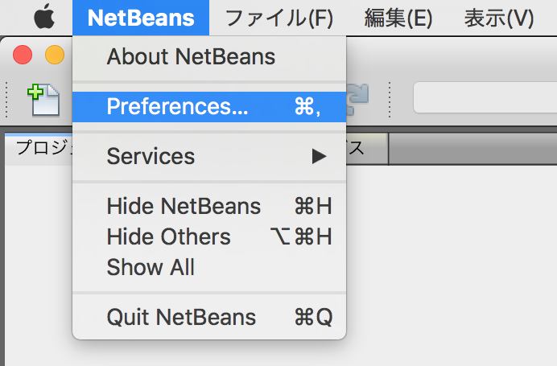

オプション画面が開きますので「C/C++」の「ビルド・ツール」タブを開きます。<br>
画面左側の「ツール・コレクション(C)」下部の「追加」ボタンをクリックします。

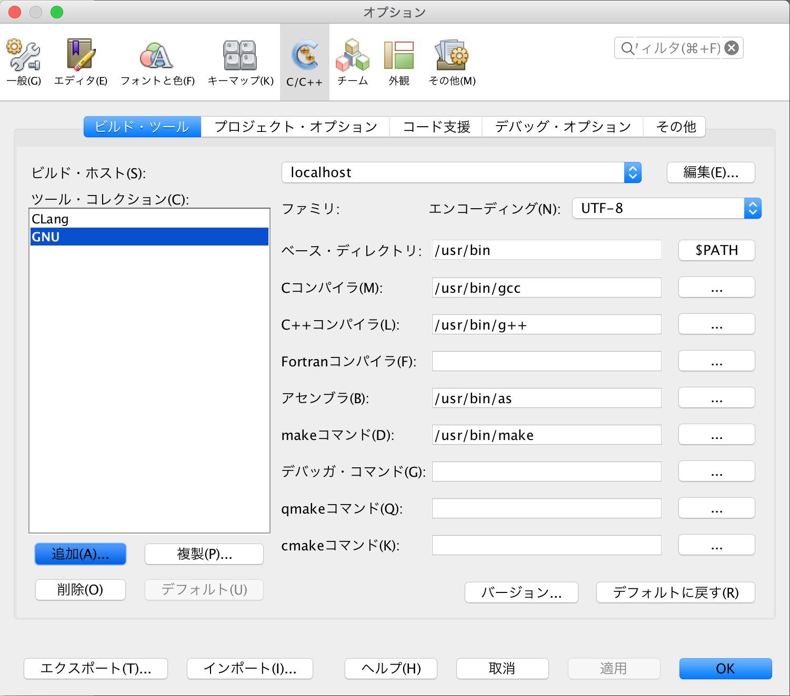

下図のようなポップアップが表示されるので、以下のように設定します。

- ベース・ディレクトリ - ARM GCCツールチェインのルートディレクトリーを選択
- ツール・コレクション・ファミリ - GNU Mac を選択
- ツール・コレクション名 - GNU_ARM と入力

選択／入力が完了したら「OK」をクリックします。

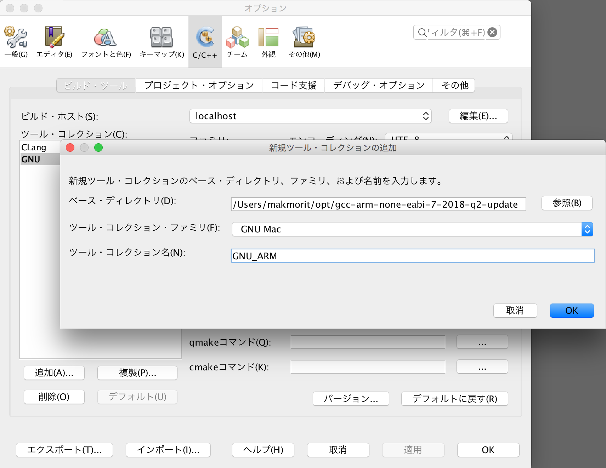

オプション画面に戻ったら、画面右上部の「$PATH」というボタンをクリックします。

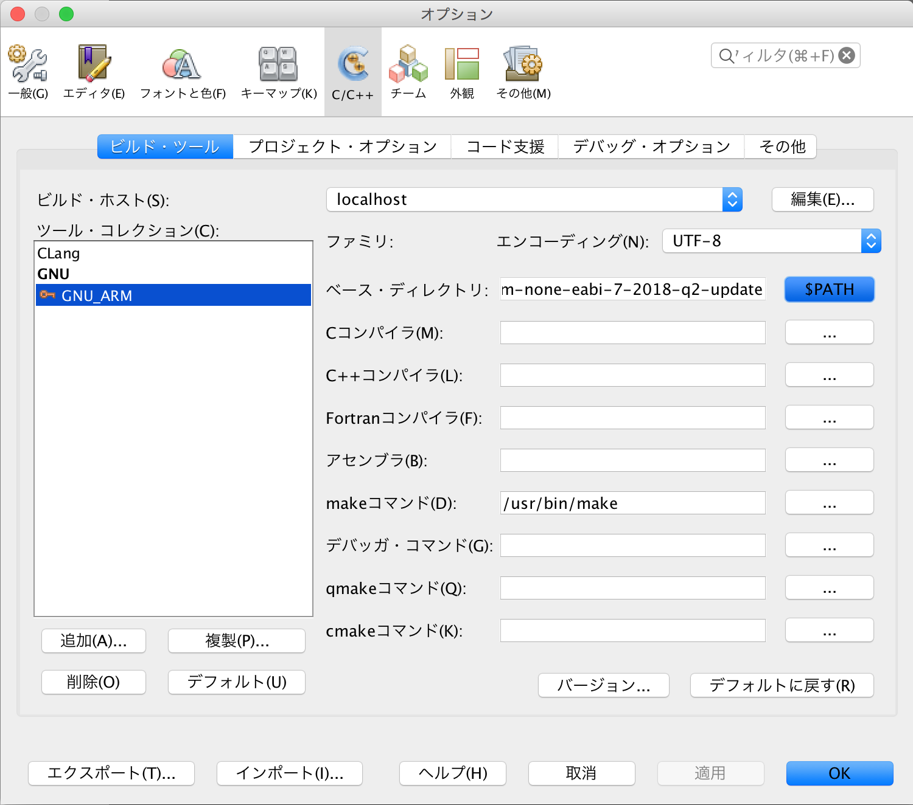

「実行コマンド・パスの変更」欄に`nrfjprog`（nRF5xコマンドライン・ツールのひとつ）のパスを追加します。<br>
下記例では「;${HOME}/opt/nRF-Command-Line-Tools_9_8_1_OSX/nrfjprog」という文字列を追加しています。

入力が完了したら「OK」をクリックします。

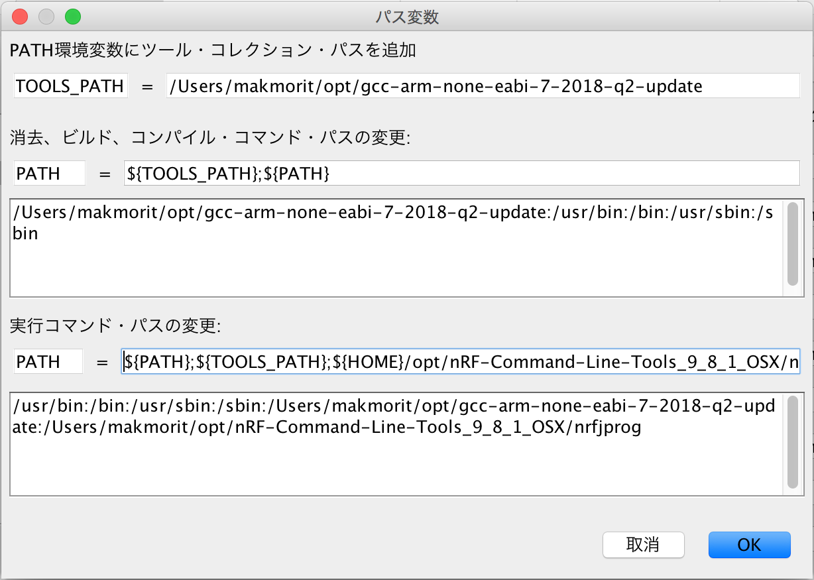

オプション画面に戻ったら、下図のように残りの項目を次々と設定します。

- Cコンパイラ - arm-none-eabi-gcc
- C++コンパイラ - arm-none-eabi-g++
- アセンブラ - arm-none-eabi-as
- デバッガ・コマンド - arm-none-eabi-gdb

設定が完了したら「OK」をクリックします。

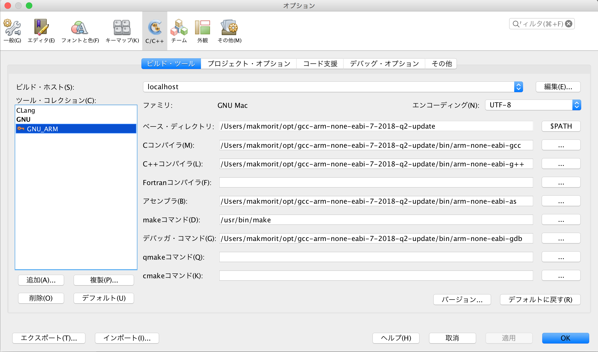

以上で、NetBeansとその稼働に必要なソフトウェアのインストールは完了となります。
