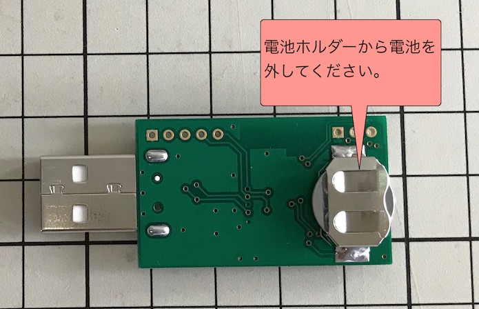
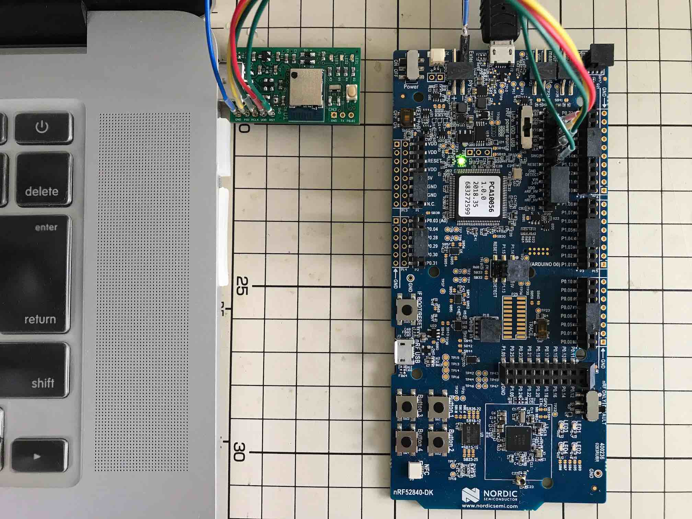
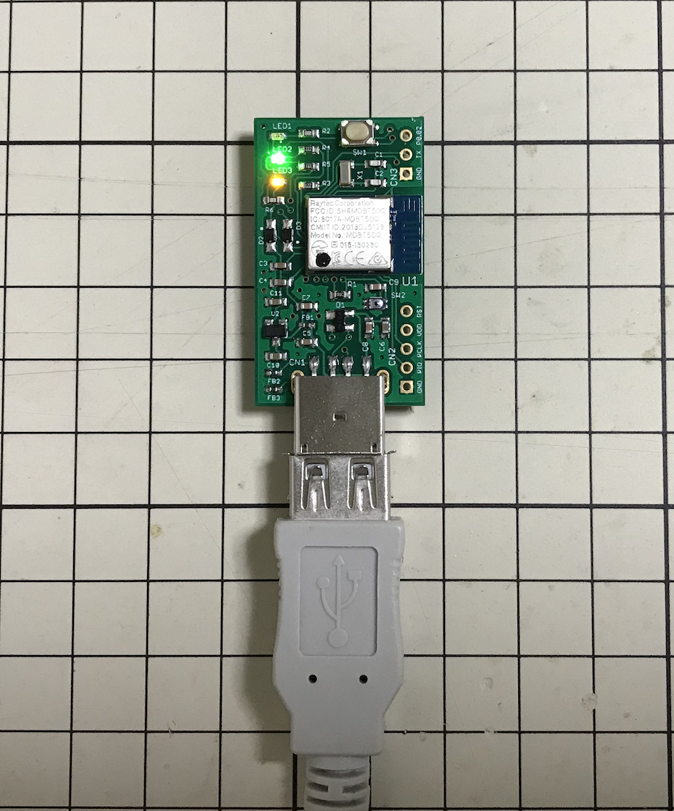

# USBブートローダー書込手順

MDBT50Q Dongleに、USBブートローダーをJ-Link経由で書込みする手順を記載します。

## 書込み準備

書込みに必要な環境と媒体を準備します。

### 動作確認時の環境

- macOS Sierra（10.12.6）
- nRF52840 DK（PCA10056）: プログラムの書込みに使用
- MDBT50Q Dongle（nRF52840）: プログラムの書込み先となるターゲット基板

### ハードウェアの準備

まず最初に、MDBT50Q Dongleの背面にあるボタン電池ケースに、<b>電池が入っていないこと</b>を必ず確認します。



次に、MDBT50Q DongleをPCのUSBポートに装着後、nRF52840 DKと接続します。<br>
接続するピンの対応関係は以下の通りです。

|ピンの名前 |MDBT50Q Dongle | | nRF52840 DK|
|:--|:-:|:-:|:-:|
|0V |GND  | <-->  |GND|
|SWD IO |PIO  | <-->  |SWDIO|
|SWD Clock |PCLK  | <--  |SWDCLK|
|SWD IO Level |VDD  | -->  |VTG|
|SWD Reset |RST  | <--  |RESET|

[注1] nRF52840 DK上の「P20」というコネクター（オスピン）に接続します。<br>
[注2] MDBT50Q Dongleの回路図はこちら（[FIDO2AUTH_001.pdf](https://github.com/diverta/onecard-fido/blob/master/FIDO2Device/pcb/FIDO2AUTH_001.pdf)）になります。

下図は実際に両者を接続した時のイメージになります。



### ファームウェアの準備

ファームウェアは、すでにビルド済みの`.hex`ファイルが、GitHubリポジトリーの以下の場所に格納されています。
- ディレクトリー: [/nRF5_SDK_v15.3.0/firmwares/secure_bootloader/](../../../nRF5_SDK_v15.3.0/firmwares/secure_bootloader)
- アプリケーション: [nrf52840_xxaa.hex](../../../nRF5_SDK_v15.3.0/firmwares/secure_bootloader/nrf52840_xxaa.hex)
- マスターブートレコード: [mbr_nrf52_2.4.1_mbr.hex](../../../nRF5_SDK_v15.3.0/firmwares/secure_bootloader/mbr_nrf52_2.4.1_mbr.hex)
- ソフトデバイス: [s140_nrf52_6.1.1_softdevice.hex](../../../nRF5_SDK_v15.3.0/firmwares/secure_bootloader/s140_nrf52_6.1.1_softdevice.hex)

### 書込み用ツールの準備

書込み用ツール「nRF Command Line Tools」を、あらかじめPCに導入しておきます。<br>
詳細につきましては、手順書「[NetBeansインストール手順](../../../nRF5_SDK_v15.3.0/NETBEANSINST.md)」内のトピック<b>「nRFコマンドラインツール」</b>をご参照ください。

## USBブートローダーの書込み

USBブートローダーイメージ（`mdbt50q_dongle.hex`）と、ソフトデバイスイメージ（`s140_nrf52_6.1.1_softdevice.hex`）に分けて書き込みます。

### USBブートローダーイメージの書込み

まずは、USBブートローダーイメージ（`mdbt50q_dongle.hex`）を書込みます。

「nRF Command Line Tools」というツールの`nrfjprog`を使用し、下記のコマンドを実行します。

```
TOOL_DIRECTORY=${HOME}/opt/nRF-Command-Line-Tools_9_8_1_OSX/nrfjprog
FIRMWARES_DIR="${HOME}/GitHub/onecard-fido/nRF5_SDK_v15.3.0/firmwares/secure_bootloader"

${TOOL_DIRECTORY}/nrfjprog -f nrf52 --eraseall
${TOOL_DIRECTORY}/nrfjprog -f nrf52 --program ${FIRMWARES_DIR}/mdbt50q_dongle.hex
```
下記は実行例になります。

```
MacBookPro-makmorit-jp:~ makmorit$ TOOL_DIRECTORY=${HOME}/opt/nRF-Command-Line-Tools_9_8_1_OSX/nrfjprog
MacBookPro-makmorit-jp:~ makmorit$ FIRMWARES_DIR="${HOME}/GitHub/onecard-fido/nRF5_SDK_v15.3.0/firmwares/secure_bootloader"
MacBookPro-makmorit-jp:~ makmorit$  
MacBookPro-makmorit-jp:~ makmorit$ ${TOOL_DIRECTORY}/nrfjprog -f nrf52 --eraseall
Erasing user available code and UICR flash areas.
Applying system reset.
MacBookPro-makmorit-jp:~ makmorit$ ${TOOL_DIRECTORY}/nrfjprog -f nrf52 --program ${FIRMWARES_DIR}/mdbt50q_dongle.hex
Parsing hex file.
Reading flash area to program to guarantee it is erased.
Checking that the area to write is not protected.
Programming device.
MacBookPro-makmorit-jp:~ makmorit$
```

### USBブートローダーの反映

MDBT50Q DongleをPCのUSBポートからいったん外し、再びUSBポートに装着しなおしてください。<br>
（このとき、<b>nRF52840 DKとの配線は外さないまま</b>にしておいてください）

下図のように、基板上のLED2（緑色）、LED3（黄色）が同時点灯していることを確認できれば、書き込んだUSBブートローダーの反映は完了です。



### ソフトデバイスの追加書込み

続いて、ソフトデバイスイメージ（`s140_nrf52_6.1.1_softdevice.hex`）を追加で書込みます。

`nrfjprog`を使用し、下記のコマンドを実行します。

```
${TOOL_DIRECTORY}/nrfjprog -f nrf52 --program ${FIRMWARES_DIR}/s140_nrf52_6.1.1_softdevice.hex --sectorerase
```
下記は実行例になります。

```
MacBookPro-makmorit-jp:~ makmorit$ ${TOOL_DIRECTORY}/nrfjprog -f nrf52 --program ${FIRMWARES_DIR}/s140_nrf52_6.1.1_softdevice.hex --sectorerase
Parsing hex file.
Erasing page at address 0x0.
Erasing page at address 0x1000.
Erasing page at address 0x2000.
（中略）
Erasing page at address 0x23000.
Erasing page at address 0x24000.
Erasing page at address 0x25000.
Applying system reset.
Checking that the area to write is not protected.
Programming device.
MacBookPro-makmorit-jp:~ makmorit$
```

その後、MDBT50Q DongleをPCのUSBポートから外し、nRF52840 DKとの配線を外してください。

## ブートローダーの起動確認

MDBT50Q Dongleが、PCのUSBポートに装着されている状態で、MDBT50Q Dongleの基板上のリセットボタンを１回押すと、ブートローダーが起動し、ブートローダーモードに遷移します。

下図のように、基板上のLED2（緑色）、LED3（黄色）が同時点灯していることを確認してください。


これで、USBブートローダーの書込みは完了となります。
