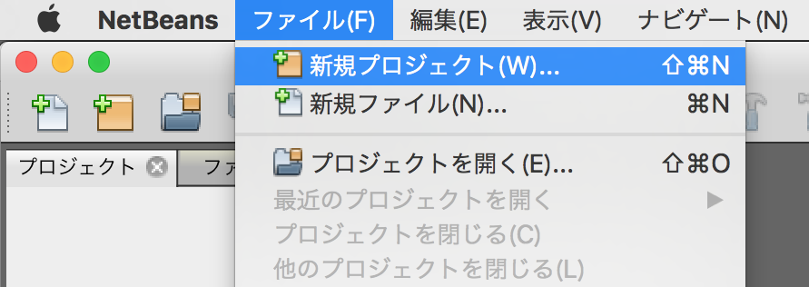
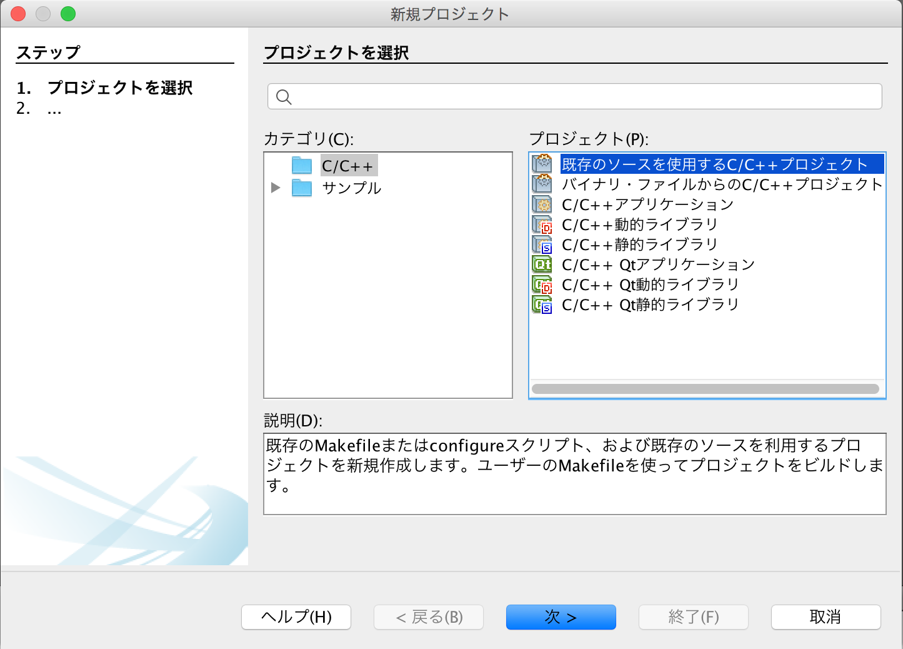
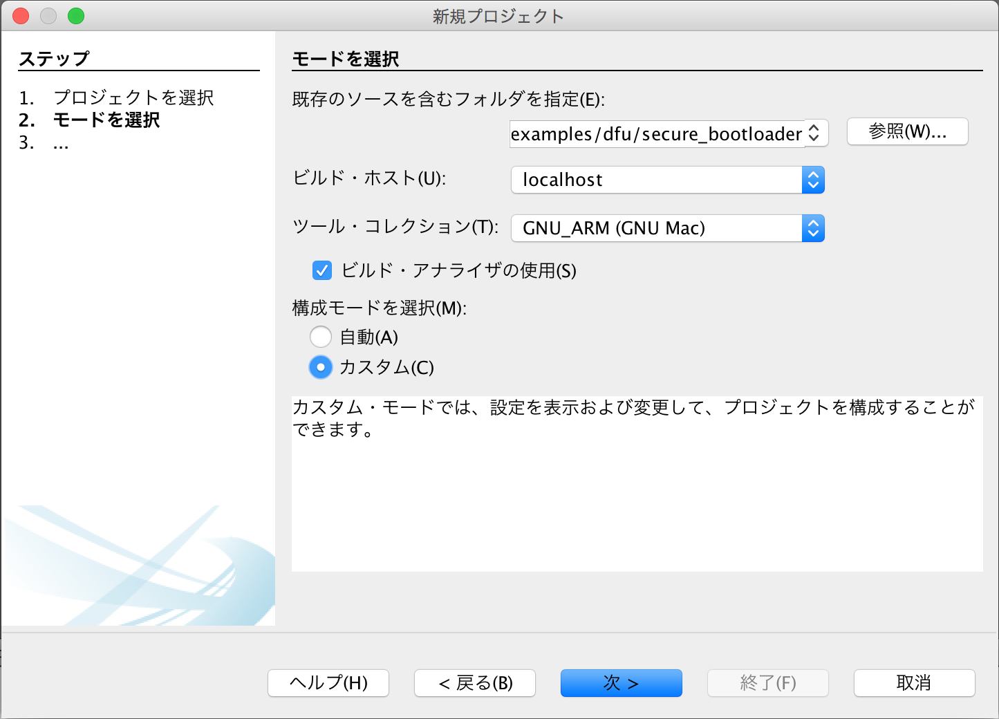
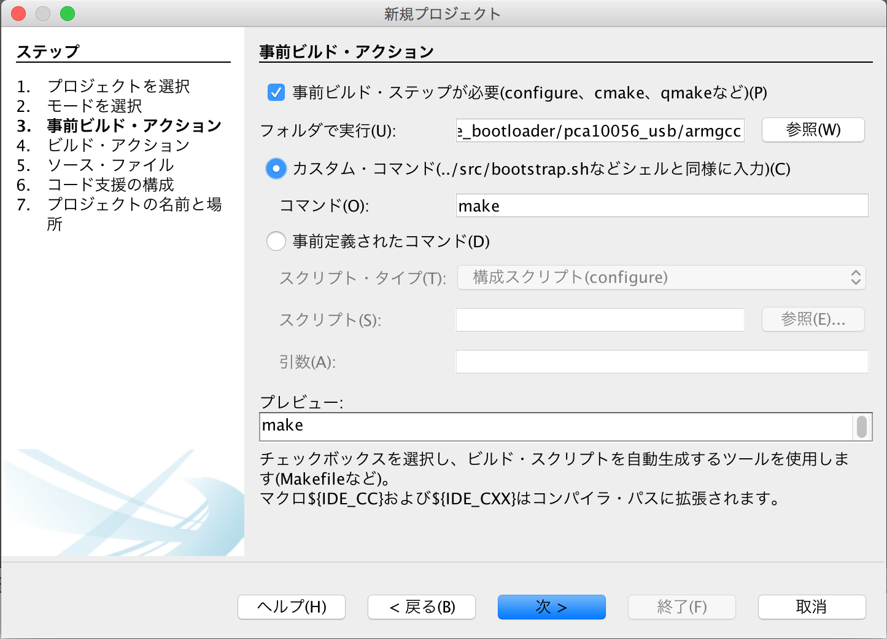
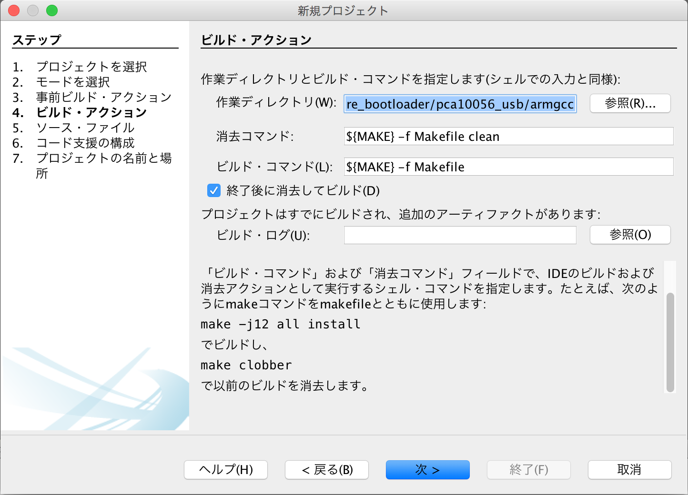
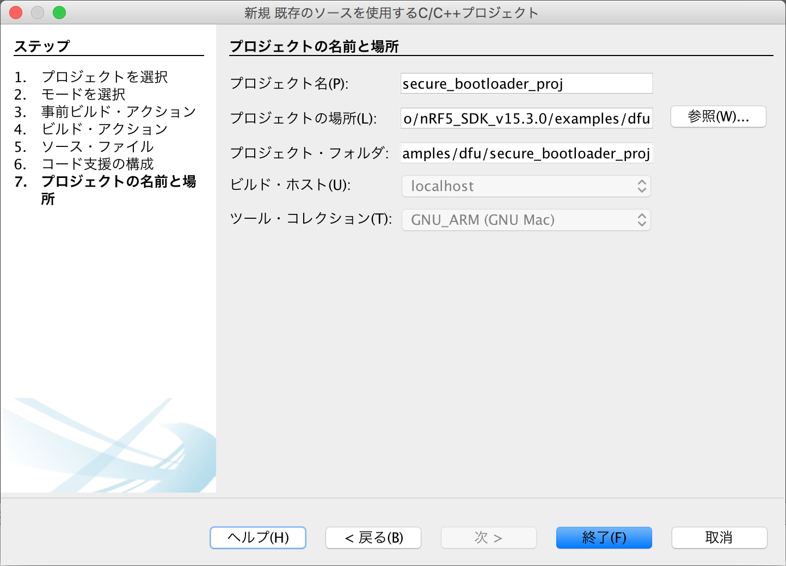
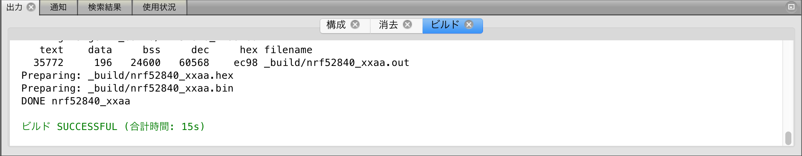
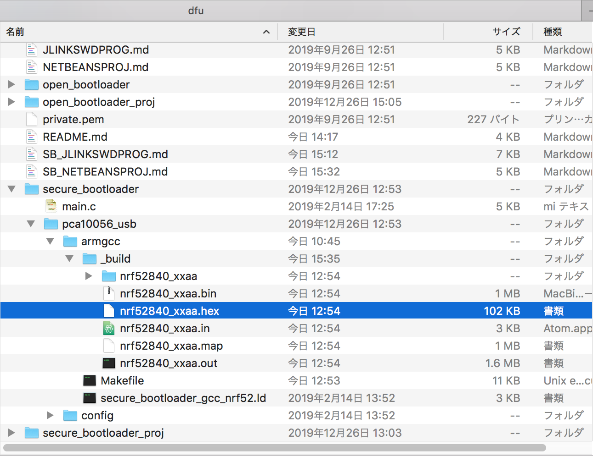

# USBブートローダー（署名機能付き）

Nordic社から提供されているサンプル「[Secure DFU Bootloader over Serial Link (UART/USB)](https://infocenter.nordicsemi.com/topic/com.nordic.infocenter.sdk5.v15.3.0/sdk_app_serial_dfu_bootloader.html)」を小修正し、[MDBT50Q Dongle](../../../../FIDO2Device/MDBT50Q_Dongle/README.md)で利用できるようにしたものです。

## 作成手順

NetBeansとARM GCC、nRF5 SDKを使用し、署名機能付きのUSBブートローダーを作成する手順を記載します。

### NetBeans環境の作成

あらかじめ、NetBeans環境をPCに作成しておきます。<br>
具体的な手順は、[NetBeansインストール手順](../../../../nRF5_SDK_v15.3.0/NETBEANSINST.md)をご参照ください。

### ソースファイルの準備

#### オリジナルソースの取得

nRF5 SDKのサンプルアプリケーション・フォルダー（/nRF5_SDK_15.3.0/examples/dfu）から、必要なソースコードを取得します。

- `secure_bootloader`サブフォルダー
- `dfu_public_key.c` - [README](../README.md)の「公開鍵ファイル」の項に記載した通りの手順で、あらかじめ作成しておきます。

今回の作成にあたっては、[`<リポジトリールート>/nRF5_SDK_v15.3.0/examples/dfu`](../../../../nRF5_SDK_v15.3.0/examples/dfu)配下に配置いたしました。

#### メイクファイルの修正

メイクファイル「[Makefile](../../../../nRF5_SDK_v15.3.0/examples/dfu/secure_bootloader/pca10056_usb/armgcc/Makefile)」の下記部分を修正します。

#### パス修正

<b>修正前</b>
```
SDK_ROOT := ../../../../..
```

<b>修正後</b>
```
SDK_ROOT := $(HOME)/opt/nRF5_SDK_15.3.0
```

#### define追加

<b>追加した行</b>
```
TARGET_BOARD     := PCA10059

# Pin for DFU mode
#  PCA10059: RESET button
CFLAGS += -DNRF_BL_DFU_ENTER_METHOD_BUTTON=0
CFLAGS += -DNRF_BL_DFU_ENTER_METHOD_GPREGRET=0
CFLAGS += -DNRF_BL_DFU_ENTER_METHOD_PINRESET=1
```

#### ターゲット変更（２箇所あります）

<b>修正前</b>
```
CFLAGS += -DBOARD_PCA10056
```

<b>修正後</b>
```
CFLAGS += -DBOARD_$(TARGET_BOARD)
```


### ソースファイルからビルド

上記で取得したソースファイルから、NetBeansプロジェクトを新規作成し、USBブートローダー（`.hex`ファイル）を生成します。

#### プロジェクトの新規作成〜ビルド実行

NetBeansを起動し、ファイル--->新規プロジェクトを実行します。



新規プロジェクト画面が表示されますので、一覧から「既存のソースを使用するC/C++プロジェクト」を選択し「次 >」をクリックします。



下図のような画面に遷移しますので、以下のように設定します。

- 既存のソースを含むフォルダを指定 - サンプルアプリが格納されているフォルダー「`examples/dfu/secure_bootloader`」を指定します。<br>
下図の例では「`/Users/makmorit/GitHub/onecard-fido/nRF5_SDK_v15.3.0/examples/dfu/secure_bootloader`」という文字列が設定されています。

- 構成モードを選択 - 「カスタム(C)」をチェックします。

設定が完了したら「次 >」をクリックします。



下図のような画面に遷移しますので、以下のように設定します。

- 「事前ビルド・ステップが必要」にチェック

- フォルダで実行(U) - サンプルアプリのサブフォルダー「`pca10056_usb/armgcc`」を指定します。<br>
下図の例では「`/Users/makmorit/GitHub/onecard-fido/nRF5_SDK_v15.3.0/examples/dfu/secure_bootloader/pca10056_usb/armgcc`」という文字列が設定されています。

- 「カスタム・コマンド」にチェック

- コマンド(O) - 「make」と入力します。

設定が完了したら「次 >」をクリックします。



「4. ビルド・アクション」に遷移しますが、以降は「7. プロジェクトの名前と場所」に遷移するまではデフォルト設定のまま「次 >」をクリックします。



「7. プロジェクトの名前と場所」に遷移したら、プロジェクト名(P)を「secure_bootloader」から「secure_bootloader_proj」に変更しておきます。<br>
（オリジナルのプロジェクト「secure_bootloader」を上書きしたくないための措置です）

設定が完了したら「終了(F)」をクリックします。



自動的にビルドがスタートしますので、しばらくそのまま待ちます。<br>
しばらくするとビルドが完了し「ビルド SUCCESSFUL」と表示されれば、ビルドは成功です。



#### ビルド結果の確認

ビルドが完了したら、USBブートローダー`nrf52840_xxaa.hex`が正しく生成されているかどうか確認します。<br>
下図は、Finderで`nrf52840_xxaa.hex`(102KB)が生成されたことを確認したところです。



以上で、ソースファイルからのビルドは完了です。

### ブートローダーイメージを作成

最後に、前述のUSBブートローダー`nrf52840_xxaa.hex`と、マスターブートレコード`mbr_nrf52_2.4.1_mbr.hex`を結合し、１本のブートローダーイメージを作成します。

#### hexファイルの結合
Nordic社が提供している`mergehex`コマンドを使用し、`nrf52840_xxaa.hex`と`mbr_nrf52_2.4.1_mbr.hex`を結合します。

以下のコマンドを実行します。

```
MERGEHEX="${HOME}/opt/nRF-Command-Line-Tools_9_8_1_OSX/mergehex/mergehex"
FIRMWARES_DIR="${HOME}/GitHub/onecard-fido/nRF5_SDK_v15.3.0/firmwares/secure_bootloader"
cd ${FIRMWARES_DIR}

${MERGEHEX} --merge mbr_nrf52_2.4.1_mbr.hex nrf52840_xxaa.hex --output mdbt50q_dongle.hex
```

下記は実行例になります。

```
MacBookPro-makmorit-jp:~ makmorit$ MERGEHEX="${HOME}/opt/nRF-Command-Line-Tools_9_8_1_OSX/mergehex/mergehex"
MacBookPro-makmorit-jp:~ makmorit$ FIRMWARES_DIR="${HOME}/GitHub/onecard-fido/nRF5_SDK_v15.3.0/firmwares/secure_bootloader"
MacBookPro-makmorit-jp:~ makmorit$ cd ${FIRMWARES_DIR}
MacBookPro-makmorit-jp:secure_bootloader makmorit$ ls -al
total 1248
drwxr-xr-x   6 makmorit  staff     204  1  9 14:23 .
drwxr-xr-x  10 makmorit  staff     340  1  9 14:23 ..
-rwxr-xr-x   1 makmorit  staff    7792  1  9 14:23 mbr_nrf52_2.4.1_mbr.hex
-rw-r--r--   1 makmorit  staff   99020  1  9 14:23 nrf52840_DK_xxaa.hex
-rw-r--r--   1 makmorit  staff   99240  1  9 14:23 nrf52840_xxaa.hex
-rwxr-xr-x   1 makmorit  staff  423104  1  9 14:23 s140_nrf52_6.1.1_softdevice.hex
MacBookPro-makmorit-jp:secure_bootloader makmorit$ ${MERGEHEX} --merge mbr_nrf52_2.4.1_mbr.hex nrf52840_xxaa.hex --output mdbt50q_dongle.hex
Parsing input hex files.
Merging files.
Storing merged file.
MacBookPro-makmorit-jp:secure_bootloader makmorit$ ls -al
total 1464
drwxr-xr-x   7 makmorit  staff     238  1  9 14:27 .
drwxr-xr-x  10 makmorit  staff     340  1  9 14:23 ..
-rwxr-xr-x   1 makmorit  staff    7792  1  9 14:23 mbr_nrf52_2.4.1_mbr.hex
-rw-r--r--   1 makmorit  staff  109365  1  9 14:27 mdbt50q_dongle.hex
-rw-r--r--   1 makmorit  staff   99020  1  9 14:23 nrf52840_DK_xxaa.hex
-rw-r--r--   1 makmorit  staff   99240  1  9 14:23 nrf52840_xxaa.hex
-rwxr-xr-x   1 makmorit  staff  423104  1  9 14:23 s140_nrf52_6.1.1_softdevice.hex
MacBookPro-makmorit-jp:secure_bootloader makmorit$
```

以上で、USBブートローダー作成は完了となります。
