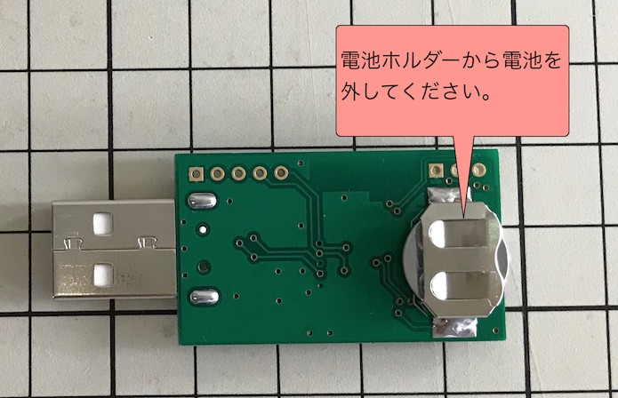
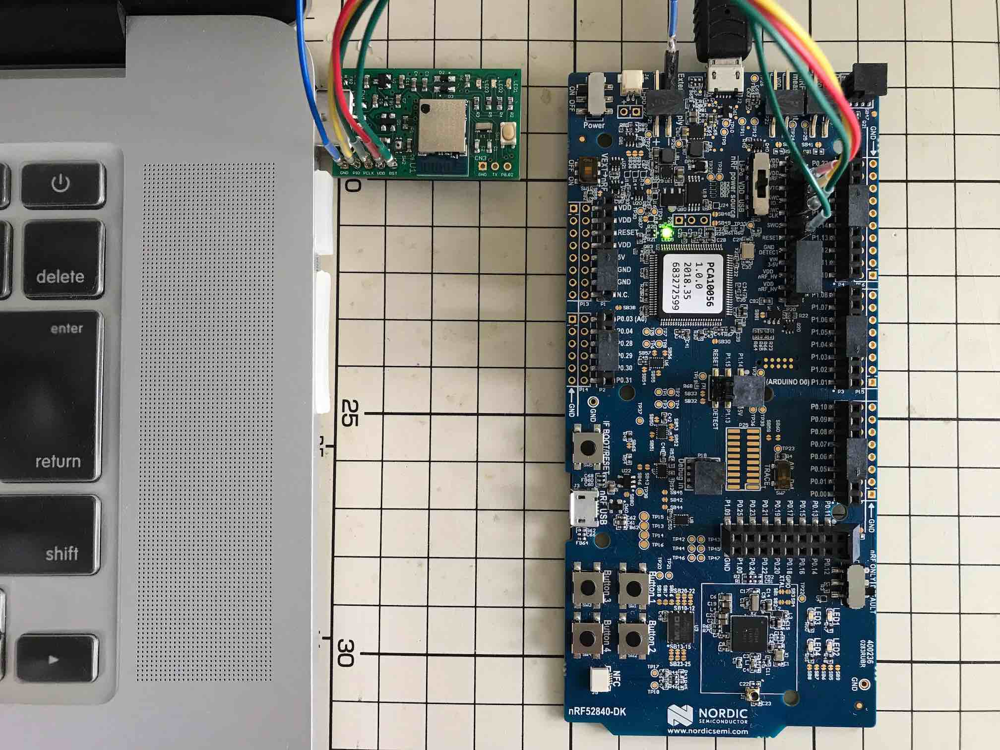
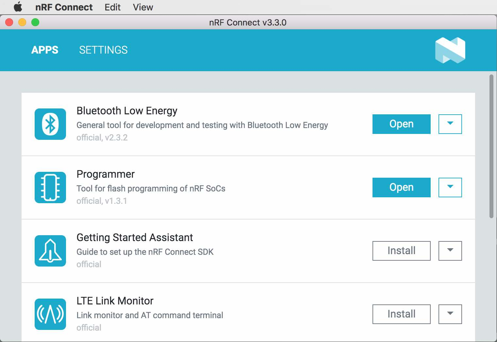
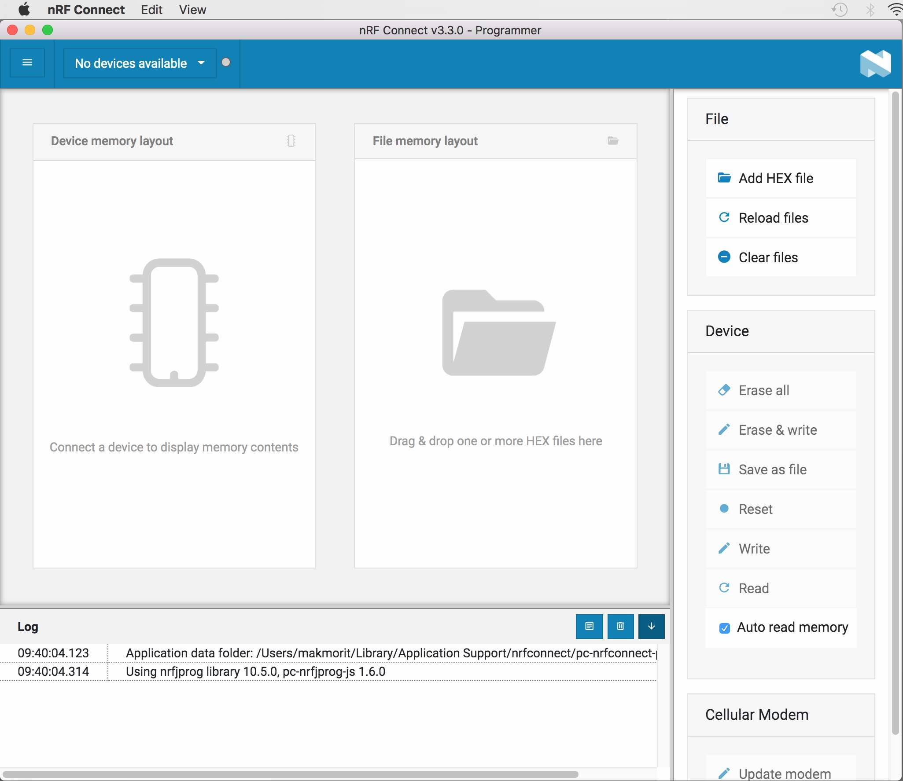
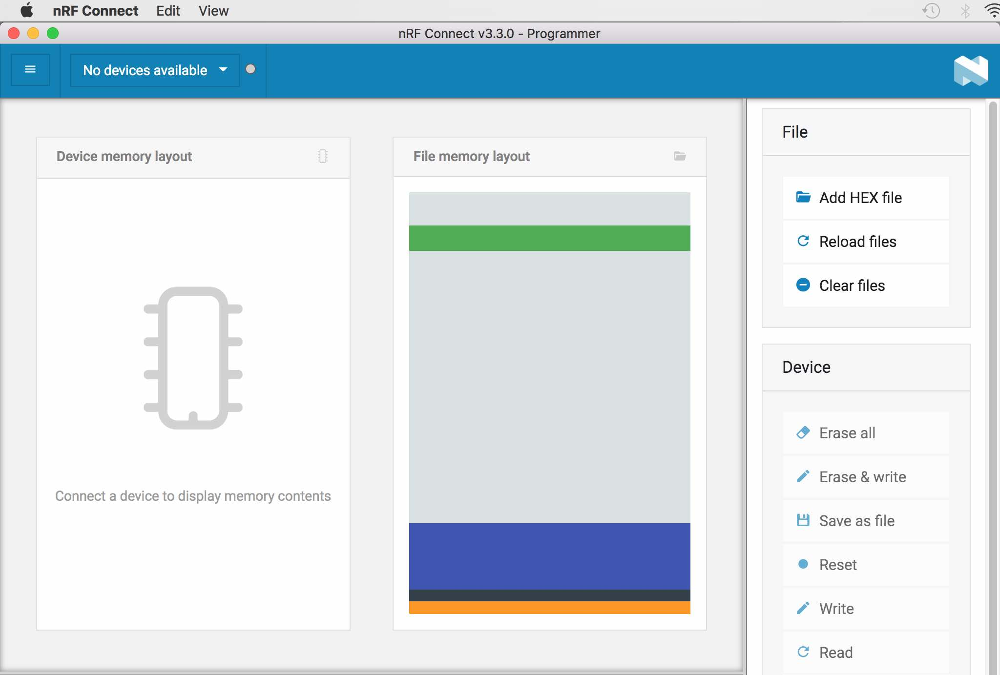
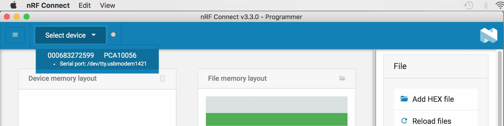
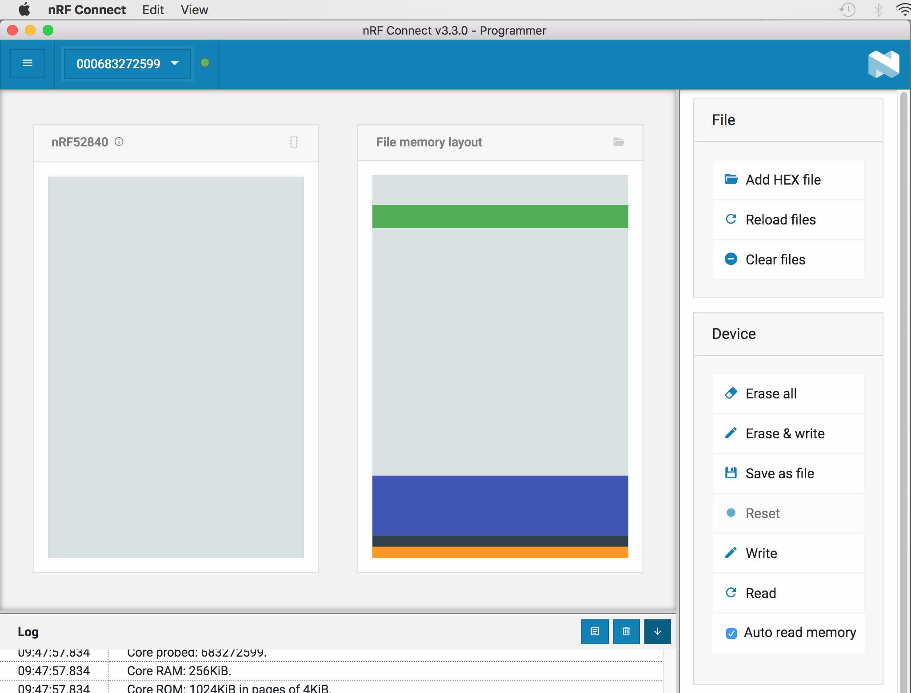
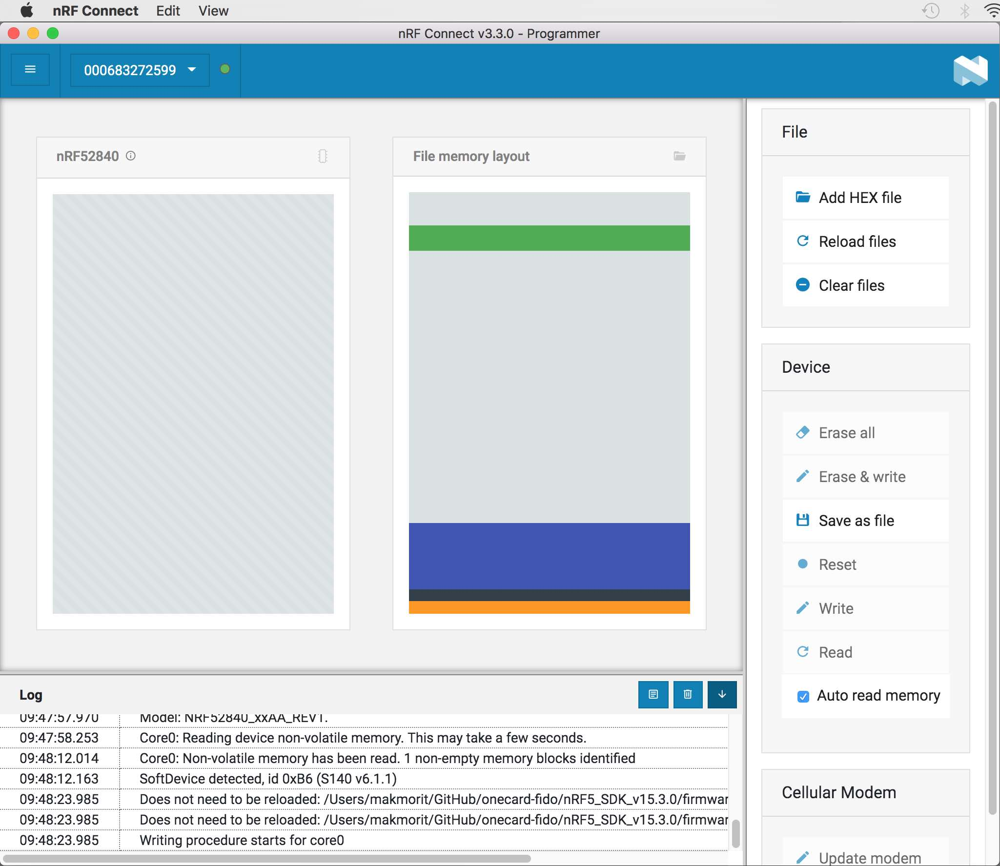
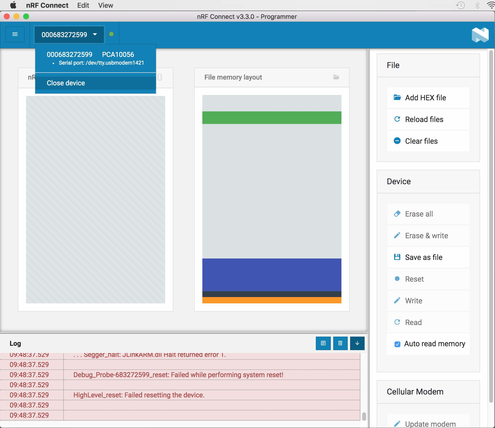
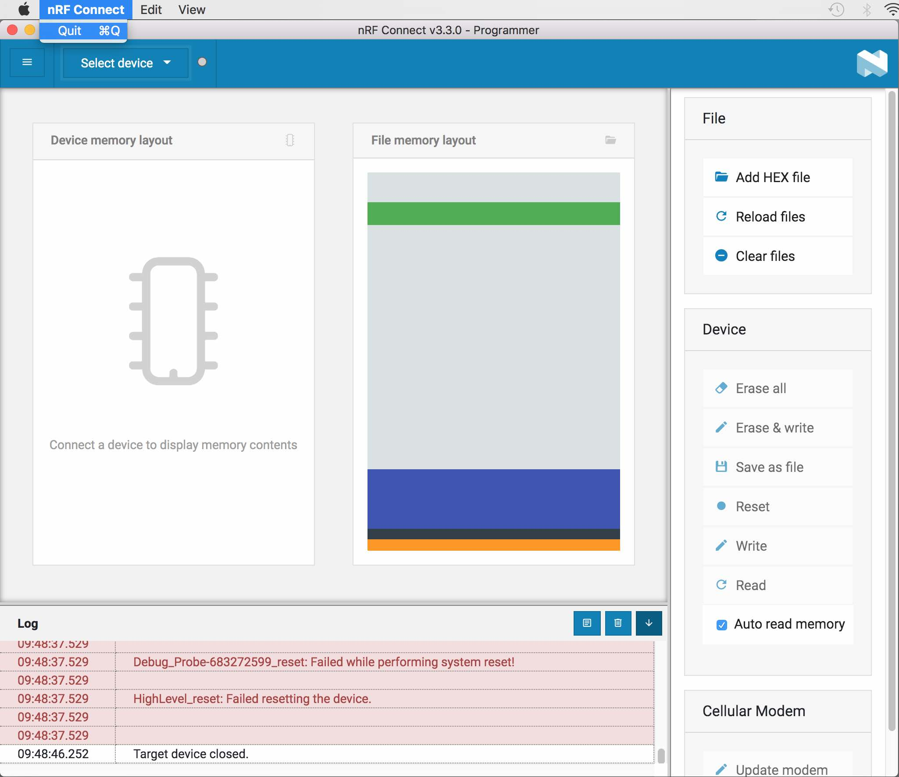

# 簡易USBブートローダー書込手順

[MDBT50Q Dongle](../../../FIDO2Device/MDBT50Q_Dongle/README.md)に、簡易USBブートローダー（Open Bootloader）をJ-Link経由で書込みする手順を記載します。

## 書込み準備

書込みに必要な環境と媒体を準備します。

### 動作確認時の環境

- macOS Sierra（10.12.6）
- nRF52840 DK（PCA10056）: プログラムの書込みに使用
- MDBT50Q Dongle（nRF52840）: プログラムの書込み先となるターゲット基板

### ハードウェアの準備

まず最初に、MDBT50Q Dongleの背面にあるボタン電池ケースに、<b>電池が入っていないこと</b>を必ず確認します。

次に、MDBT50Q DongleをPCのUSBポートに装着後、nRF52840 DKと接続します。 
接続するピンの対応関係は以下の通りです。

|ピンの名前 |MDBT50Q Dongle | | nRF52840 DK|
|:--|:-:|:-:|:-:|
|0V |GND  | <-->  |GND|
|SWD IO |PIO  | <-->  |SWDIO|
|SWD Clock |PCLK  | <--  |SWDCLK|
|SWD IO Level |VDD  | -->  |VTG|
|SWD Reset |RST  | <--  |RESET|

[注1] nRF52840 DK上の「P20」というコネクター（オスピン）に接続します。 
[注2] MDBT50Q Dongle（rev2）の回路図はこちら（[FIDO2AUTH_001.pdf](../../../FIDO2Device/MDBT50Q_Dongle/pcb_rev2/FIDO2AUTH_002.pdf)）になります。

下図は実際に両者を接続した時のイメージになります。 
この時、MDBT50Q Dongleは、PCのUSBポートに装着しておいてください。

### ファームウェアの準備

ファームウェアは、すでにビルド済みの`.hex`ファイルが、GitHubリポジトリーの以下の場所に格納されています。
- ブートローダー: [nrf52840_xxaa.hex](../../../nRF5_SDK_v15.3.0/firmwares/open_bootloader/nrf52840_xxaa.hex)
- ソフトデバイス: [s140_nrf52_6.1.1_softdevice.hex](../../../nRF5_SDK_v15.3.0/firmwares/s140_nrf52_6.1.1_softdevice.hex)

### 書込み用ツールの準備

書込み用ツール「nRF Connect for Desktop」を、あらかじめPCに導入しておきます。 
詳細につきましては、手順書[「nRF Connect for Desktop導入手順」](../../../nRF5_SDK_v15.3.0/NRFCONNECTINST.md)をご参照ください。

## 簡易USBブートローダーの書込み

### 書込み準備

nRF Connectを起動します。 
画面上部の「Launch app」ボタンをクリックすると、Programmerという項目が表示されます。 
右横の「Launch」ボタンをクリックします。

プログラミングツールが起動します。 
右側の「File Memory Layout」欄がブランクになっていることを確認します。

ブランクになっていない場合は、右側の「Clear Files」というリンクをクリックして「File Memory Layout」欄をブランクにしてください。

「File Memory Layout」欄に、先述のファイル２点をドラッグ＆ドロップします。 
かならず、[s140_nrf52_6.1.1_softdevice.hex](../../../nRF5_SDK_v15.3.0/firmwares/s140_nrf52_6.1.1_softdevice.hex) --> [nrf52840_xxaa.hex](../../../nRF5_SDK_v15.3.0/firmwares/open_bootloader/nrf52840_xxaa.hex)の順でドラッグ＆ドロップしてください。

２点のファイルが、「File Memory Layout」欄に、下図のように配置されることを確認します。

画面左上部の「Select device」プルダウンをクリックして、PCA10056（前述のnRF52840 DK）を選択します。

しばらくすると、左側の「nRF52840」欄に、nRF52840 DKに接続されているMDBT50Q Dongle側のメモリーイメージが表示されます。 
（下図例ではメモリーイメージが表示されていませんが、これは事前に全領域が消去済みであったためです）

これで書き込み準備は完了です。

### 書込み実行

画面右下部にある「Erase & write」のリンクをクリックし、書込みをスタートさせます。 
下図のように「nRF52840」欄に淡い縞模様が表示され、書込処理が進みます。

しばらくすると、下図のように画面下部のメッセージ欄が赤く変化します。 
画面左上部にあるプルダウンから「Close device」を選択し、nRF52840 DKとの接続をすみやかに切断してください。

切断が完了したら、画面の「Quit」を実行して、nRF Connectを終了させます。

その後、MDBT50Q DongleをPCのUSBポートから外し、nRF52840 DKとの配線を外してください。

これで、簡易USBブートローダーの書込みは完了となります。
