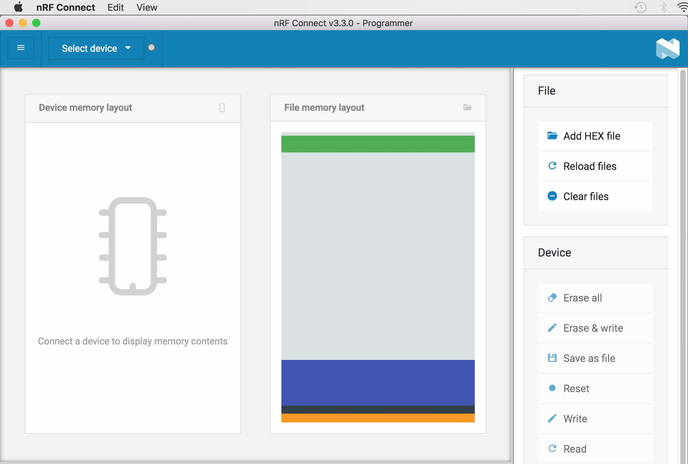
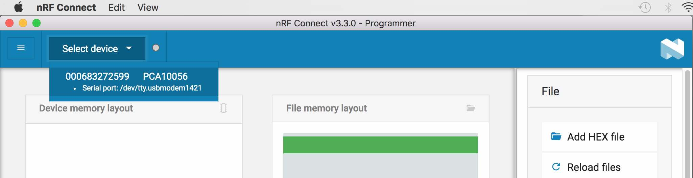
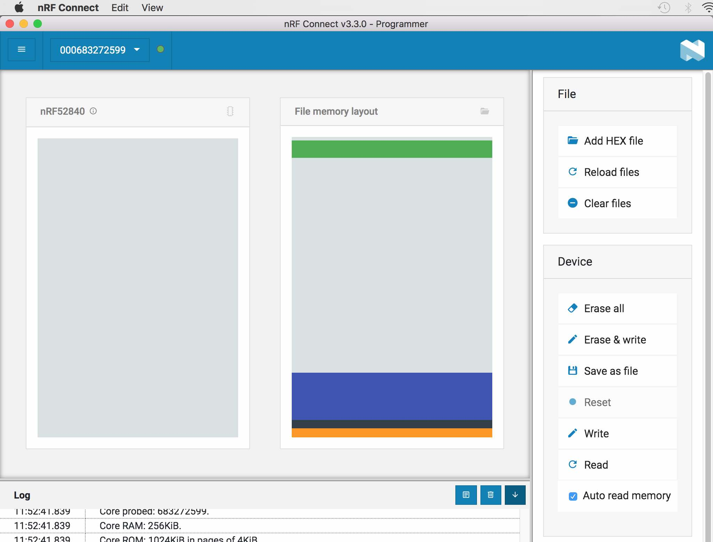
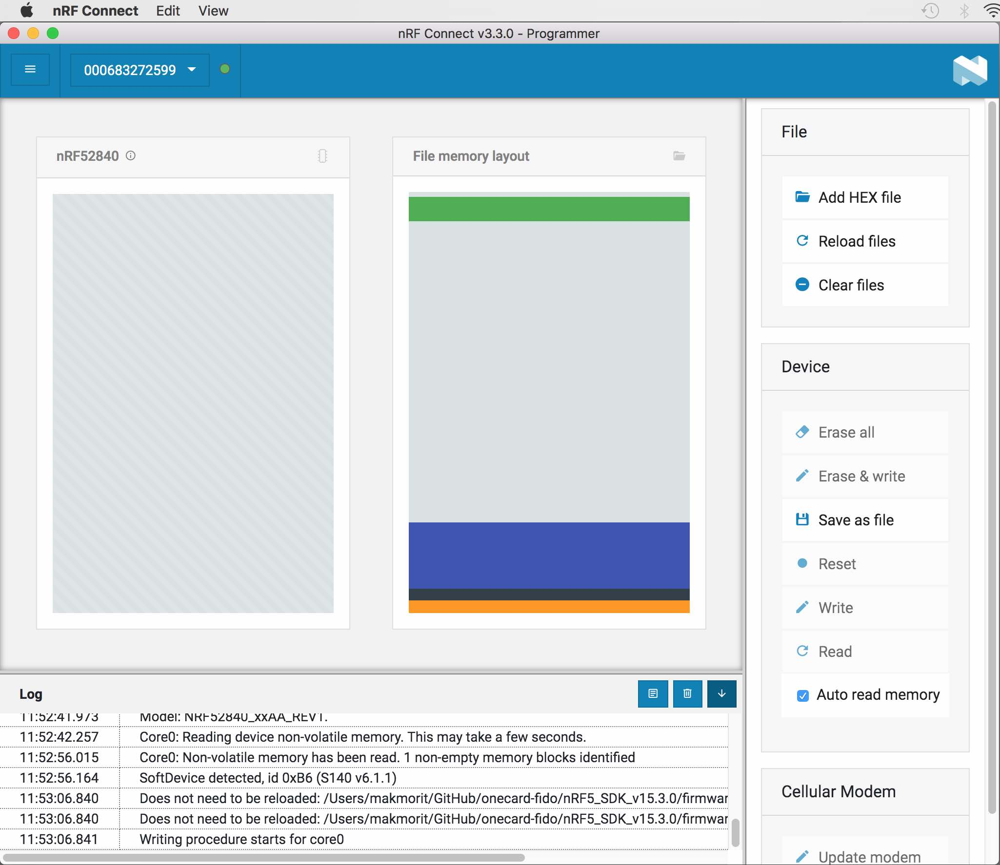
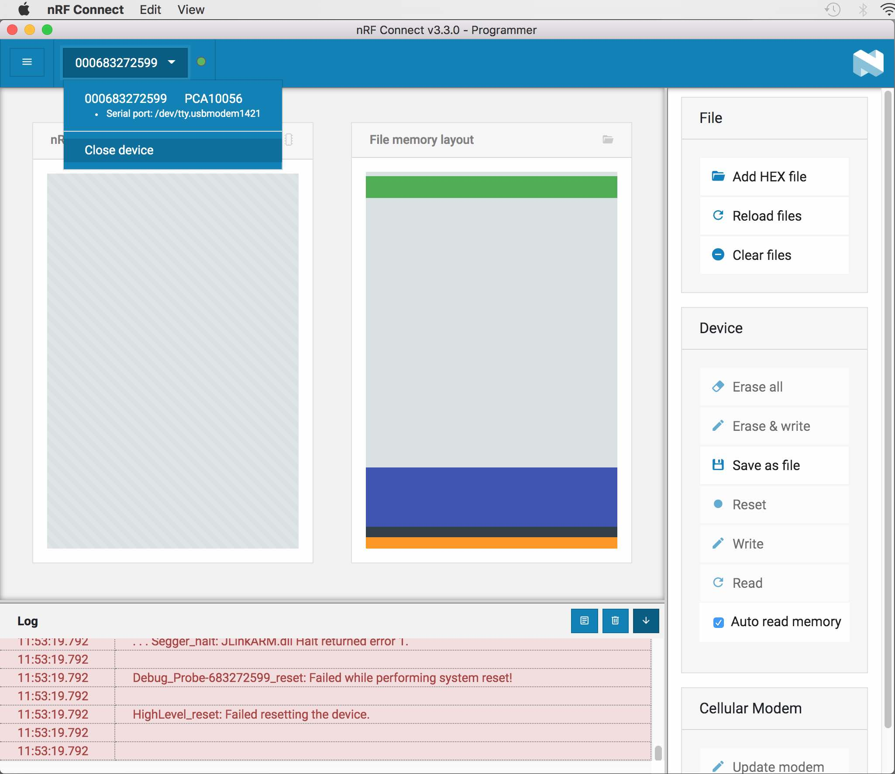

# 署名機能付きUSBブートローダー移行手順書

## 概要

[バージョン0.1.27](https://github.com/diverta/onecard-fido/tree/improve-FIDO2MT-macOS-cmd-BLmode/MaintenanceTool)以降の[FIDO認証器管理ツール](../../../MaintenanceTool/README.md)を使用する場合は、[MDBT50Q Dongle](../../../FIDO2Device/MDBT50Q_Dongle)のブートローダーを、現在の[簡易USBブートローダー](../../../nRF5_SDK_v15.3.0/firmwares/open_bootloader)から、[署名機能付きUSBブートローダー](../../../nRF5_SDK_v15.3.0/firmwares/secure_bootloader)に移行させる必要があります。

[MDBT50Q Dongle（rev2）](https://github.com/diverta/onecard-fido/blob/improve-FIDO2MT-macOS-cmd-BLmode/FIDO2Device/MDBT50Q_Dongle)に、署名機能付きUSBブートローダーを新規導入する手順を、以下に掲載いたします。

### 背景と目的

[バージョン0.1.26](https://github.com/diverta/onecard-fido/tree/improve-FIDO2MT-macOS-cmd-BLmode/MaintenanceTool)の管理ツールを使用した[ファームウェア更新手順](https://github.com/diverta/onecard-fido/blob/bug-nRF52840-BLE-auth-scanparam/MaintenanceTool/macOSApp/UPDATEFIRMWARE.md)においては、MDBT50Q Dongleをブートローダーモードに遷移させるために、基板上のRESETボタンを押す運用としております。

この運用にしてしまいますと、一般的に意図されているのRESETボタンの目的（すなわち、アプリケーション・ファームウェアを再始動させる）が実現できなくなるばかりでなく、ユーザーによるボタン操作により、意図せずブートローダーモードに遷移してしまう可能性があります。

そこで、今回制作した[署名機能付きUSBブートローダー](../../../nRF5_SDK_v15.3.0/firmwares/secure_bootloader)では、管理ツール画面上の操作により、基板上の物理的なボタン操作無しで、MDBT50Q Dongleをブートローダーモードに遷移させることを可能としています。

他方、結果として、署名機能付きUSBブートローダー単体でブートローダーモードに遷移させる手段がなくなってしまうため[注1]、本手順書により、[バージョン0.1.27](https://github.com/diverta/onecard-fido/tree/improve-FIDO2MT-macOS-cmd-BLmode/MaintenanceTool)以降の[FIDO認証器管理ツール](../../../MaintenanceTool/README.md)とセットで、署名機能付きUSBブートローダーを新規導入する必要があります。

[注1] 署名機能付きUSBブートローダーだけが、MDBT50Q Dongleに導入されている場合は、アプリケーションが存在しないため、USBポートに装着時は、必然的にブートローダーモードに遷移します。

### 注意事項

この移行作業を実施すると、MDBT50Q DongleのFlash ROM全領域が消去されるため、MDBT50Q Dongleに導入した秘密鍵・証明書や、PIN番号、WebAuthn認証情報などは、すべて消去されます。

## 導入の準備

署名機能付きUSBブートローダー（以下、単にブートローダー）の導入に必要な環境と媒体を準備します。

### 動作確認時の環境

- macOS Sierra（10.12.6）
- nRF52840 DK（PCA10056）: プログラムの書込みに使用
- MDBT50Q Dongle（nRF52840）: プログラムの書込み先となるターゲット基板

### ハードウェアの準備

まず最初に、MDBT50Q Dongleの背面にあるボタン電池ケースに、<b>電池が入っていないこと</b>を必ず確認します。


次に、MDBT50Q DongleをPCのUSBポートに装着後、nRF52840 DKと接続します。<br>
接続するピンの対応関係は以下の通りです。

|ピンの名前 |MDBT50Q Dongle | | nRF52840 DK|
|:--|:-:|:-:|:-:|
|0V |GND  | <-->  |GND|
|SWD IO |PIO  | <-->  |SWDIO|
|SWD Clock |PCLK  | <--  |SWDCLK|
|SWD IO Level |VDD  | -->  |VTG|
|SWD Reset |RST  | <--  |RESET|

[注1] nRF52840 DK上の「P20」というコネクター（オスピン）に接続します。<br>
[注2] MDBT50Q Dongle（rev2）の回路図はこちら（[FIDO2AUTH_001.pdf](../../../FIDO2Device/MDBT50Q_Dongle/pcb_rev2/FIDO2AUTH_002.pdf)）になります。

下図は実際に両者を接続した時のイメージになります。


### ファームウェアの準備

ファームウェアは、すでにビルド済みの`.hex`ファイルが、GitHubリポジトリーの以下の場所に格納されています。
- ソフトデバイス: [s140_nrf52_6.1.1_softdevice.hex](../../../nRF5_SDK_v15.3.0/firmwares/s140_nrf52_6.1.1_softdevice.hex)
- ブートローダー: [secure_bootloader/nrf52840_xxaa.hex](../../../nRF5_SDK_v15.3.0/firmwares/secure_bootloader/nrf52840_xxaa.hex)

### 書込み用ツールの準備

以下のツールを、あらかじめPCに導入しておきます。

- <b>nRF Command Line Tools</b><br>
詳細につきましては、手順書「[NetBeansインストール手順](../../../nRF5_SDK_v15.3.0/NETBEANSINST.md)」内のトピック<b>「nRFコマンドラインツール」</b>をご参照ください。

- <b>nRF Connect for Desktop</b><br>
詳細につきましては、手順書[「nRF Connect for Desktop導入手順」](../../../nRF5_SDK_v15.3.0/NRFCONNECTINST.md)をご参照ください。

### 管理ツールの準備

署名機能付きUSBブートローダーをブートローダーモードに遷移させるために必要となる、アプリケーション・ファームウェアは、[FIDO認証器管理ツール（macOS版）](../../../MaintenanceTool/macOSApp/README.md)（以下「管理ツール」）を使用して導入します。<br>
アプリケーション・ファームウェアの更新イメージファイル（[app_dfu_package.0.2.8.zip](../../../nRF5_SDK_v15.3.0/firmwares/app_dfu_package.0.2.8.zip)）は、管理ツールに同梱されております。

[バージョン0.1.27](https://github.com/diverta/onecard-fido/tree/improve-FIDO2MT-macOS-cmd-BLmode/MaintenanceTool)以降の[管理ツール](../../../MaintenanceTool/macOSApp)を、あらかじめPCに導入しておきます。<br>
詳細につきましては、手順書[「インストール手順」](../../../MaintenanceTool/macOSApp/INSTALLPRG.md)をご参照ください。

## ブートローダーの導入

MDBT50Q Dongleに、ブートローダーとソフトデバイスを導入します。

### Flash ROM全消去

以下のコマンドを実行します。

```
TOOLDIR=${HOME}/opt/nRF-Command-Line-Tools_9_8_1_OSX/nrfjprog
${TOOLDIR}/nrfjprog -f nrf52 --eraseall
```

以下は実行例になります。
```
MacBookPro-makmorit-jp:~ makmorit$ TOOLDIR=${HOME}/opt/nRF-Command-Line-Tools_9_8_1_OSX/nrfjprog
MacBookPro-makmorit-jp:~ makmorit$ ${TOOLDIR}/nrfjprog -f nrf52 --eraseall
Erasing user available code and UICR flash areas.
Applying system reset.
MacBookPro-makmorit-jp:~ makmorit$
```

以上で、Flash ROM全消去は完了になりますが、MDBT50Q DongleはPCのUSBポートに装着し、かつ、nRF52840 DKと接続したままにしておきます。

### 書込み準備

nRF Connectを起動します。<br>
画面上部の「APPS」をクリックすると、Programmerという項目が表示されます。<br>
右横の「Open」ボタンをクリックします。


プログラミングツールが起動します。<br>
右側の「File Memory Layout」欄がブランクになっていることを確認します。

ブランクになっていない場合は、右側の「Clear Files」というリンクをクリックして「File Memory Layout」欄をブランクにしてください。


「File Memory Layout」欄に、先述のファイル２点をドラッグ＆ドロップします。<br>
かならず、[s140_nrf52_6.1.1_softdevice.hex](../../../nRF5_SDK_v15.3.0/firmwares/s140_nrf52_6.1.1_softdevice.hex) --> [secure_bootloader/nrf52840_xxaa.hex](../../../nRF5_SDK_v15.3.0/firmwares/secure_bootloader/nrf52840_xxaa.hex)の順でドラッグ＆ドロップしてください。

２点のファイルが、「File Memory Layout」欄に、下図のように配置されることを確認します。



画面左上部の「Select device」プルダウンをクリックして、PCA10056（前述のnRF52840 DK）を選択します。



しばらくすると、左側の「nRF52840」欄に、nRF52840 DKに接続されているMDBT50Q Dongle側のメモリーイメージが表示されます。<br>
下図例ではメモリーイメージが表示されていませんが、これは事前実行したFlash ROM全消去により、全領域が初期状態となったためです。



これで書き込み準備は完了です。

### 書込み実行

画面右下部にある「Write」のリンクをクリックし、書込みをスタートさせます。<br>
下図のように「nRF52840」欄に淡い縞模様が表示され、書込処理が進みます。



しばらくすると、下図のように画面下部のメッセージ欄が赤く変化します。<br>
画面左上部にあるプルダウンから「Close device」を選択し、nRF52840 DKとの接続をすみやかに切断してください。



切断が完了したら、画面の「Quit」を実行して、nRF Connectを終了させます。


その後、MDBT50Q DongleをPCのUSBポートから外し、nRF52840 DKとの配線を外してください。

これで、USBブートローダーの導入は完了となります。

続いて、管理ツールにより、[アプリケーション・ファームウェア](../../../nRF5_SDK_v15.3.0/firmwares/app_dfu_package.0.2.8.zip)を導入してください。
