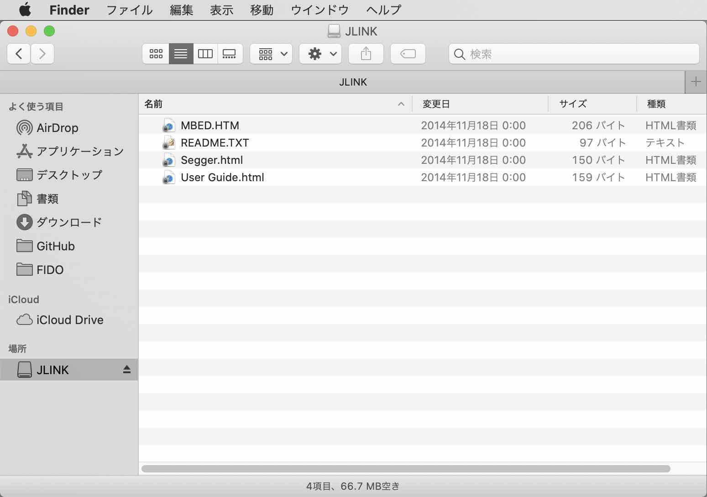

# TF-Mサンプルアプリ動作確認手順書

Zephyrプロジェクトから提供されている、Trusted Firmware（TF-M）サンプルアプリ「[TF-M PSA Level 1](https://docs.zephyrproject.org/latest/samples/tfm_integration/psa_level_1/README.html)」の動作確認手順について掲載します。

## 事前準備

#### nRF Connect SDKのインストール
「[nRF Connect SDK](https://developer.nordicsemi.com/nRF_Connect_SDK/doc/latest/nrf/index.html)」を、PC（macOS）にインストールします。<br>
インストールの詳細につきましては、別途手順書「[nRF Connect SDKインストール手順書](../../../nRF5340_app/INSTALLSDK.md)」をご参照願います。

#### ボードをPCに接続

動作確認に使用する開発ボード（nRF5340 DK）を、USBケーブルでPCに接続します。<br>
Finderで、JLINKという名前のボリュームができていることを確認してください。



#### デバッグプリント表示用のターミナルを起動

サンプルアプリからのデバッグプリントを表示させるための、ターミナルを起動しておきます。<br>
以下のコマンドを実行します。

```
screen `ls /dev/tty.usbmodem*5` 115200
```

## サンプルアプリの準備

サンプルアプリ「[TF-M PSA Level 1](https://docs.zephyrproject.org/latest/samples/tfm_integration/psa_level_1/README.html)」を、SDKサンプルフォルダーから任意のフォルダーに複製します。<br>
サンプルアプリのビルドと動作確認は、複製されたフォルダー上で実行するようにします。

#### サンプルアプリのコピー

サンプルアプリのプロジェクトフォルダー`${HOME}/GitHub/onecard-fido/pyvenvs/ncs/zephyr/samples/tfm_integration/psa_level_1`を、別フォルダー`${HOME}/GitHub/onecard-fido/pyvenvs/ncs/research/`配下に複製します。<br>
下記コマンドを実行します。

```
cp -pr ${HOME}/GitHub/onecard-fido/pyvenvs/ncs/zephyr/samples/tfm_integration/psa_level_1 ${HOME}/GitHub/onecard-fido/pyvenvs/ncs/research/
```

下記は実行例になります。

```
bash-3.2$ cp -pr ${HOME}/GitHub/onecard-fido/pyvenvs/ncs/zephyr/samples/tfm_integration/psa_level_1 ${HOME}/GitHub/onecard-fido/pyvenvs/ncs/research/
bash-3.2$
bash-3.2$ ls -al ${HOME}/GitHub/onecard-fido/pyvenvs/ncs/research/psa_level_1
total 72
drwxr-xr-x  10 makmorit  staff    320  4 12 11:42 .
drwxr-xr-x   5 makmorit  staff    160  4 13 09:15 ..
-rw-r--r--@  1 makmorit  staff   6148  4 12 11:42 .DS_Store
-rw-r--r--   1 makmorit  staff    664  3 29 12:34 CMakeLists.txt
-rw-r--r--   1 makmorit  staff    469  3 29 12:34 Kconfig
-rw-r--r--   1 makmorit  staff  10457  3 29 12:34 README.rst
drwxr-xr-x   3 makmorit  staff     96  3 29 12:34 boards
-rw-r--r--   1 makmorit  staff    437  3 29 12:34 prj.conf
-rw-r--r--   1 makmorit  staff    611  3 29 12:34 sample.yaml
drwxr-xr-x  15 makmorit  staff    480  3 29 12:34 src
bash-3.2$
```

#### ビルド／書込み専用シェルの作成

ビルド／書込みを実行するために使用する`westbuild.sh`を、下記内容で作成します。[注1][注2]<br>
作成場所はプロジェクトフォルダー（`${HOME}/GitHub/onecard-fido/pyvenvs/ncs/research/psa_level_1`）直下とします。

```
bash-3.2$ cd ${HOME}/GitHub/onecard-fido/pyvenvs/ncs/research/psa_level_1
bash-3.2$ cat westbuild.sh
#!/bin/bash

# Environment variables for the GNU Arm Embedded toolchain
export ZEPHYR_TOOLCHAIN_VARIANT=gnuarmemb
export GNUARMEMB_TOOLCHAIN_PATH="${HOME}/opt/gcc-arm-none-eabi-9-2020-q2-update"

# Paths for command
export PATH=${PATH}:/Applications/CMake.app/Contents/bin
export PATH=${PATH}:${HOME}/opt/nRF-Command-Line-Tools_10_9_0_OSX/nrfjprog

# bash completion
export REPO_HOME=${HOME}/GitHub/onecard-fido
export NCS_HOME=${REPO_HOME}/pyvenvs/ncs
source ${NCS_HOME}/west-completion.bash

# Enter Python3 venv
source ${NCS_HOME}/bin/activate

if [ "$1" == "-f" ]; then
    # Erase flash
    nrfjprog -f NRF53 --eraseall
    if [ `echo $?` -ne 0 ]; then
        deactivate
        exit 1
    fi
    # Flash for nRF5340 DK
    ${NCS_HOME}/bin/west -v flash -d build_signed
    if [ `echo $?` -ne 0 ]; then
        deactivate
        exit 1
    fi
else
    # Build for nRF5340 DK
    rm -rfv build_signed
    ${NCS_HOME}/bin/west build -c -b nrf5340dk_nrf5340_cpuappns -d build_signed
    if [ `echo $?` -ne 0 ]; then
        deactivate
        exit 1
    fi
fi

deactivate
exit 0
bash-3.2$
```

[注1] `gcc-arm-none-eabi-9-2020-q2-update`＝[ARM GCCツールチェイン](../../../nRF52840_app/ARMGCCINST.md)の名称<br>
[注2] `nRF-Command-Line-Tools_10_9_0_OSX`＝[nRFコマンドラインツール](https://www.nordicsemi.com/Software-and-Tools/Development-Tools/nRF5-Command-Line-Tools/Download)のインストール先フォルダー名

## サンプルアプリのビルド

サンプルアプリ「TF-M PSA Level 1」をビルドし、ファームウェアイメージファイルを作成します。<br>
ビルド専用シェルを使用するため、Python3仮想環境に入る必要はありません。

#### ビルドの実行

先述のビルド専用シェル`westbuild.sh`を使用して、サンプルアプリをビルドします。<br>
以下のコマンドを実行します。

```
cd ${HOME}/GitHub/onecard-fido/pyvenvs/ncs/research/psa_level_1
./westbuild.sh
```

以下は実行例になります。<br>
ファームウェアイメージファイルは、サンプルアプリディレクトリー配下の`build_signed/zephyr/merged.hex`という名称で作成されるようです。

```
bash-3.2$ cd ${HOME}/GitHub/onecard-fido/pyvenvs/ncs/research/psa_level_1
bash-3.2$ ./westbuild.sh
-- west build: generating a build system
Including boilerplate (Zephyr base): /Users/makmorit/GitHub/onecard-fido/pyvenvs/ncs/zephyr/cmake/app/boilerplate.cmake
-- Application: /Users/makmorit/GitHub/onecard-fido/pyvenvs/ncs/research/psa_level_1
-- Zephyr version: 2.5.99 (/Users/makmorit/GitHub/onecard-fido/pyvenvs/ncs/zephyr)
-- Found Python3: /Users/makmorit/GitHub/onecard-fido/pyvenvs/ncs/bin/python3 (found suitable exact version "3.7.3") found components: Interpreter
-- Found west (found suitable version "0.10.1", minimum required is "0.7.1")
-- Board: nrf5340dk_nrf5340_cpuappns
-- Cache files will be written to: /Users/makmorit/Library/Caches/zephyr
-- Found toolchain: gnuarmemb (/Users/makmorit/opt/gcc-arm-none-eabi-9-2020-q2-update)
-- Found BOARD.dts: /Users/makmorit/GitHub/onecard-fido/pyvenvs/ncs/zephyr/boards/arm/nrf5340dk_nrf5340/nrf5340dk_nrf5340_cpuappns.dts
-- Generated zephyr.dts: /Users/makmorit/GitHub/onecard-fido/pyvenvs/ncs/research/psa_level_1/build_signed/zephyr/zephyr.dts
-- Generated devicetree_unfixed.h: /Users/makmorit/GitHub/onecard-fido/pyvenvs/ncs/research/psa_level_1/build_signed/zephyr/include/generated/devicetree_unfixed.h
-- Generated device_extern.h: /Users/makmorit/GitHub/onecard-fido/pyvenvs/ncs/research/psa_level_1/build_signed/zephyr/include/generated/device_extern.h
Parsing /Users/makmorit/GitHub/onecard-fido/pyvenvs/ncs/research/psa_level_1/Kconfig
Loaded configuration '/Users/makmorit/GitHub/onecard-fido/pyvenvs/ncs/zephyr/boards/arm/nrf5340dk_nrf5340/nrf5340dk_nrf5340_cpuappns_defconfig'
Merged configuration '/Users/makmorit/GitHub/onecard-fido/pyvenvs/ncs/research/psa_level_1/prj.conf'
Configuration saved to '/Users/makmorit/GitHub/onecard-fido/pyvenvs/ncs/research/psa_level_1/build_signed/zephyr/.config'
Kconfig header saved to '/Users/makmorit/GitHub/onecard-fido/pyvenvs/ncs/research/psa_level_1/build_signed/zephyr/include/generated/autoconf.h'
-- The C compiler identification is GNU 9.3.1
-- The CXX compiler identification is GNU 9.3.1
-- The ASM compiler identification is GNU
-- Found assembler: /Users/makmorit/opt/gcc-arm-none-eabi-9-2020-q2-update/bin/arm-none-eabi-gcc
-- Configuring done
-- Generating done
-- Build files have been written to: /Users/makmorit/GitHub/onecard-fido/pyvenvs/ncs/research/psa_level_1/build_signed
-- west build: building application
[1/181] Preparing syscall dependency handling

[11/181] Performing configure step for 'tfm'
-- The C compiler identification is GNU 9.3.1
-- The ASM compiler identification is GNU
-- Found assembler: /Users/makmorit/opt/gcc-arm-none-eabi-9-2020-q2-update/bin/arm-none-eabi-gcc
-- Found Git: /usr/bin/git (found version "2.24.3 (Apple Git-128)")
-- Populating mbedcrypto
-- Configuring done
-- Generating done
-- Build files have been written to: /Users/makmorit/GitHub/onecard-fido/pyvenvs/ncs/research/psa_level_1/build_signed/tfm/lib/ext/mbedcrypto-subbuild
[1/9] Creating directories for 'mbedcrypto-populate'
[1/9] Performing download step (git clone) for 'mbedcrypto-populate'
Cloning into 'mbedcrypto-src'...
remote: Enumerating objects: 18545, done.        
remote: Counting objects: 100% (18545/18545), done.        
remote: Compressing objects: 100% (8824/8824), done.        
remote: Total 18545 (delta 14476), reused 12872 (delta 9593), pack-reused 0
Receiving objects: 100% (18545/18545), 17.69 MiB | 2.09 MiB/s, done.
Resolving deltas: 100% (14476/14476), done.
Note: switching to 'mbedtls-2.24.0'.

You are in 'detached HEAD' state. You can look around, make experimental
changes and commit them, and you can discard any commits you make in this
state without impacting any branches by switching back to a branch.

If you want to create a new branch to retain commits you create, you may
do so (now or later) by using -c with the switch command. Example:

  git switch -c <new-branch-name>

Or undo this operation with:

  git switch -

Turn off this advice by setting config variable advice.detachedHead to false

HEAD is now at 523f0554 Merge pull request #748 from ARMmbed/mbedtls-2.24.0r0-pr
[2/9] Performing update step for 'mbedcrypto-populate'
[4/9] Performing patch step for 'mbedcrypto-populate'
[5/9] No configure step for 'mbedcrypto-populate'
[6/9] No build step for 'mbedcrypto-populate'
[7/9] No install step for 'mbedcrypto-populate'
[8/9] No test step for 'mbedcrypto-populate'
[9/9] Completed 'mbedcrypto-populate'
-- Found Python3: /Users/makmorit/GitHub/onecard-fido/pyvenvs/ncs/bin/python3 (found version "3.7.3") found components: Interpreter
Start to generate PSA manifests:
Generating /Users/makmorit/GitHub/onecard-fido/pyvenvs/ncs/research/psa_level_1/build_signed/tfm/generated/secure_fw/partitions/protected_storage/psa_manifest/tfm_protected_storage.h
Generating /Users/makmorit/GitHub/onecard-fido/pyvenvs/ncs/research/psa_level_1/build_signed/tfm/generated/secure_fw/partitions/protected_storage/auto_generated/intermedia_tfm_protected_storage.c
Generating /Users/makmorit/GitHub/onecard-fido/pyvenvs/ncs/research/psa_level_1/build_signed/tfm/generated/secure_fw/partitions/internal_trusted_storage/psa_manifest/tfm_internal_trusted_storage.h
Generating /Users/makmorit/GitHub/onecard-fido/pyvenvs/ncs/research/psa_level_1/build_signed/tfm/generated/secure_fw/partitions/internal_trusted_storage/auto_generated/intermedia_tfm_internal_trusted_storage.c
Generating /Users/makmorit/GitHub/onecard-fido/pyvenvs/ncs/research/psa_level_1/build_signed/tfm/generated/secure_fw/partitions/audit_logging/psa_manifest/tfm_audit_logging.h
Generating /Users/makmorit/GitHub/onecard-fido/pyvenvs/ncs/research/psa_level_1/build_signed/tfm/generated/secure_fw/partitions/audit_logging/auto_generated/intermedia_tfm_audit_logging.c
Generating /Users/makmorit/GitHub/onecard-fido/pyvenvs/ncs/research/psa_level_1/build_signed/tfm/generated/secure_fw/partitions/crypto/psa_manifest/tfm_crypto.h
Generating /Users/makmorit/GitHub/onecard-fido/pyvenvs/ncs/research/psa_level_1/build_signed/tfm/generated/secure_fw/partitions/crypto/auto_generated/intermedia_tfm_crypto.c
Generating /Users/makmorit/GitHub/onecard-fido/pyvenvs/ncs/research/psa_level_1/build_signed/tfm/generated/secure_fw/partitions/platform/psa_manifest/tfm_platform.h
Generating /Users/makmorit/GitHub/onecard-fido/pyvenvs/ncs/research/psa_level_1/build_signed/tfm/generated/secure_fw/partitions/platform/auto_generated/intermedia_tfm_platform.c
Generating /Users/makmorit/GitHub/onecard-fido/pyvenvs/ncs/research/psa_level_1/build_signed/tfm/generated/secure_fw/partitions/initial_attestation/psa_manifest/tfm_initial_attestation.h
Generating /Users/makmorit/GitHub/onecard-fido/pyvenvs/ncs/research/psa_level_1/build_signed/tfm/generated/secure_fw/partitions/initial_attestation/auto_generated/intermedia_tfm_initial_attestation.c
Generating /Users/makmorit/GitHub/onecard-fido/pyvenvs/ncs/research/psa_level_1/build_signed/tfm/generated/test_services/tfm_core_test/psa_manifest/tfm_ss_core_test.h
Generating /Users/makmorit/GitHub/onecard-fido/pyvenvs/ncs/research/psa_level_1/build_signed/tfm/generated/test_services/tfm_core_test/auto_generated/intermedia_tfm_ss_core_test.c
Generating /Users/makmorit/GitHub/onecard-fido/pyvenvs/ncs/research/psa_level_1/build_signed/tfm/generated/test_services/tfm_core_test_2/psa_manifest/tfm_ss_core_test_2.h
Generating /Users/makmorit/GitHub/onecard-fido/pyvenvs/ncs/research/psa_level_1/build_signed/tfm/generated/test_services/tfm_core_test_2/auto_generated/intermedia_tfm_ss_core_test_2.c
Generating /Users/makmorit/GitHub/onecard-fido/pyvenvs/ncs/research/psa_level_1/build_signed/tfm/generated/test_services/tfm_secure_client_service/psa_manifest/tfm_secure_client_service.h
Generating /Users/makmorit/GitHub/onecard-fido/pyvenvs/ncs/research/psa_level_1/build_signed/tfm/generated/test_services/tfm_secure_client_service/auto_generated/intermedia_tfm_secure_client_service.c
Generating /Users/makmorit/GitHub/onecard-fido/pyvenvs/ncs/research/psa_level_1/build_signed/tfm/generated/test_services/tfm_ipc_service/psa_manifest/tfm_ipc_service_test.h
Generating /Users/makmorit/GitHub/onecard-fido/pyvenvs/ncs/research/psa_level_1/build_signed/tfm/generated/test_services/tfm_ipc_service/auto_generated/intermedia_tfm_ipc_service_test.c
Generating /Users/makmorit/GitHub/onecard-fido/pyvenvs/ncs/research/psa_level_1/build_signed/tfm/generated/test_services/tfm_ipc_client/psa_manifest/tfm_ipc_client_test.h
Generating /Users/makmorit/GitHub/onecard-fido/pyvenvs/ncs/research/psa_level_1/build_signed/tfm/generated/test_services/tfm_ipc_client/auto_generated/intermedia_tfm_ipc_client_test.c
Generating /Users/makmorit/GitHub/onecard-fido/pyvenvs/ncs/research/psa_level_1/build_signed/tfm/generated/test_services/tfm_irq_test_service_1/psa_manifest/tfm_irq_test_service_1.h
Generating /Users/makmorit/GitHub/onecard-fido/pyvenvs/ncs/research/psa_level_1/build_signed/tfm/generated/test_services/tfm_irq_test_service_1/auto_generated/intermedia_tfm_irq_test_service_1.c
Generating /Users/makmorit/GitHub/onecard-fido/pyvenvs/ncs/research/psa_level_1/build_signed/tfm/generated/test_services/tfm_ps_test_service/psa_manifest/tfm_ps_test_service.h
Generating /Users/makmorit/GitHub/onecard-fido/pyvenvs/ncs/research/psa_level_1/build_signed/tfm/generated/test_services/tfm_ps_test_service/auto_generated/intermedia_tfm_ps_test_service.c
Generating /Users/makmorit/GitHub/onecard-fido/pyvenvs/ncs/research/psa_level_1/build_signed/tfm/generated/test_services/tfm_secure_client_2/psa_manifest/tfm_secure_client_2.h
Generating /Users/makmorit/GitHub/onecard-fido/pyvenvs/ncs/research/psa_level_1/build_signed/tfm/generated/test_services/tfm_secure_client_2/auto_generated/intermedia_tfm_secure_client_2.c
Generating /Users/makmorit/GitHub/onecard-fido/pyvenvs/ncs/research/psa_level_1/build_signed/tfm/generated/secure_fw/partitions/psa_proxy/psa_manifest/tfm_psa_proxy.h
Generating /Users/makmorit/GitHub/onecard-fido/pyvenvs/ncs/research/psa_level_1/build_signed/tfm/generated/secure_fw/partitions/psa_proxy/auto_generated/intermedia_tfm_psa_proxy.c
Start to generate file from the generated list:
Generating /Users/makmorit/GitHub/onecard-fido/pyvenvs/ncs/research/psa_level_1/build_signed/tfm/generated/secure_fw/spm/cmsis_func/tfm_spm_db_func.inc
Generating /Users/makmorit/GitHub/onecard-fido/pyvenvs/ncs/research/psa_level_1/build_signed/tfm/generated/secure_fw/spm/cmsis_psa/tfm_spm_db_ipc.inc
Generating /Users/makmorit/GitHub/onecard-fido/pyvenvs/ncs/research/psa_level_1/build_signed/tfm/generated/secure_fw/partitions/tfm_service_list.inc
Generating /Users/makmorit/GitHub/onecard-fido/pyvenvs/ncs/research/psa_level_1/build_signed/tfm/generated/secure_fw/spm/cmsis_func/tfm_veneers.c
Generating /Users/makmorit/GitHub/onecard-fido/pyvenvs/ncs/research/psa_level_1/build_signed/tfm/generated/interface/include/tfm_veneers.h
Generating /Users/makmorit/GitHub/onecard-fido/pyvenvs/ncs/research/psa_level_1/build_signed/tfm/generated/secure_fw/spm/cmsis_func/tfm_secure_irq_handlers.inc
Generating /Users/makmorit/GitHub/onecard-fido/pyvenvs/ncs/research/psa_level_1/build_signed/tfm/generated/secure_fw/spm/cmsis_psa/tfm_secure_irq_handlers_ipc.inc
Generating /Users/makmorit/GitHub/onecard-fido/pyvenvs/ncs/research/psa_level_1/build_signed/tfm/generated/interface/include/psa_manifest/sid.h
Generating /Users/makmorit/GitHub/onecard-fido/pyvenvs/ncs/research/psa_level_1/build_signed/tfm/generated/interface/include/psa_manifest/pid.h
Generation of files done
-- Found PythonInterp: /Users/makmorit/GitHub/onecard-fido/pyvenvs/ncs/bin/python3 (found suitable version "3.7.3", minimum required is "3")
-- Could NOT find Sphinx (missing: SPHINX_EXECUTABLE SPHINX_VERSION)
CMake Warning (dev) at /Applications/CMake.app/Contents/share/cmake-3.18/Modules/FindPackageHandleStandardArgs.cmake:273 (message):
  The package name passed to `find_package_handle_standard_args` (PY_M2R)
  does not match the name of the calling package (PythonModules).  This can
  lead to problems in calling code that expects `find_package` result
  variables (e.g., `_FOUND`) to follow a certain pattern.
Call Stack (most recent call first):
  cmake/FindPythonModules.cmake:60 (find_package_handle_standard_args)
  docs/CMakeLists.txt:14 (find_package)
This warning is for project developers.  Use -Wno-dev to suppress it.

-- Can not find Python module m2r (missing: PY_M2R)
CMake Warning (dev) at /Applications/CMake.app/Contents/share/cmake-3.18/Modules/FindPackageHandleStandardArgs.cmake:273 (message):
  The package name passed to `find_package_handle_standard_args`
  (PY_SPHINX-RTD-THEME) does not match the name of the calling package
  (PythonModules).  This can lead to problems in calling code that expects
  `find_package` result variables (e.g., `_FOUND`) to follow a certain
  pattern.
Call Stack (most recent call first):
  cmake/FindPythonModules.cmake:60 (find_package_handle_standard_args)
  docs/CMakeLists.txt:14 (find_package)
This warning is for project developers.  Use -Wno-dev to suppress it.

-- Can not find Python module sphinx-rtd-theme (missing: PY_SPHINX-RTD-THEME)
CMake Warning (dev) at /Applications/CMake.app/Contents/share/cmake-3.18/Modules/FindPackageHandleStandardArgs.cmake:273 (message):
  The package name passed to `find_package_handle_standard_args`
  (PY_SPHINXCONTRIB.PLANTUML) does not match the name of the calling package
  (PythonModules).  This can lead to problems in calling code that expects
  `find_package` result variables (e.g., `_FOUND`) to follow a certain
  pattern.
Call Stack (most recent call first):
  cmake/FindPythonModules.cmake:60 (find_package_handle_standard_args)
  docs/CMakeLists.txt:14 (find_package)
This warning is for project developers.  Use -Wno-dev to suppress it.

-- Can not find Python module sphinxcontrib.plantuml (missing: PY_SPHINXCONTRIB.PLANTUML)
-- Could NOT find Java (missing: Java_JAVA_EXECUTABLE Runtime) (Required is at least version "1.8")
CMake Warning (dev) at /Applications/CMake.app/Contents/share/cmake-3.18/Modules/FindPackageHandleStandardArgs.cmake:273 (message):
  The package name passed to `find_package_handle_standard_args` (Plantuml)
  does not match the name of the calling package (PlantUML).  This can lead
  to problems in calling code that expects `find_package` result variables
  (e.g., `_FOUND`) to follow a certain pattern.
Call Stack (most recent call first):
  cmake/FindPlantUML.cmake:63 (find_package_handle_standard_args)
  docs/CMakeLists.txt:15 (find_package)
This warning is for project developers.  Use -Wno-dev to suppress it.

-- Could NOT find Plantuml (missing: PLANTUML_JAR_PATH PLANTUML_VERSION)
-- Could NOT find Doxygen (missing: DOXYGEN_EXECUTABLE) (Required is at least version "1.8.0")
-- Could NOT find LATEX (missing: LATEX_COMPILER PDFLATEX)
-- ---------- Display crypto configuration - start --------------
-- CRYPTO_KEY_MODULE_DISABLED is set to FALSE
-- CRYPTO_AEAD_MODULE_DISABLED is set to FALSE
-- CRYPTO_MAC_MODULE_DISABLED is set to FALSE
-- CRYPTO_CIPHER_MODULE_DISABLED is set to FALSE
-- CRYPTO_HASH_MODULE_DISABLED is set to FALSE
-- CRYPTO_GENERATOR_MODULE_DISABLED is set to FALSE
-- CRYPTO_ASYMMETRIC_MODULE_DISABLED is set to FALSE
-- CRYPTO_ENGINE_BUF_SIZE is set to 0x2080
-- CRYPTO_CONC_OPER_NUM is set to 8
-- ---------- Display crypto configuration - stop ---------------
-- Performing Test C_COMPILER_SUPPORTS_WFORMAT_SIGNEDNESS
-- Performing Test C_COMPILER_SUPPORTS_WFORMAT_SIGNEDNESS - Failed
-- ----------- Display storage configuration - start ------------
-- PS_CREATE_FLASH_LAYOUT is set to ON
-- PS_ENCRYPTION is set to ON
-- PS_RAM_FS is set to OFF
-- PS_ROLLBACK_PROTECTION is set to ON
-- PS_VALIDATE_METADATA_FROM_FLASH is set to ON
-- PS_MAX_ASSET_SIZE is set to 2048
-- PS_NUM_ASSETS is set to 10
-- PS_CRYPTO_AEAD_ALG is set to PSA_ALG_GCM
-- ITS_CREATE_FLASH_LAYOUT is set to ON
-- ITS_RAM_FS is set to OFF
-- ITS_VALIDATE_METADATA_FROM_FLASH is set to ON
-- ITS_MAX_ASSET_SIZE is set to 512
-- ITS_NUM_ASSETS is set to 5
-- ITS_BUF_SIZE is not set (defaults to ITS_MAX_ASSET_SIZE)
-- ----------- Display storage configuration - stop -------------
-- Configuring done
-- Generating done
-- Build files have been written to: /Users/makmorit/GitHub/onecard-fido/pyvenvs/ncs/research/psa_level_1/build_signed/tfm
[11/181] Performing build step for 'tfm'
[84/372] Generating ../generated/secure_fw/spm/cmsis_func/...t/sid.h, ../generated/interface/include/psa_manifest/pid.h
Start to generate PSA manifests:
Generating /Users/makmorit/GitHub/onecard-fido/pyvenvs/ncs/research/psa_level_1/build_signed/tfm/generated/secure_fw/partitions/protected_storage/psa_manifest/tfm_protected_storage.h
Generating /Users/makmorit/GitHub/onecard-fido/pyvenvs/ncs/research/psa_level_1/build_signed/tfm/generated/secure_fw/partitions/protected_storage/auto_generated/intermedia_tfm_protected_storage.c
Generating /Users/makmorit/GitHub/onecard-fido/pyvenvs/ncs/research/psa_level_1/build_signed/tfm/generated/secure_fw/partitions/internal_trusted_storage/psa_manifest/tfm_internal_trusted_storage.h
Generating /Users/makmorit/GitHub/onecard-fido/pyvenvs/ncs/research/psa_level_1/build_signed/tfm/generated/secure_fw/partitions/internal_trusted_storage/auto_generated/intermedia_tfm_internal_trusted_storage.c
Generating /Users/makmorit/GitHub/onecard-fido/pyvenvs/ncs/research/psa_level_1/build_signed/tfm/generated/secure_fw/partitions/audit_logging/psa_manifest/tfm_audit_logging.h
Generating /Users/makmorit/GitHub/onecard-fido/pyvenvs/ncs/research/psa_level_1/build_signed/tfm/generated/secure_fw/partitions/audit_logging/auto_generated/intermedia_tfm_audit_logging.c
Generating /Users/makmorit/GitHub/onecard-fido/pyvenvs/ncs/research/psa_level_1/build_signed/tfm/generated/secure_fw/partitions/crypto/psa_manifest/tfm_crypto.h
Generating /Users/makmorit/GitHub/onecard-fido/pyvenvs/ncs/research/psa_level_1/build_signed/tfm/generated/secure_fw/partitions/crypto/auto_generated/intermedia_tfm_crypto.c
Generating /Users/makmorit/GitHub/onecard-fido/pyvenvs/ncs/research/psa_level_1/build_signed/tfm/generated/secure_fw/partitions/platform/psa_manifest/tfm_platform.h
Generating /Users/makmorit/GitHub/onecard-fido/pyvenvs/ncs/research/psa_level_1/build_signed/tfm/generated/secure_fw/partitions/platform/auto_generated/intermedia_tfm_platform.c
Generating /Users/makmorit/GitHub/onecard-fido/pyvenvs/ncs/research/psa_level_1/build_signed/tfm/generated/secure_fw/partitions/initial_attestation/psa_manifest/tfm_initial_attestation.h
Generating /Users/makmorit/GitHub/onecard-fido/pyvenvs/ncs/research/psa_level_1/build_signed/tfm/generated/secure_fw/partitions/initial_attestation/auto_generated/intermedia_tfm_initial_attestation.c
Generating /Users/makmorit/GitHub/onecard-fido/pyvenvs/ncs/research/psa_level_1/build_signed/tfm/generated/test_services/tfm_core_test/psa_manifest/tfm_ss_core_test.h
Generating /Users/makmorit/GitHub/onecard-fido/pyvenvs/ncs/research/psa_level_1/build_signed/tfm/generated/test_services/tfm_core_test/auto_generated/intermedia_tfm_ss_core_test.c
Generating /Users/makmorit/GitHub/onecard-fido/pyvenvs/ncs/research/psa_level_1/build_signed/tfm/generated/test_services/tfm_core_test_2/psa_manifest/tfm_ss_core_test_2.h
Generating /Users/makmorit/GitHub/onecard-fido/pyvenvs/ncs/research/psa_level_1/build_signed/tfm/generated/test_services/tfm_core_test_2/auto_generated/intermedia_tfm_ss_core_test_2.c
Generating /Users/makmorit/GitHub/onecard-fido/pyvenvs/ncs/research/psa_level_1/build_signed/tfm/generated/test_services/tfm_secure_client_service/psa_manifest/tfm_secure_client_service.h
Generating /Users/makmorit/GitHub/onecard-fido/pyvenvs/ncs/research/psa_level_1/build_signed/tfm/generated/test_services/tfm_secure_client_service/auto_generated/intermedia_tfm_secure_client_service.c
Generating /Users/makmorit/GitHub/onecard-fido/pyvenvs/ncs/research/psa_level_1/build_signed/tfm/generated/test_services/tfm_ipc_service/psa_manifest/tfm_ipc_service_test.h
Generating /Users/makmorit/GitHub/onecard-fido/pyvenvs/ncs/research/psa_level_1/build_signed/tfm/generated/test_services/tfm_ipc_service/auto_generated/intermedia_tfm_ipc_service_test.c
Generating /Users/makmorit/GitHub/onecard-fido/pyvenvs/ncs/research/psa_level_1/build_signed/tfm/generated/test_services/tfm_ipc_client/psa_manifest/tfm_ipc_client_test.h
Generating /Users/makmorit/GitHub/onecard-fido/pyvenvs/ncs/research/psa_level_1/build_signed/tfm/generated/test_services/tfm_ipc_client/auto_generated/intermedia_tfm_ipc_client_test.c
Generating /Users/makmorit/GitHub/onecard-fido/pyvenvs/ncs/research/psa_level_1/build_signed/tfm/generated/test_services/tfm_irq_test_service_1/psa_manifest/tfm_irq_test_service_1.h
Generating /Users/makmorit/GitHub/onecard-fido/pyvenvs/ncs/research/psa_level_1/build_signed/tfm/generated/test_services/tfm_irq_test_service_1/auto_generated/intermedia_tfm_irq_test_service_1.c
Generating /Users/makmorit/GitHub/onecard-fido/pyvenvs/ncs/research/psa_level_1/build_signed/tfm/generated/test_services/tfm_ps_test_service/psa_manifest/tfm_ps_test_service.h
Generating /Users/makmorit/GitHub/onecard-fido/pyvenvs/ncs/research/psa_level_1/build_signed/tfm/generated/test_services/tfm_ps_test_service/auto_generated/intermedia_tfm_ps_test_service.c
Generating /Users/makmorit/GitHub/onecard-fido/pyvenvs/ncs/research/psa_level_1/build_signed/tfm/generated/test_services/tfm_secure_client_2/psa_manifest/tfm_secure_client_2.h
Generating /Users/makmorit/GitHub/onecard-fido/pyvenvs/ncs/research/psa_level_1/build_signed/tfm/generated/test_services/tfm_secure_client_2/auto_generated/intermedia_tfm_secure_client_2.c
Generating /Users/makmorit/GitHub/onecard-fido/pyvenvs/ncs/research/psa_level_1/build_signed/tfm/generated/secure_fw/partitions/psa_proxy/psa_manifest/tfm_psa_proxy.h
Generating /Users/makmorit/GitHub/onecard-fido/pyvenvs/ncs/research/psa_level_1/build_signed/tfm/generated/secure_fw/partitions/psa_proxy/auto_generated/intermedia_tfm_psa_proxy.c
Start to generate file from the generated list:
Generating /Users/makmorit/GitHub/onecard-fido/pyvenvs/ncs/research/psa_level_1/build_signed/tfm/generated/secure_fw/spm/cmsis_func/tfm_spm_db_func.inc
Generating /Users/makmorit/GitHub/onecard-fido/pyvenvs/ncs/research/psa_level_1/build_signed/tfm/generated/secure_fw/spm/cmsis_psa/tfm_spm_db_ipc.inc
Generating /Users/makmorit/GitHub/onecard-fido/pyvenvs/ncs/research/psa_level_1/build_signed/tfm/generated/secure_fw/partitions/tfm_service_list.inc
Generating /Users/makmorit/GitHub/onecard-fido/pyvenvs/ncs/research/psa_level_1/build_signed/tfm/generated/secure_fw/spm/cmsis_func/tfm_veneers.c
Generating /Users/makmorit/GitHub/onecard-fido/pyvenvs/ncs/research/psa_level_1/build_signed/tfm/generated/interface/include/tfm_veneers.h
Generating /Users/makmorit/GitHub/onecard-fido/pyvenvs/ncs/research/psa_level_1/build_signed/tfm/generated/secure_fw/spm/cmsis_func/tfm_secure_irq_handlers.inc
Generating /Users/makmorit/GitHub/onecard-fido/pyvenvs/ncs/research/psa_level_1/build_signed/tfm/generated/secure_fw/spm/cmsis_psa/tfm_secure_irq_handlers_ipc.inc
Generating /Users/makmorit/GitHub/onecard-fido/pyvenvs/ncs/research/psa_level_1/build_signed/tfm/generated/interface/include/psa_manifest/sid.h
Generating /Users/makmorit/GitHub/onecard-fido/pyvenvs/ncs/research/psa_level_1/build_signed/tfm/generated/interface/include/psa_manifest/pid.h
Generation of files done
[171/372] Building C object secure_fw/partitions/crypto/mb...library/CMakeFiles/crypto_service_mbedcrypto.dir/entropy.o
lib/ext/mbedcrypto-src/library/entropy.c:25:2: warning: #warning "**** WARNING!  MBEDTLS_TEST_NULL_ENTROPY defined! " [-Wcpp]
   25 | #warning "**** WARNING!  MBEDTLS_TEST_NULL_ENTROPY defined! "
      |  ^~~~~~~
lib/ext/mbedcrypto-src/library/entropy.c:26:2: warning: #warning "**** THIS BUILD HAS NO DEFINED ENTROPY SOURCES " [-Wcpp]
   26 | #warning "**** THIS BUILD HAS NO DEFINED ENTROPY SOURCES "
      |  ^~~~~~~
lib/ext/mbedcrypto-src/library/entropy.c:27:2: warning: #warning "**** THIS BUILD IS *NOT* SUITABLE FOR PRODUCTION USE " [-Wcpp]
   27 | #warning "**** THIS BUILD IS *NOT* SUITABLE FOR PRODUCTION USE "
      |  ^~~~~~~
[301/372] Building C object secure_fw/spm/CMakeFiles/tfm_spm.dir/cmsis_func/spm_func.o
/Users/makmorit/GitHub/onecard-fido/pyvenvs/ncs/modules/tee/tfm/trusted-firmware-m/secure_fw/spm/cmsis_func/spm_func.c: In function 'tfm_spm_seal_psp_stacks':
/Users/makmorit/GitHub/onecard-fido/pyvenvs/ncs/modules/tee/tfm/trusted-firmware-m/secure_fw/spm/cmsis_func/spm_func.c:91:5: warning: array subscript 1 is outside array bounds of 'uint32_t[1]' {aka 'long unsigned int[1]'} [-Warray-bounds]
   91 |     *(arm_lib_stck_seal_base + 1) = TFM_STACK_SEAL_VALUE;
      |     ^~~~~~~~~~~~~~~~~~~~~~~~~~~~~
In file included from /Users/makmorit/GitHub/onecard-fido/pyvenvs/ncs/modules/tee/tfm/trusted-firmware-m/secure_fw/spm/cmsis_func/spm_func.c:23:
/Users/makmorit/GitHub/onecard-fido/pyvenvs/ncs/modules/tee/tfm/trusted-firmware-m/secure_fw/spm/cmsis_func/spm_func.c:56:18: note: while referencing 'Image$$ARM_LIB_STACK_SEAL$$ZI$$Base'
   56 | REGION_DECLARE_T(Image$$, ARM_LIB_STACK_SEAL, $$ZI$$Base, uint32_t);
      |                  ^~~~~~~
/Users/makmorit/GitHub/onecard-fido/pyvenvs/ncs/modules/tee/tfm/trusted-firmware-m/platform/include/region.h:12:25: note: in definition of macro 'REGION'
   12 | #define REGION(a, b, c) a##b##c
      |                         ^
/Users/makmorit/GitHub/onecard-fido/pyvenvs/ncs/modules/tee/tfm/trusted-firmware-m/platform/include/region.h:15:47: note: in expansion of macro 'REGION_NAME'
   15 | #define REGION_DECLARE_T(a, b, c, t) extern t REGION_NAME(a, b, c)
      |                                               ^~~~~~~~~~~
/Users/makmorit/GitHub/onecard-fido/pyvenvs/ncs/modules/tee/tfm/trusted-firmware-m/secure_fw/spm/cmsis_func/spm_func.c:56:1: note: in expansion of macro 'REGION_DECLARE_T'
   56 | REGION_DECLARE_T(Image$$, ARM_LIB_STACK_SEAL, $$ZI$$Base, uint32_t);
      | ^~~~~~~~~~~~~~~~
[334/372] Linking C executable bin/bl2.axf
Memory region         Used Size  Region Size  %age Used
           FLASH:       26484 B        32 KB     80.82%
             RAM:       23424 B       256 KB      8.94%
[356/372] Linking C executable bin/tfm_s.axf
Memory region         Used Size  Region Size  %age Used
           FLASH:      124220 B       254 KB     47.76%
             RAM:       49552 B       256 KB     18.90%
[366/372] Linking C executable bin/tfm_ns.axf
Memory region         Used Size  Region Size  %age Used
           FLASH:       11024 B       206 KB      5.23%
             RAM:        9984 B       256 KB      3.81%
[372/372] Generating tfm_s_ns_signed.bin
[13/181] Performing install step for 'tfm'
[0/1] Install the project...
-- Install configuration: "MinSizeRel"
-- Installing: /Users/makmorit/GitHub/onecard-fido/pyvenvs/ncs/research/psa_level_1/build_signed/tfm/secure_fw/partitions/crypto/mbedcrypto/install/libmbedcrypto.a
-- Installing: /Users/makmorit/GitHub/onecard-fido/pyvenvs/ncs/research/psa_level_1/build_signed/tfm/secure_fw/partitions/crypto/mbedcrypto/install/libmbedx509.a
-- Installing: /Users/makmorit/GitHub/onecard-fido/pyvenvs/ncs/research/psa_level_1/build_signed/tfm/secure_fw/partitions/crypto/mbedcrypto/install/libmbedtls.a
-- Installing: /Users/makmorit/GitHub/onecard-fido/pyvenvs/ncs/research/psa_level_1/build_signed/tfm/bl2/mbedcrypto/install/libmbedcrypto.a
-- Installing: /Users/makmorit/GitHub/onecard-fido/pyvenvs/ncs/research/psa_level_1/build_signed/tfm/bl2/mbedcrypto/install/libmbedx509.a
-- Installing: /Users/makmorit/GitHub/onecard-fido/pyvenvs/ncs/research/psa_level_1/build_signed/tfm/bl2/mbedcrypto/install/libmbedtls.a
-- Installing: /Users/makmorit/GitHub/onecard-fido/pyvenvs/ncs/research/psa_level_1/build_signed/tfm/install/outputs/EXTERNAL/NRF/MODULES/TFM/BOARDS/NRF5340_CPUAPP
-- Installing: /Users/makmorit/GitHub/onecard-fido/pyvenvs/ncs/research/psa_level_1/build_signed/tfm/install/outputs/EXTERNAL/NRF/MODULES/TFM/BOARDS/NRF5340_CPUAPP/tfm_s.axf
-- Installing: /Users/makmorit/GitHub/onecard-fido/pyvenvs/ncs/research/psa_level_1/build_signed/tfm/install/outputs/EXTERNAL/NRF/MODULES/TFM/BOARDS/NRF5340_CPUAPP/tfm_ns.axf
-- Installing: /Users/makmorit/GitHub/onecard-fido/pyvenvs/ncs/research/psa_level_1/build_signed/tfm/install/outputs/EXTERNAL/NRF/MODULES/TFM/BOARDS/NRF5340_CPUAPP/bl2.map
-- Installing: /Users/makmorit/GitHub/onecard-fido/pyvenvs/ncs/research/psa_level_1/build_signed/tfm/install/outputs/EXTERNAL/NRF/MODULES/TFM/BOARDS/NRF5340_CPUAPP/bl2.elf
-- Installing: /Users/makmorit/GitHub/onecard-fido/pyvenvs/ncs/research/psa_level_1/build_signed/tfm/install/outputs/EXTERNAL/NRF/MODULES/TFM/BOARDS/NRF5340_CPUAPP/tfm_ns_signed.bin
-- Installing: /Users/makmorit/GitHub/onecard-fido/pyvenvs/ncs/research/psa_level_1/build_signed/tfm/install/outputs/EXTERNAL/NRF/MODULES/TFM/BOARDS/NRF5340_CPUAPP/tfm_s.bin
-- Installing: /Users/makmorit/GitHub/onecard-fido/pyvenvs/ncs/research/psa_level_1/build_signed/tfm/install/outputs/EXTERNAL/NRF/MODULES/TFM/BOARDS/NRF5340_CPUAPP/tfm_ns.bin
-- Installing: /Users/makmorit/GitHub/onecard-fido/pyvenvs/ncs/research/psa_level_1/build_signed/tfm/install/outputs/EXTERNAL/NRF/MODULES/TFM/BOARDS/NRF5340_CPUAPP/tfm_ns.hex
-- Installing: /Users/makmorit/GitHub/onecard-fido/pyvenvs/ncs/research/psa_level_1/build_signed/tfm/install/outputs/EXTERNAL/NRF/MODULES/TFM/BOARDS/NRF5340_CPUAPP/tfm_s.hex
-- Installing: /Users/makmorit/GitHub/onecard-fido/pyvenvs/ncs/research/psa_level_1/build_signed/tfm/install/outputs/EXTERNAL/NRF/MODULES/TFM/BOARDS/NRF5340_CPUAPP/bl2.bin
-- Installing: /Users/makmorit/GitHub/onecard-fido/pyvenvs/ncs/research/psa_level_1/build_signed/tfm/install/outputs/EXTERNAL/NRF/MODULES/TFM/BOARDS/NRF5340_CPUAPP/bl2.hex
-- Installing: /Users/makmorit/GitHub/onecard-fido/pyvenvs/ncs/research/psa_level_1/build_signed/tfm/install/outputs/EXTERNAL/NRF/MODULES/TFM/BOARDS/NRF5340_CPUAPP/tfm_s_signed.bin
-- Installing: /Users/makmorit/GitHub/onecard-fido/pyvenvs/ncs/research/psa_level_1/build_signed/tfm/install/outputs/EXTERNAL/NRF/MODULES/TFM/BOARDS/NRF5340_CPUAPP/tfm_s.elf
-- Installing: /Users/makmorit/GitHub/onecard-fido/pyvenvs/ncs/research/psa_level_1/build_signed/tfm/install/outputs/EXTERNAL/NRF/MODULES/TFM/BOARDS/NRF5340_CPUAPP/tfm_ns.elf
-- Installing: /Users/makmorit/GitHub/onecard-fido/pyvenvs/ncs/research/psa_level_1/build_signed/tfm/install/outputs/EXTERNAL/NRF/MODULES/TFM/BOARDS/NRF5340_CPUAPP/tfm_s_ns_signed.bin
-- Installing: /Users/makmorit/GitHub/onecard-fido/pyvenvs/ncs/research/psa_level_1/build_signed/tfm/install/outputs/EXTERNAL/NRF/MODULES/TFM/BOARDS/NRF5340_CPUAPP/tfm_s.map
-- Installing: /Users/makmorit/GitHub/onecard-fido/pyvenvs/ncs/research/psa_level_1/build_signed/tfm/install/outputs/EXTERNAL/NRF/MODULES/TFM/BOARDS/NRF5340_CPUAPP/tfm_ns.map
-- Installing: /Users/makmorit/GitHub/onecard-fido/pyvenvs/ncs/research/psa_level_1/build_signed/tfm/install/outputs/EXTERNAL/NRF/MODULES/TFM/BOARDS/NRF5340_CPUAPP/bl2.axf
-- Installing: /Users/makmorit/GitHub/onecard-fido/pyvenvs/ncs/research/psa_level_1/build_signed/tfm/install/interface/lib/s_veneers.o
-- Installing: /Users/makmorit/GitHub/onecard-fido/pyvenvs/ncs/research/psa_level_1/build_signed/tfm/install/interface/include/psa/client.h
-- Installing: /Users/makmorit/GitHub/onecard-fido/pyvenvs/ncs/research/psa_level_1/build_signed/tfm/install/interface/include/psa/error.h
-- Installing: /Users/makmorit/GitHub/onecard-fido/pyvenvs/ncs/research/psa_level_1/build_signed/tfm/install/interface/include/os_wrapper/common.h
-- Installing: /Users/makmorit/GitHub/onecard-fido/pyvenvs/ncs/research/psa_level_1/build_signed/tfm/install/interface/include/os_wrapper/mutex.h
-- Installing: /Users/makmorit/GitHub/onecard-fido/pyvenvs/ncs/research/psa_level_1/build_signed/tfm/install/interface/include/os_wrapper/semaphore.h
-- Installing: /Users/makmorit/GitHub/onecard-fido/pyvenvs/ncs/research/psa_level_1/build_signed/tfm/install/interface/include/os_wrapper/thread.h
-- Installing: /Users/makmorit/GitHub/onecard-fido/pyvenvs/ncs/research/psa_level_1/build_signed/tfm/install/interface/include/os_wrapper/tick.h
-- Installing: /Users/makmorit/GitHub/onecard-fido/pyvenvs/ncs/research/psa_level_1/build_signed/tfm/install/interface/include/psa_manifest/sid.h
-- Installing: /Users/makmorit/GitHub/onecard-fido/pyvenvs/ncs/research/psa_level_1/build_signed/tfm/install/interface/include/tfm_api.h
-- Installing: /Users/makmorit/GitHub/onecard-fido/pyvenvs/ncs/research/psa_level_1/build_signed/tfm/install/interface/include/tfm_ns_interface.h
-- Installing: /Users/makmorit/GitHub/onecard-fido/pyvenvs/ncs/research/psa_level_1/build_signed/tfm/install/interface/include/tfm_ns_svc.h
-- Installing: /Users/makmorit/GitHub/onecard-fido/pyvenvs/ncs/research/psa_level_1/build_signed/tfm/install/interface/include/ext/tz_context.h
-- Installing: /Users/makmorit/GitHub/onecard-fido/pyvenvs/ncs/research/psa_level_1/build_signed/tfm/install/interface/include/tfm/veneers/tfm_veneers.h
-- Installing: /Users/makmorit/GitHub/onecard-fido/pyvenvs/ncs/research/psa_level_1/build_signed/tfm/install/interface/include/psa/protected_storage.h
-- Installing: /Users/makmorit/GitHub/onecard-fido/pyvenvs/ncs/research/psa_level_1/build_signed/tfm/install/interface/include/psa/internal_trusted_storage.h
-- Installing: /Users/makmorit/GitHub/onecard-fido/pyvenvs/ncs/research/psa_level_1/build_signed/tfm/install/interface/include/psa/storage_common.h
-- Installing: /Users/makmorit/GitHub/onecard-fido/pyvenvs/ncs/research/psa_level_1/build_signed/tfm/install/interface/include/psa/crypto_extra.h
-- Installing: /Users/makmorit/GitHub/onecard-fido/pyvenvs/ncs/research/psa_level_1/build_signed/tfm/install/interface/include/psa/crypto_compat.h
-- Installing: /Users/makmorit/GitHub/onecard-fido/pyvenvs/ncs/research/psa_level_1/build_signed/tfm/install/interface/include/psa/crypto.h
-- Installing: /Users/makmorit/GitHub/onecard-fido/pyvenvs/ncs/research/psa_level_1/build_signed/tfm/install/interface/include/psa/crypto_client_struct.h
-- Installing: /Users/makmorit/GitHub/onecard-fido/pyvenvs/ncs/research/psa_level_1/build_signed/tfm/install/interface/include/psa/crypto_sizes.h
-- Installing: /Users/makmorit/GitHub/onecard-fido/pyvenvs/ncs/research/psa_level_1/build_signed/tfm/install/interface/include/psa/crypto_struct.h
-- Installing: /Users/makmorit/GitHub/onecard-fido/pyvenvs/ncs/research/psa_level_1/build_signed/tfm/install/interface/include/psa/crypto_types.h
-- Installing: /Users/makmorit/GitHub/onecard-fido/pyvenvs/ncs/research/psa_level_1/build_signed/tfm/install/interface/include/psa/crypto_values.h
-- Installing: /Users/makmorit/GitHub/onecard-fido/pyvenvs/ncs/research/psa_level_1/build_signed/tfm/install/interface/include/tfm_crypto_defs.h
-- Installing: /Users/makmorit/GitHub/onecard-fido/pyvenvs/ncs/research/psa_level_1/build_signed/tfm/install/interface/include/psa/initial_attestation.h
-- Installing: /Users/makmorit/GitHub/onecard-fido/pyvenvs/ncs/research/psa_level_1/build_signed/tfm/install/interface/include/psa_audit_api.h
-- Installing: /Users/makmorit/GitHub/onecard-fido/pyvenvs/ncs/research/psa_level_1/build_signed/tfm/install/interface/include/psa_audit_defs.h
-- Installing: /Users/makmorit/GitHub/onecard-fido/pyvenvs/ncs/research/psa_level_1/build_signed/tfm/install/interface/include/tfm_platform_api.h
-- Installing: /Users/makmorit/GitHub/onecard-fido/pyvenvs/ncs/research/psa_level_1/build_signed/tfm/install/interface/src/tfm_ns_interface.c
-- Installing: /Users/makmorit/GitHub/onecard-fido/pyvenvs/ncs/research/psa_level_1/build_signed/tfm/install/interface/src/tfm_ps_func_api.c
-- Installing: /Users/makmorit/GitHub/onecard-fido/pyvenvs/ncs/research/psa_level_1/build_signed/tfm/install/interface/src/tfm_its_func_api.c
-- Installing: /Users/makmorit/GitHub/onecard-fido/pyvenvs/ncs/research/psa_level_1/build_signed/tfm/install/interface/src/tfm_crypto_func_api.c
-- Installing: /Users/makmorit/GitHub/onecard-fido/pyvenvs/ncs/research/psa_level_1/build_signed/tfm/install/interface/src/tfm_initial_attestation_func_api.c
-- Installing: /Users/makmorit/GitHub/onecard-fido/pyvenvs/ncs/research/psa_level_1/build_signed/tfm/install/interface/src/tfm_audit_func_api.c
-- Installing: /Users/makmorit/GitHub/onecard-fido/pyvenvs/ncs/research/psa_level_1/build_signed/tfm/install/interface/src/tfm_platform_func_api.c
-- Installing: /Users/makmorit/GitHub/onecard-fido/pyvenvs/ncs/research/psa_level_1/build_signed/tfm/install/image_signing/scripts
-- Installing: /Users/makmorit/GitHub/onecard-fido/pyvenvs/ncs/research/psa_level_1/build_signed/tfm/install/image_signing/scripts/requirements.txt
-- Installing: /Users/makmorit/GitHub/onecard-fido/pyvenvs/ncs/research/psa_level_1/build_signed/tfm/install/image_signing/scripts/wrapper
-- Installing: /Users/makmorit/GitHub/onecard-fido/pyvenvs/ncs/research/psa_level_1/build_signed/tfm/install/image_signing/scripts/wrapper/wrapper.py
-- Installing: /Users/makmorit/GitHub/onecard-fido/pyvenvs/ncs/research/psa_level_1/build_signed/tfm/install/image_signing/scripts/__pycache__
-- Installing: /Users/makmorit/GitHub/onecard-fido/pyvenvs/ncs/research/psa_level_1/build_signed/tfm/install/image_signing/scripts/__pycache__/macro_parser.cpython-37.pyc
-- Installing: /Users/makmorit/GitHub/onecard-fido/pyvenvs/ncs/research/psa_level_1/build_signed/tfm/install/image_signing/scripts/assemble.py
-- Installing: /Users/makmorit/GitHub/onecard-fido/pyvenvs/ncs/research/psa_level_1/build_signed/tfm/install/image_signing/scripts/macro_parser.py
-- Installing: /Users/makmorit/GitHub/onecard-fido/pyvenvs/ncs/research/psa_level_1/build_signed/tfm/install/image_signing/layout_files/signing_layout_s.o
-- Installing: /Users/makmorit/GitHub/onecard-fido/pyvenvs/ncs/research/psa_level_1/build_signed/tfm/install/image_signing/layout_files/signing_layout_ns.o
-- Installing: /Users/makmorit/GitHub/onecard-fido/pyvenvs/ncs/research/psa_level_1/build_signed/tfm/install/image_signing/keys/root-RSA-3072_1.pem
[171/181] Linking C executable zephyr/zephyr_prebuilt.elf

[178/181] Linking C executable zephyr/zephyr.elf
Memory region         Used Size  Region Size  %age Used
           FLASH:       33292 B       208 KB     15.63%
            SRAM:       11448 B       256 KB      4.37%
        IDT_LIST:          0 GB         2 KB      0.00%

[181/181] Generating zephyr/merged.hex
bash-3.2$
```

## サンプルアプリの書込み

先述のビルド専用シェル`westbuild.sh`を使用して、サンプルアプリをnRF5340に書込みます。<br>
以下のコマンドを実行します。

```
cd ${HOME}/GitHub/onecard-fido/pyvenvs/ncs/research/psa_level_1
./westbuild.sh -f
```

以下は実行例になります。

```
bash-3.2$ cd ${HOME}/GitHub/onecard-fido/pyvenvs/ncs/research/psa_level_1
bash-3.2$ ./westbuild.sh -f
Erasing user available code and UICR flash areas.
Applying system reset.
ZEPHYR_BASE=/Users/makmorit/GitHub/onecard-fido/pyvenvs/ncs/zephyr (origin: configfile)
-- west flash: rebuilding
cmake version 3.18.0 is OK; minimum version is 3.13.1
Running CMake: /Applications/CMake.app/Contents/bin/cmake --build build_signed
[0/14] Performing build step for 'tfm'
ninja: no work to do.
[2/5] Linking C executable zephyr/zephyr.elf
Memory region         Used Size  Region Size  %age Used
           FLASH:       33292 B       208 KB     15.63%
            SRAM:       11448 B       256 KB      4.37%
        IDT_LIST:          0 GB         2 KB      0.00%

[5/5] Generating zephyr/merged.hex
-- west flash: using runner nrfjprog
runners.nrfjprog: nrfjprog --ids
Using board 960160943
-- runners.nrfjprog: Flashing file: /Users/makmorit/GitHub/onecard-fido/pyvenvs/ncs/research/psa_level_1/build_signed/zephyr/merged.hex
-- runners.nrfjprog: Generating CP_APPLICATION hex file /Users/makmorit/GitHub/onecard-fido/pyvenvs/ncs/research/psa_level_1/build_signed/zephyr/GENERATED_CP_APPLICATION_merged.hex
runners.nrfjprog: nrfjprog --program /Users/makmorit/GitHub/onecard-fido/pyvenvs/ncs/research/psa_level_1/build_signed/zephyr/GENERATED_CP_APPLICATION_merged.hex --sectorerase -f NRF53 --coprocessor CP_APPLICATION --snr 960160943
Parsing hex file.
Erasing page at address 0x0.
Erasing page at address 0x1000.
Erasing page at address 0x2000.
Erasing page at address 0x3000.
Erasing page at address 0x4000.
Erasing page at address 0x5000.
Erasing page at address 0x6000.
Erasing page at address 0x8000.
Erasing page at address 0x9000.
Erasing page at address 0xA000.
Erasing page at address 0xB000.
Erasing page at address 0xC000.
Erasing page at address 0xD000.
Erasing page at address 0xE000.
Erasing page at address 0xF000.
Erasing page at address 0x10000.
Erasing page at address 0x11000.
Erasing page at address 0x12000.
Erasing page at address 0x13000.
Erasing page at address 0x14000.
Erasing page at address 0x15000.
Erasing page at address 0x16000.
Erasing page at address 0x17000.
Erasing page at address 0x18000.
Erasing page at address 0x19000.
Erasing page at address 0x1A000.
Erasing page at address 0x1B000.
Erasing page at address 0x1C000.
Erasing page at address 0x1D000.
Erasing page at address 0x1E000.
Erasing page at address 0x1F000.
Erasing page at address 0x20000.
Erasing page at address 0x21000.
Erasing page at address 0x22000.
Erasing page at address 0x23000.
Erasing page at address 0x24000.
Erasing page at address 0x25000.
Erasing page at address 0x26000.
Erasing page at address 0x47000.
Erasing page at address 0x48000.
Erasing page at address 0x49000.
Erasing page at address 0x4A000.
Erasing page at address 0x4B000.
Erasing page at address 0x4C000.
Erasing page at address 0x4D000.
Erasing page at address 0x4E000.
Erasing page at address 0x4F000.
Erasing page at address 0x50000.
Applying system reset.
Checking that the area to write is not protected.
Programming device.
runners.nrfjprog: nrfjprog --pinreset -f NRF53 --snr 960160943
Applying pin reset.
-- runners.nrfjprog: Board with serial number 960160943 flashed successfully.
bash-3.2$
```

以上で、サンプルアプリの書込みは完了になります。

## サンプルアプリのデバッグ出力

サンプルアプリの[Sample Output](https://docs.zephyrproject.org/latest/samples/tfm_integration/psa_level_1/README.html#sample-output)通りに、デバッグプリントが出力されているかどうか確認します。

以下は出力例になります。<br>
（内部生成された乱数に基づくデータのため、実行ごとに内容が変化する可能性があります）

```
*** Booting Zephyr OS build v2.4.99-ncs1-1818-g54dea0b2b530  ***
[00:00:02.521,759] <inf> app: att: System IAT size is: 544 bytes.
[00:00:02.521,759] <inf> app: att: Requesting IAT with 64 byte challenge.
[00:00:03.616,302] <inf> app: att: IAT data received: 544 bytes.
          0  1  2  3  4  5  6  7  8  9  A  B  C  D  E  F
00000000 D2 84 43 A1 01 26 A0 59 01 D4 AA 3A 00 01 24 FF ..C..&.Y...:..$.
00000010 58 40 00 11 22 33 44 55 66 77 88 99 AA BB CC DD X@.."3DUfw......
00000020 EE FF 00 11 22 33 44 55 66 77 88 99 AA BB CC DD ...."3DUfw......
00000030 EE FF 00 11 22 33 44 55 66 77 88 99 AA BB CC DD ...."3DUfw......
00000040 EE FF 00 11 22 33 44 55 66 77 88 99 AA BB CC DD ...."3DUfw......
00000050 EE FF 3A 00 01 24 FB 58 20 A0 A1 A2 A3 A4 A5 A6 ..:..$.X .......
00000060 A7 A8 A9 AA AB AC AD AE AF B0 B1 B2 B3 B4 B5 B6 ................
00000070 B7 B8 B9 BA BB BC BD BE BF 3A 00 01 25 00 58 21 .........:..%.X!
00000080 01 FA 58 75 5F 65 86 27 CE 54 60 F2 9B 75 29 67 ..Xu_e.'.T`..u)g
00000090 13 24 8C AE 7A D9 E2 98 4B 90 28 0E FC BC B5 02 .$..z...K.(.....
000000A0 48 3A 00 01 24 FA 58 20 AA AA AA AA AA AA AA AA H:..$.X ........
000000B0 BB BB BB BB BB BB BB BB CC CC CC CC CC CC CC CC ................
000000C0 DD DD DD DD DD DD DD DD 3A 00 01 24 F8 20 3A 00 ........:..$. :.
000000D0 01 24 F9 19 30 00 3A 00 01 24 FD 82 A5 01 63 53 .$..0.:..$....cS
000000E0 50 45 04 65 30 2E 30 2E 30 05 58 20 BF E6 D8 6F PE.e0.0.0.X ...o
000000F0 88 26 F4 FF 97 FB 96 C4 E6 FB C4 99 3E 46 19 FC .&..........>F..
00000100 56 5D A2 6A DF 34 C3 29 48 9A DC 38 06 66 53 48 V].j.4.)H..8.fSH
00000110 41 32 35 36 02 58 20 78 15 BE 20 8A DC 60 95 00 A256.X x.. ..`..
00000120 B6 0D DD AB 1E 63 B8 7F F2 4B 2A EE 9B 4B 2B 1C .....c...K*..K+.
00000130 5A A1 FC 2B D9 A8 FD A5 01 63 53 50 45 04 65 30 Z..+.....cSPE.e0
00000140 2E 30 2E 30 05 58 20 B3 60 CA F5 C9 8C 6B 94 2A .0.0.X .`....k.*
00000150 48 82 FA 9D 48 23 EF B1 66 A9 EF 6A 6E 4A A3 7C H...H#..f..jnJ.|
00000160 19 19 ED 1F CC C0 49 06 66 53 48 41 32 35 36 02 ......I.fSHA256.
00000170 58 20 1D E7 2E 91 5B 3C 85 38 48 71 2C 5C 71 B8 X ....[<.8Hq,\q.
00000180 83 B3 E5 4D 34 C9 35 AA C1 5E 02 3A DB 8B 0D 02 ...M4.5..^.:....
00000190 9B FB 3A 00 01 25 01 77 77 77 77 2E 74 72 75 73 ..:..%.wwww.trus
000001A0 74 65 64 66 69 72 6D 77 61 72 65 2E 6F 72 67 3A tedfirmware.org:
000001B0 00 01 24 F7 71 50 53 41 5F 49 4F 54 5F 50 52 4F ..$.qPSA_IOT_PRO
000001C0 46 49 4C 45 5F 31 3A 00 01 24 FC 72 30 36 30 34 FILE_1:..$.r0604
000001D0 35 36 35 32 37 32 38 32 39 31 30 30 31 30 58 40 56527282910010X@
000001E0 23 D2 A8 A6 4C A2 2E 96 DC 2F F4 F9 F2 9A 72 34 #...L..../....r4
000001F0 FF 6C 70 7F 36 0F 86 17 0C 7F 12 E0 B7 0D ED 1C .lp.6...........
00000200 D2 26 73 71 3C D5 C8 2C 68 2A D5 98 BC 14 1E 76 .&sq<..,h*.....v
00000210 2B A1 30 93 62 94 E5 9D 9D D3 76 D8 F1 25 DF 26 +.0.b.....v..%.&
[00:00:03.863,555] <inf> app: Generating 256 bytes of random data.
          0  1  2  3  4  5  6  7  8  9  A  B  C  D  E  F
00000000 AA 11 FE 64 60 FA 00 A1 82 57 33 2A F8 4B 21 BA ...d`....W3*.K!.
00000010 48 AB B1 2C 2F 2E EC 17 7F A7 FE 0F D2 5C 1A E5 H..,/........\..
00000020 28 0E FD EB 5C 2F C1 46 54 99 95 63 A9 84 5B BA (...\/.FT..c..[.
00000030 7D C3 3E F6 A6 60 01 AB E2 79 FD 71 37 AE 16 5B }.>..`...y.q7..[
00000040 F9 AF 54 1F B1 8E C6 51 0F 64 46 4D 2B E1 A2 8E ..T....Q.dFM+...
00000050 38 5C 88 1B EB 2E 0D 19 B7 71 75 24 3B 80 7E 16 8\.......qu$;.~.
00000060 3A 6D 90 36 8E FF 34 4C ED DC D5 B4 40 92 21 FD :m.6..4L....@.!.
00000070 01 C8 03 CD 14 FF C0 F1 49 40 97 73 58 58 D6 24 ........I@.sXX.$
00000080 3A 2F BE D9 A2 B2 A8 5F 1B F6 14 35 3B 87 CB F6 :/....._...5;...
00000090 EE FC F7 84 7C C4 45 B5 F3 79 7B 40 66 DD C0 6F ....|.E..y{@f..o
000000A0 01 9F 1D E4 BF E6 A4 14 D2 39 FF B8 2B BD 54 93 .........9..+.T.
000000B0 AE 8C 99 CF 68 34 18 53 B8 D6 4D DF A6 16 7D 7A ....h4.S..M...}z
000000C0 6B C3 9A 1B B5 C7 3D D9 A2 48 91 2B CC D5 8E 05 k.....=..H.+....
000000D0 E9 58 01 FB CF AC EB 70 B3 B6 B9 6A EC D7 7A 85 .X.....p...j..z.
000000E0 1F CC 0D 9C 47 C8 8E C3 09 0E FE 63 2B 96 11 9C ....G......c+...
000000F0 98 F6 C3 89 1C 0D 2C 65 EA 47 FB FA BB 78 FA C4 ......,e.G...x..
[00:00:03.978,942] <inf> app: Calculating SHA-256 hash of value.
          0  1  2  3  4  5  6  7  8  9  A  B  C  D  E  F
00000000 E3 B0 C4 42 98 FC 1C 14 9A FB F4 C8 99 6F B9 24
00000010 27 AE 41 E4 64 9B 93 4C A4 95 99 1B 78 52 B8 55
```

以上で、サンプルアプリの動作確認は完了となります。

#### ご参考
ブートローダーのログは、デフォルトで参照可能となっております。<br>
ただし、標準のUARTポートからは出力されず、TF-M専用のUARTポートから出力されます。

TF-M専用のUARTポートは、デフォルトで <b>TX=P0.25、RX=P0.26</b> となっております。<br>
こちらのポートをターミナルから参照すると、以下のようなログ出力を確認できます。

```
[INF] Starting bootloader
[INF] Swap type: none
[INF] Swap type: none
[INF] Bootloader chainload address offset: 0x8000
[INF] Jumping to the first image slot
[Sec Thread] Secure image initializing!
Booting TFM v1.2.0
```
